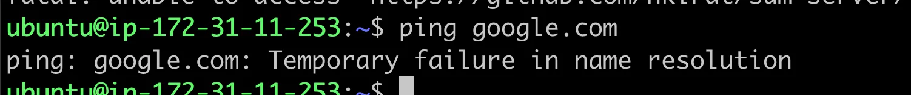
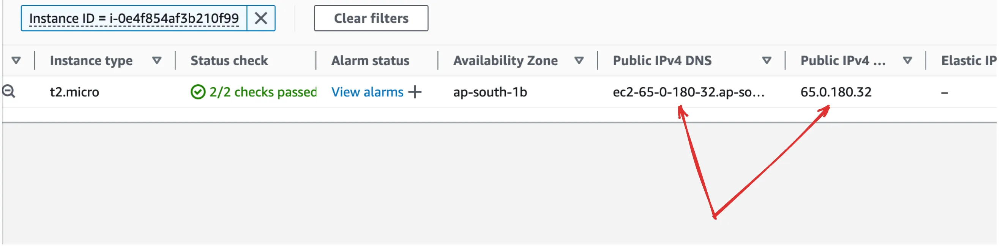
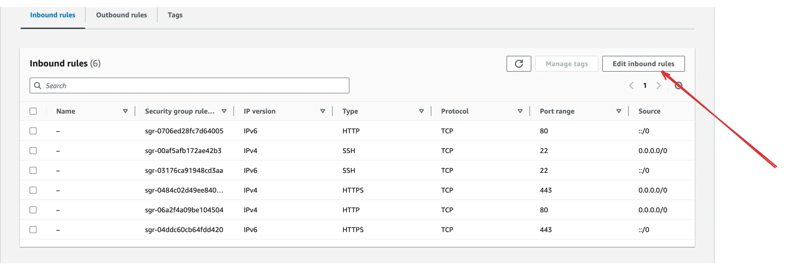
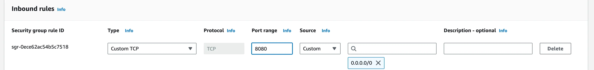
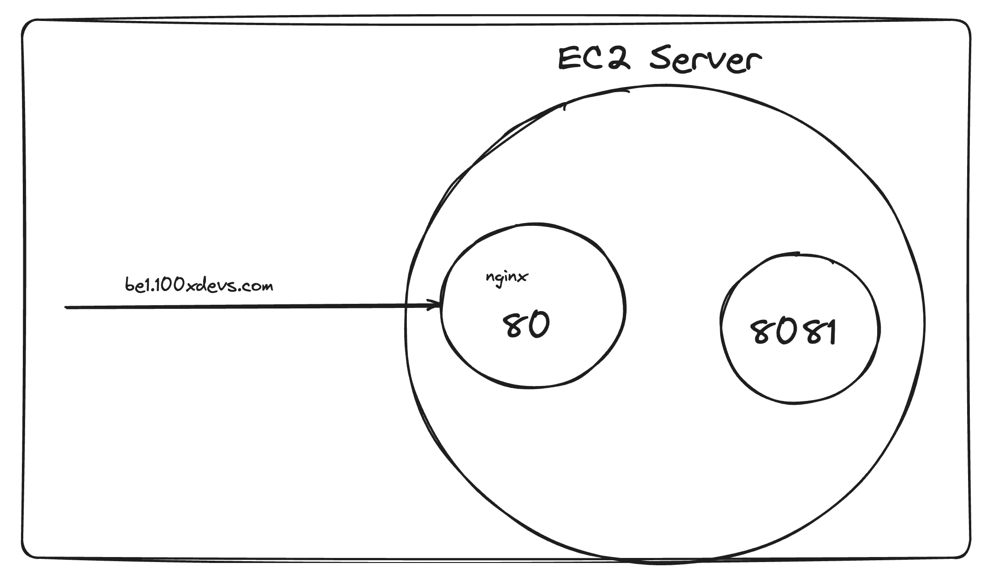
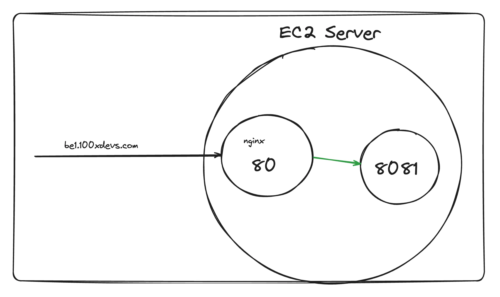

### **Why Do We Need to Use a Cloud Database to Deploy?**

1. **Accessing the App Remotely**:

   - When an app is run locally, it is only accessible within the local network because it does not have a **public IP address**.
   - Public IPs are unique and allow devices to be accessible over the internet. However, the number of public IPs is limited and expensive to own directly.

2. **Role of Cloud Providers**:

   - Cloud providers like **AWS**, **Azure**, and **Google Cloud** offer **public IPs** on a rental basis as part of their services.
   - These IPs are used to make your application or database available to users from anywhere in the world.

3. **Connecting to a Domain**:

   - A **domain name** can be linked to the public IP address of your app through **DNS (Domain Name System)**.
   - This makes it easier for users to access your app using a memorable domain name instead of an IP address (e.g., `www.example.com` instead of `192.168.x.x`).

4. **Why Cloud Databases Specifically?**:

   - **Reliability**: Cloud databases are maintained by providers to ensure high uptime and minimal data loss.
   - **Scalability**: As your app grows, cloud databases allow you to scale storage and performance effortlessly.
   - **Accessibility**: These databases are hosted on the internet, making them accessible from anywhere, unlike local databases tied to your personal machine or local network.

5. **Summary**:
   - Deploying on the cloud ensures your app has a **public IP** for global accessibility.
   - Cloud databases support this deployment by being accessible from any location while providing reliability, scalability, and ease of management.

### EC2 servers

- VMs on AWS are called EC2 Servers
- EC2 stands for Elastic compute Version 2.
- Elastic - Can increase/decrease the size of the machine
- Compute - It is a machine
- You can spin up a new EC2 instance from the aws dashboard

  

### Steps to create an EC2 server

1. Click on Launch a new instance

   

2. Give a name

   

3. Select an OS

   

4. Select an size

   

5. Create a new pair from which we can connect to that server from our local machine through the ip address

   

6. Select size

   

7. select that from where request will be comming http/https

   

### SSH into server

1. ssh into machine

```
ssh -i kirat-class.pem ubuntu@ec2-65-0-180-32.ap-south-1.compute.amazonaws.com
```

2. Exception case ( Give ssh key permissions )

   `IF error comes for some skeyecurity purpose of that file we get from aws key pair then run this command then run again that above code ^^`

```
chmod 700 kirat-class.pem
```

3. Git clone

```
git clone https://github.com/hkirat/sum-server
```

`If your aws machine shows you the following error, your aws machine doesn’t have access to the internet
Solution - https://www.tecmint.com/resolve-temporary-failure-in-name-resolution/`



4. Install Node.js

```
https://www.digitalocean.com/community/tutorials/how-to-install-node-js-on-ubuntu-20-04
```

5. Install all dependencies

```
cd sum-server
npm install
```

6. Start backend

```
node index.js
```

### Try hitting the server

- You have a ip/DNS that you can hit to access your ec2 server
  

- Try visiting your domain

```
your_domain:3000
```

`Notice you cant visit the website`

### process to solve that

- Security group
  

- You can either open port 8080, or process on port 80
  

  

```
http://your_domain:8080
```

### What is Nginx?

**Nginx** (pronounced "engine-x") is a powerful web server software that can act as:


1. **Reverse Proxy**:

   - Sits between client requests and your application server
   - Can distribute incoming traffic across multiple servers (load balancing)
   - Handles SSL/TLS termination for HTTPS connections

2. **Web Server**:

   - Serves static files directly (images, CSS, JavaScript)
   - More efficient than having your Node.js application handle static content
   - Can compress responses to reduce bandwidth

3. **Key Benefits**:

   - **Performance**: Highly efficient at handling concurrent connections
   - **Security**: Adds an extra layer of security by not exposing your application server directly
   - **Port Management**: Can route traffic from standard ports (80/443) to your application ports (3000, 8080, etc.)

4. **Common Usage with Node.js**:

```nginx
server {
    listen 80;
    server_name your_domain.com;

    location / {
        proxy_pass http://localhost:3000;
        proxy_http_version 1.1;
        proxy_set_header Upgrade $http_upgrade;
        proxy_set_header Connection 'upgrade';
        proxy_set_header Host $host;
        proxy_cache_bypass $http_upgrade;
    }
}
```

5. **Why Use Nginx?**:

   - Industry standard for production deployments
   - Better performance than exposing Node.js directly
   - Handles multiple applications on different ports
   - Manages SSL certificates and HTTPS traffic efficiently

6. **Installing nginx**

```nginx
sudo apt update
sudo apt install nginx
```

- This should start a nginx server on port 80
- Try visiting the website



7. **Create a reverse Proxy**

```nginx
sudo rm sudo vi /etc/nginx/nginx.conf
sudo vi /etc/nginx/nginx.conf
events {
    # Event directives...
}

http {
	server {
    listen 80;
    server_name be1.100xdevs.com;

    location / {
        proxy_pass http://localhost:8080;
        proxy_http_version 1.1;
        proxy_set_header Upgrade $http_upgrade;
        proxy_set_header Connection 'upgrade';
        proxy_set_header Host $host;
        proxy_cache_bypass $http_upgrade;
    }
	}
}

sudo nginx -s reload
```

8. **Start the Backend server**

```nginx
node index.js
```

- Visit the website
- https://be1.100xdevs.com/


