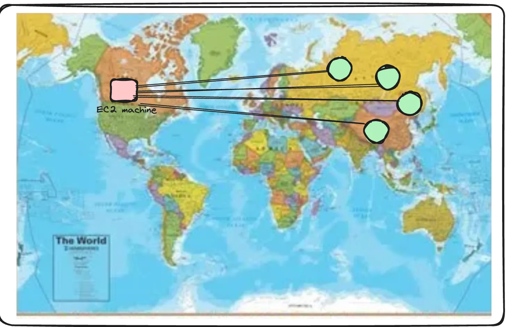
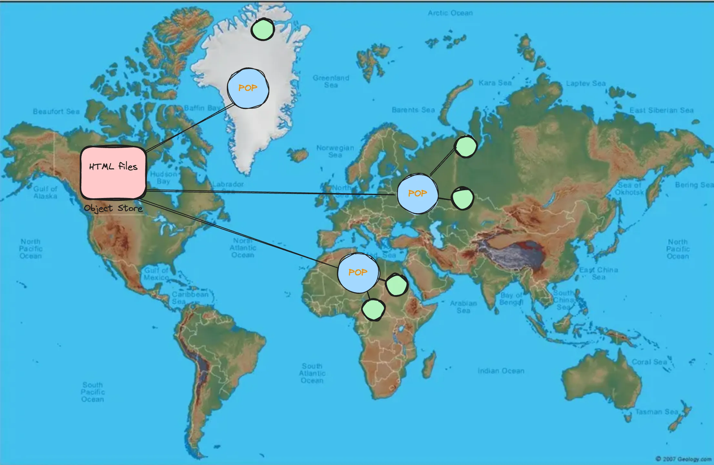
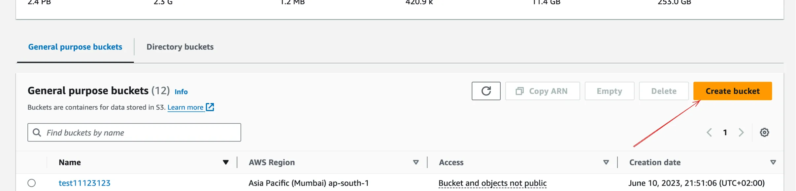
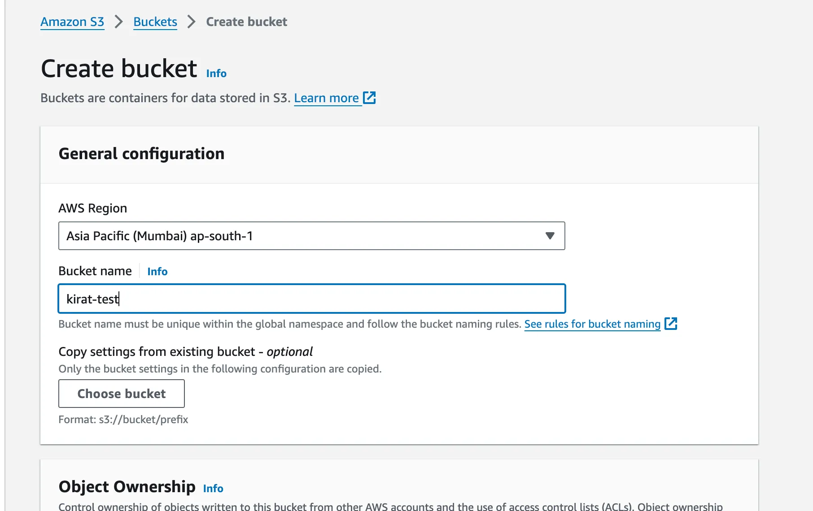
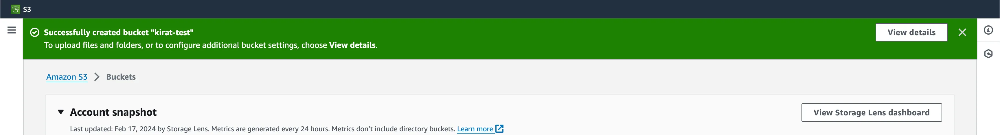
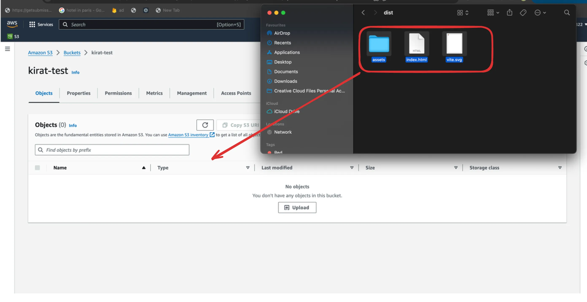
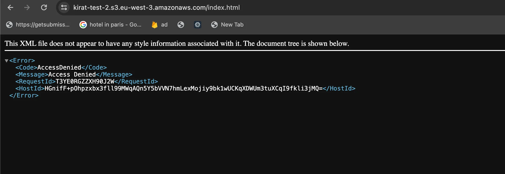
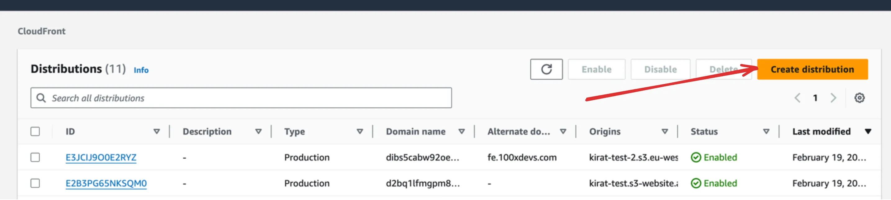
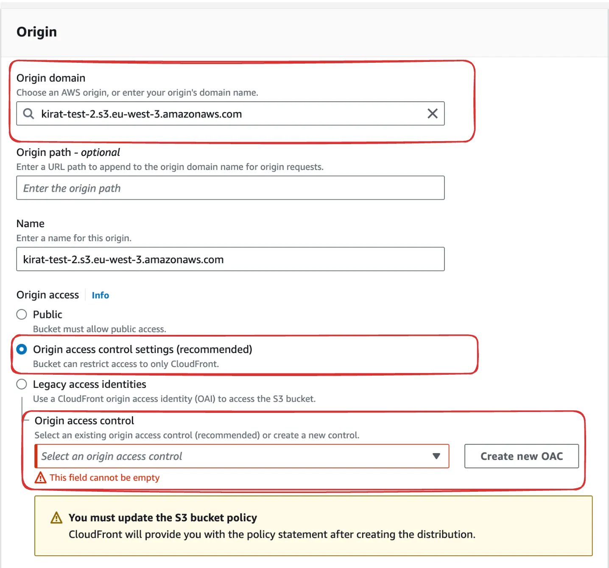
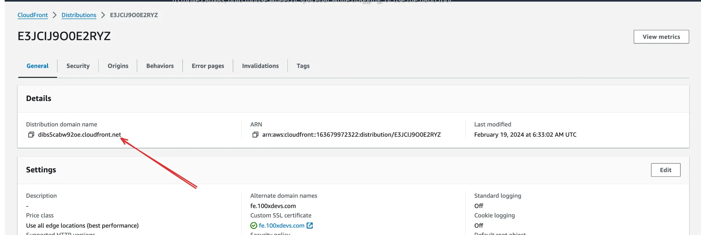

### How to Deploy Frontend on AWS

- New concepts we will learn:
  - **S3 (Simple Storage Service):** An object storage service for storing and retrieving any amount of data.
  - **CloudFront (CDN):** A content delivery network to deliver your content with low latency.

### Build Your Frontend App

- **Note:** This approach will not work for Next.js as it uses Server-Side Rendering (SSR).

1. **Navigate to your project directory.**
2. **Build your project using the following command:**

   ```bash
   npm run build
   ```

3. **Serve the HTML/CSS/JS locally to test:**

   Install the `serve` package globally:

   ```bash
   npm i -g serve
   ```

   Serve your project:

   ```bash
   serve
   ```

   At this point, you have basic HTML/CSS/JS code that you can deploy on the internet. While you might be tempted to host this on an EC2 instance, using S3 and CloudFront is a more efficient approach.

### Understanding CDNs (Content Delivery Networks)

A CDN is a distributed network of servers designed to deliver content to users more efficiently. Here's why CDNs are superior to traditional hosting:

#### Comparison: Traditional vs CDN Approach

1. **Traditional EC2 Approach:**
   
   - Single point of delivery
   - Higher latency for distant users
   - Greater server load
   - No built-in caching

2. **CDN Approach:**
   
   - Distributed network of edge locations
   - Content served from nearest location
   - Automatic scaling and load balancing
   - Built-in caching

#### Why Use Object Storage + CDN for Frontend?

1. **Perfect for Static Content:**
   - Ideal for HTML, CSS, JS files
   - Great for images, videos, and other media
   - Consistent content that can be cached

2. **Benefits:**
   - Faster load times
   - Lower latency
   - Reduced origin server load
   - Better scalability
   - Cost-effective

3. **Important Note:**
   - This approach is optimal for frontend assets and static content
   - Not suitable for backend services that require dynamic responses
   - Backend services should still use compute instances (like EC2) for processing requests

### Creating a object store in S3

- In AWS, S3 is their object store offering.
  You can create a bucket in there. A bucket represents a logical place where you store all the files of a certain project.







### Upload your file bundle in S3 (file & folder inside dist folder)



### Try accessing the website

- You might be tempted to open your S3 bucket at this point, but don’t
  Your S3 bucket should be blocked by default, and you should allow cloudfront (CDN) to access it.



### Connecting a cloudfront

1. Create a Cloudfront distribution

- Go to cloudfront and create a new distribution. A distribution here means you’re creating a place from where content can be distributed.



2. Select your S3 bucket as the source



`💡 Origin Access Control (OAC) is a feature in Cloudfront, which allows you to restrict direct access to the content stored in your origin, such as an Amazon S3 bucket or a web server, ensuring that users can only access the content through the CDN distribution and not by directly accessing the origin URL`

- By the end of this, you should have a working cloudfront URL.


