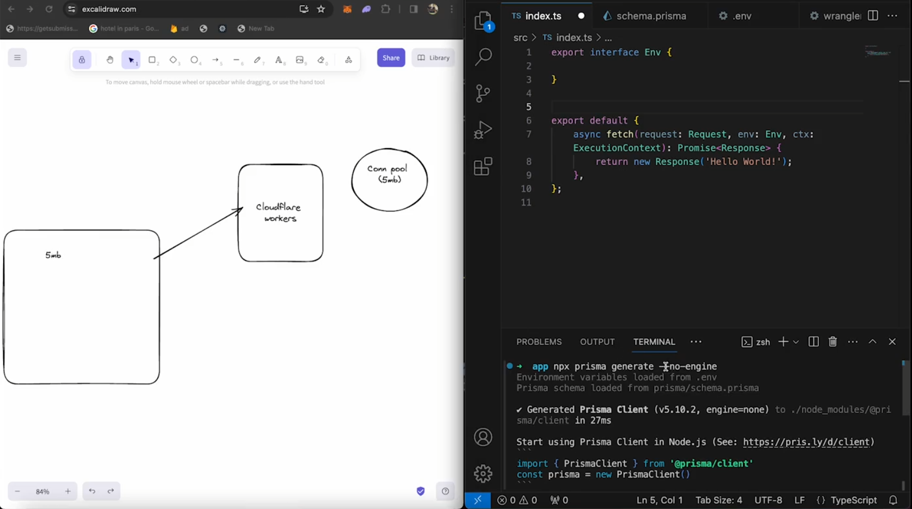

# Connection pooling with cloudflare with the help of prisma

## connection pooling in serveless Env.

```
npx create cloudflare@latest
```

```
npx install --save-dev prisma
```

```
npx prisma init
```

```
npx prisma migarate dev --name any_name
```

```
generate the connection string the pooling string from prisma accelation with your existing neon postgres url
```

```
Then paste the Database url that generate through prisma accelation in wrangler.toml as if anything paste on that file (wrangler.toml) then it can directly acces by our index.ts file thats why we paste there
```

```
npm install @prisma/extension-acceleration
```

```
npx prisma generate --no-engine
```

```
Then this code for create log in database

import { PrismaClient } from '@prisma/client/edge';
import { withAccelerate } from '@prisma/extension-accelerate';

export interface Env {
	DATABASE_URL: string;
}

export default {
	async fetch(request: Request, env: Env, etx: ExecutionContext): Promise<Response> {
		const prisma = new PrismaClient({
			datasourceUrl: env.DATABASE_URL,
		}).$extends(withAccelerate());

		const response = await prisma.log.create({
			data: {
				level: 'Info',
				message: 'Hello World',
				meta: {
					Headers: JSON.stringify(request.headers),
				},
			},
		});
		console.log(JSON.stringify(response));
		return new Response(`request method: ${request.method}, response: ${JSON.stringify(response)}`);
	},
};
```



```
npx wrangler whoami (to check the user is looged in or not)
```

```
npm run deploy
```
