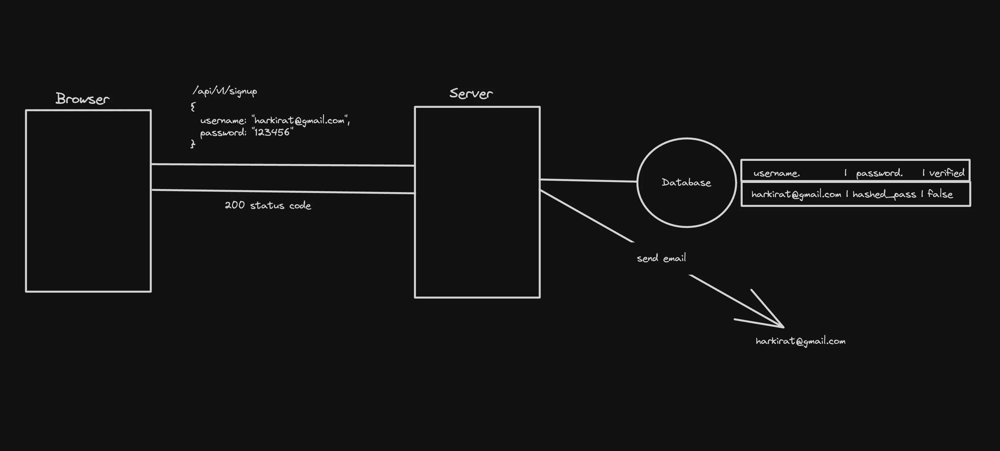
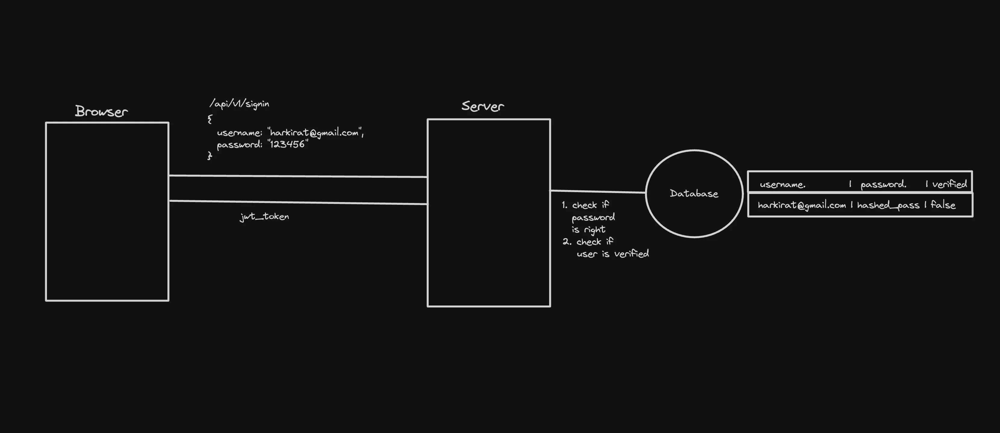
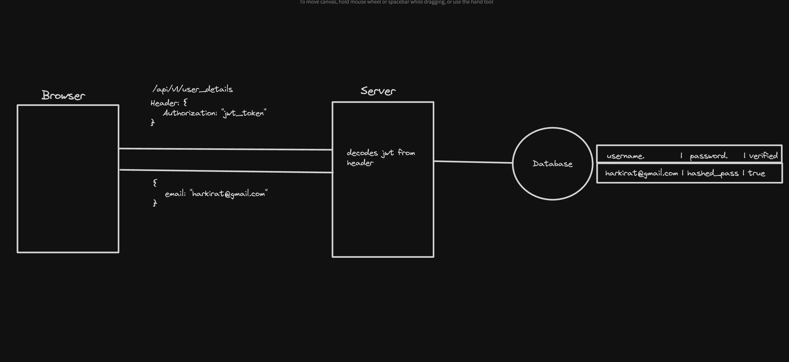

# jwt authentication and cookie authentication

- Jwt and cookie both work same but in jwt we set cookie manually in local storage and send that cookie im every request but in cookie auth it automatically set in cookies and automatically fetched with every call until you remove it or it expired.

- `signup`

  

- `signin`

  

- `auth req`

  

# Types of cookies

- `Persistent` - Stay even if u close the window
- `Session` - Go away after the window closes
- `Secure` - Sent only over secure, encrypted connections (HTTPS).
