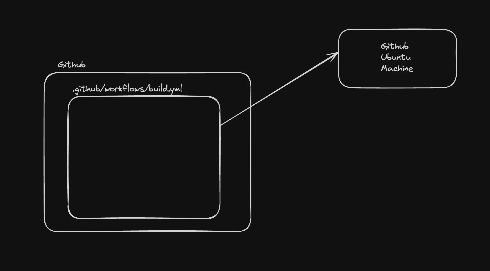
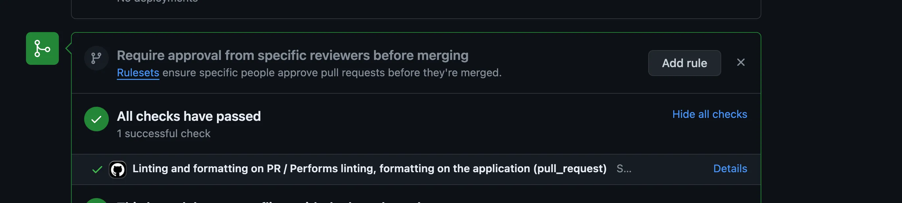
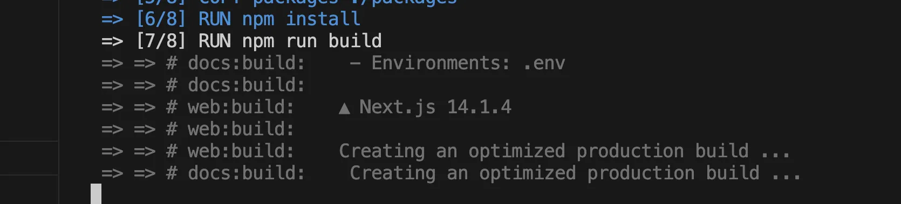
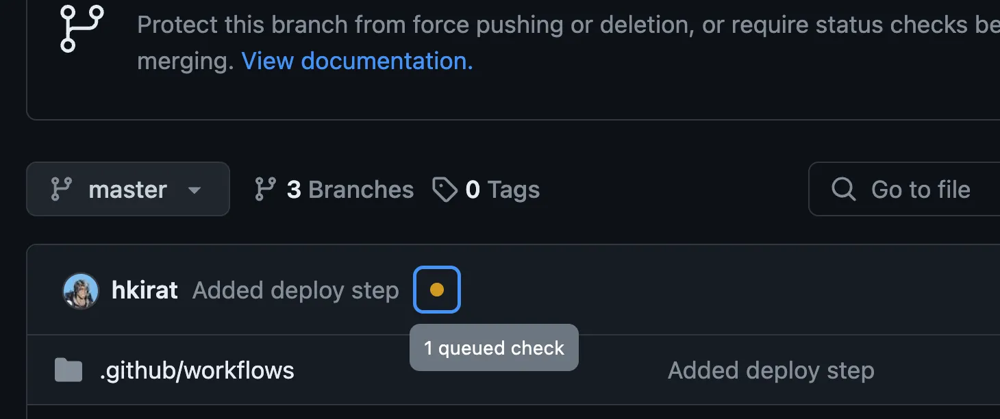
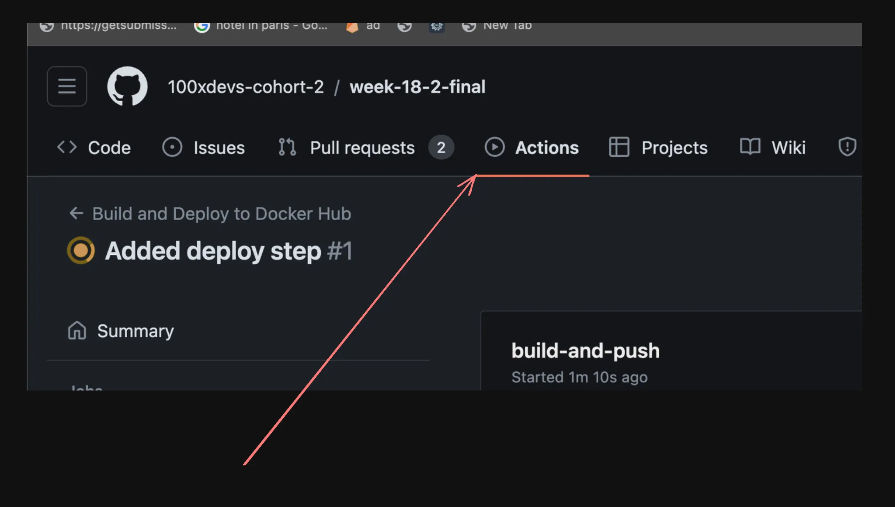
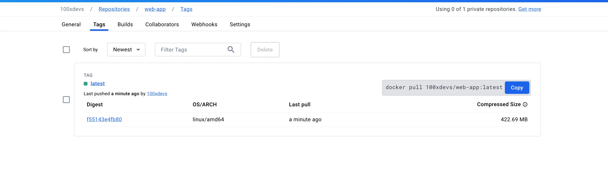

# What is CI and CD?

## Continuous Integration (CI)

Continuous Integration (CI) is a development practice where developers frequently integrate their code changes into a shared repository, preferably several times a day. Each integration is automatically verified by the monorepo we’re dealing with today.

[Monorepo Link](https://github.com/100xdevs-cohort-2/week-18-2-ci-cd)

This monorepo contains three applications:

- `bank-webhook`
- `merchant-app`
- `user-app`

We’ll be deploying all three to the same EC2 instance.

## Building the Project and Running Automated Tests

This process allows teams to detect problems early, improve software quality, and reduce the time it takes to validate and release new software updates.

## Continuous Deployment (CD)

As the name suggests, CD involves deploying your code continuously to various environments (dev/stage/prod).

### Continuous Deployment in GitHub

We’ll be deploying a Next.js app to EC2 servers via Docker.

💡 **Note:** You don’t necessarily need Docker when deploying to a simple EC2 server. However, if you deploy to:

1. GCP App Runner
2. ECS
3. Kubernetes

Then it makes more sense to deploy a Dockerized application.

### Architecture Diagram


💡 **Tip:** The last step of deployment varies based on where you’re pushing your image.

## How to Create a CI/CD Pipeline?

For GitHub, you can add all your pipelines to `.github/workflows`.

Example: [GitHub Workflow Example](https://github.com/code100x/cms/blob/main/.github/workflows/lint.yml)

### CI Pipeline Example


### CI pipelines look like this finally


💡 **Hint:** Use [Online YAML to JSON Converter](https://onlineyamltools.com/convert-yaml-to-json) to visualize the pipeline in JSON format.

# Continuous Deployment (CD) Pipeline Setup

## Step 1 - Create the CD Pipeline

Make sure that whenever someone tries to create a **PR**, we build the project and make sure that it builds as expected.



## 🚀 Setting Up the CD Pipeline

### 1️⃣ Fork the Main Repository

Fork the repository from: [100xdevs-cohort-2/week-18-2-ci-cd](https://github.com/100xdevs-cohort-2/week-18-2-ci-cd)

### 2️⃣ Add a GitHub Actions Workflow File

Create a new file at **`.github/workflows/build.yml`** in the root directory of the repository.

### 3️⃣ Create the Workflow Configuration

Add the following YAML code to `build.yml`:

```yaml
ame: Build on PR

on:
  pull_request:
    branches:
      - master

jobs:
  build:
    runs-on: ubuntu-latest
    steps:
      - uses: actions/checkout@v3

      - name: Use Node.js
        uses: actions/setup-node@v3
        with:
          node-version: "20"

      - name: Install Dependencies
        run: npm install

      - name: Run Build
        run: npm run build
```

### 4️⃣ Push Changes to `master` Branch

Commit and push the `build.yml` file to the `master` branch.

### 5️⃣ Create a New Branch & Open a Pull Request

1. Create a new branch and make minimal changes.
2. Open a **Pull Request (PR)**.
3. The GitHub Actions workflow should automatically run.

### ✅ Expected Behavior

- If the build succeeds, the PR is **valid** and can be merged.
- If the build fails, the PR will show an **error**, preventing broken code from being merged.



---

## 🚀 Let’s Add a Deploy Step

### 1️⃣ Create Dockerfiles for Your Apps

Create the necessary Dockerfile for your user application:

#### `docker/Dockerfile.user`

```dockerfile
FROM node:20.12.0-alpine3.19

WORKDIR /usr/src/app

COPY package.json package-lock.json turbo.json tsconfig.json ./
COPY apps ./apps
COPY packages ./packages

# Install dependencies
RUN npm install

# Generate Prisma client
RUN cd packages/db && npx prisma generate && cd ../..

# Build only the user app
RUN npm run build

CMD ["npm", "run", "start-user-app"]
```

### 2️⃣ Add `start-user-app` Script

Modify the root `package.json` to include:

```json
"scripts": {
  "start-user-app": "cd ./apps/user-app && npm run start"
}
```

💡 **Optimization Tip:**
You dont really need to build every app for every dockerfile. Can you change the build command so that only a single app is built for each dockerfile?



---

## 📦 Create the CD Pipeline

This pipeline will:

1. Clone the repository
2. Build the Docker image
3. Push the image to Docker Hub

### 3️⃣ Create `.github/workflows/deploy.yml`

```yaml
name: Build and Deploy to Docker Hub

on:
  push:
    branches:
      - master

jobs:
  build-and-push:
    runs-on: ubuntu-latest
    steps:
      - name: Check Out Repo
        uses: actions/checkout@v2

      - name: Log in to Docker Hub
        uses: docker/login-action@v1
        with:
          username: ${{ secrets.DOCKER_USERNAME }}
          password: ${{ secrets.DOCKER_PASSWORD }}

      - name: Build and Push Docker Image
        uses: docker/build-push-action@v2
        with:
          context: .
          file: ./Dockerfile
          push: true
          tags: 100xdevs/web-app:latest # Replace with your Docker Hub username and repository

      - name: Verify Pushed Image
        run: docker pull 100xdevs/web-app:latest # Replace with your Docker Hub username and repository
```

### 4️⃣ Add Secrets to GitHub

Ensure the following secrets are added to your repository:

- **DOCKER_USERNAME** (your Docker Hub username)
- **DOCKER_PASSWORD** (your Docker Hub password/token)

### 5️⃣ Verify Deployment

1. Push your changes to `master`.
2. Check the GitHub Actions workflow.





3. Visit **Docker Hub** to confirm the image has been uploaded.



💡 **Note:** You may need to inject additional environment variables (like `DB_URL`) for the build to function correctly.

---
