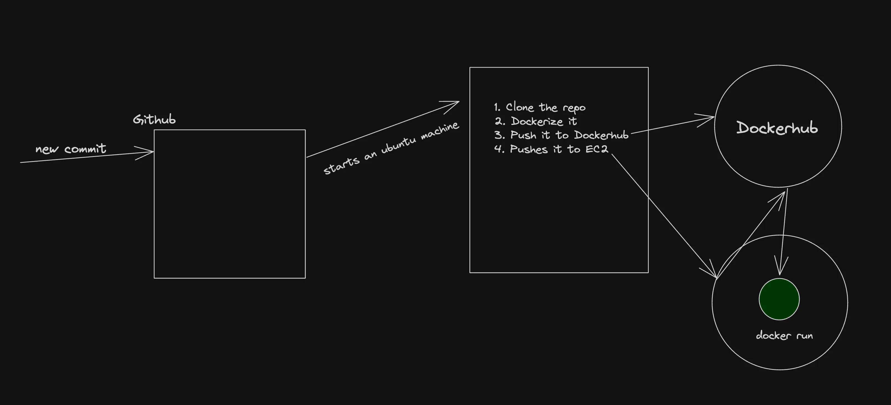
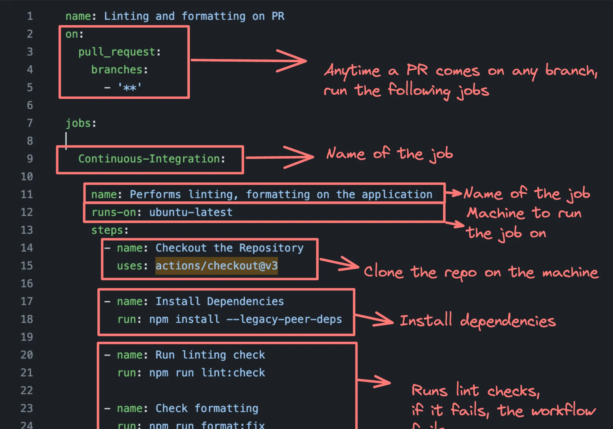
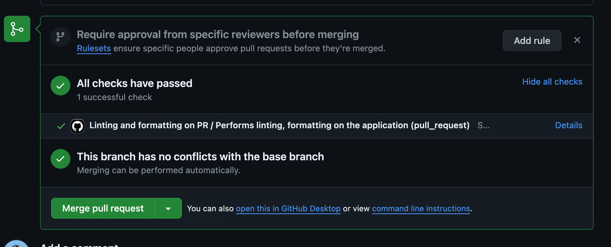

# What is CI and CD?

## Continuous Integration (CI)
Continuous Integration (CI) is a development practice where developers frequently integrate their code changes into a shared repository, preferably several times a day. Each integration is automatically verified by the monorepo we’re dealing with today.

[Monorepo Link](https://github.com/100xdevs-cohort-2/week-18-2-ci-cd)

This monorepo contains three applications:
- `bank-webhook`
- `merchant-app`
- `user-app`

We’ll be deploying all three to the same EC2 instance.

## Building the Project and Running Automated Tests
This process allows teams to detect problems early, improve software quality, and reduce the time it takes to validate and release new software updates.

## Continuous Deployment (CD)
As the name suggests, CD involves deploying your code continuously to various environments (dev/stage/prod).

### Continuous Deployment in GitHub
We’ll be deploying a Next.js app to EC2 servers via Docker.

💡 **Note:** You don’t necessarily need Docker when deploying to a simple EC2 server. However, if you deploy to:
1. GCP App Runner
2. ECS
3. Kubernetes

Then it makes more sense to deploy a Dockerized application.

### Architecture Diagram

💡 **Tip:** The last step of deployment varies based on where you’re pushing your image.

## How to Create a CI/CD Pipeline?
For GitHub, you can add all your pipelines to `.github/workflows`.

Example: [GitHub Workflow Example](https://github.com/code100x/cms/blob/main/.github/workflows/lint.yml)

### CD Pipeline Example

### CD pipelines look like this finally 

💡 **Hint:** Use [Online YAML to JSON Converter](https://onlineyamltools.com/convert-yaml-to-json) to visualize the pipeline in JSON format.
