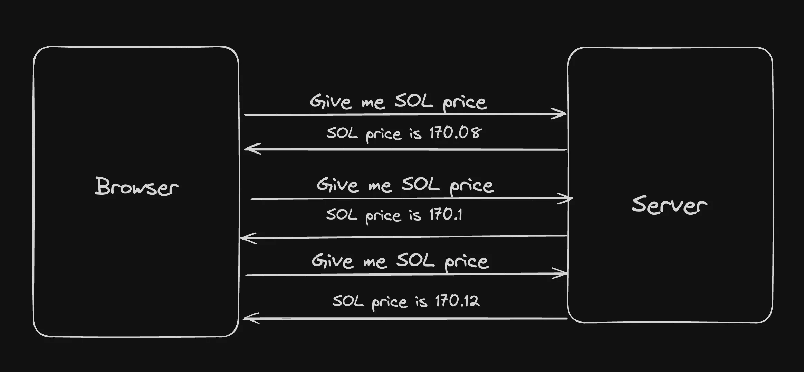
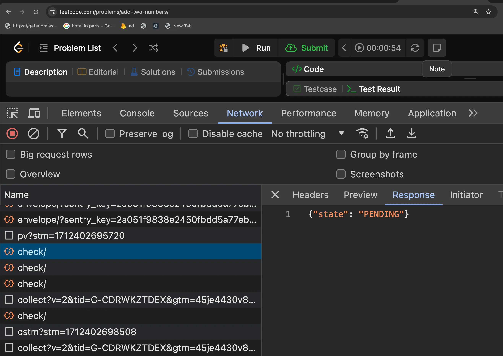

e7d34d1db701# What is backend communication?

- In the real world, you have various backend systems, not just one.
  

- For example, for a website like PayTM, whenever you do a transaction, the following might happen
  

- For leetcode, whenever the user submits a problem, the following might happen -
  

# Types of communication

- Synchronous (Strong coupling)

  - HTTP (REST/GraphQL)
  - Websocket (debatable if sync or async)

- Asynchronous (Weak coupling)
  - Messaging queues
  - Pub subs
  - Server-Sent Events
  - Websocket (debatable if sync or async)

# Websockets

- WebSockets provide a way to establish a persistent, full-duplex communication channel over a single TCP connection between the client (typically a web browser) and the server.

# Use Cases for WebSockets:

- Real-Time Applications: Chat applications, live sports updates, real-time gaming, and any application requiring instant updates can benefit from WebSockets.
- Live Feeds: Financial tickers, news feeds, and social media updates are examples where WebSockets can be used to push live data to users.
- Interactive Services: Collaborative editing tools, live customer support chat, and interactive webinars can use WebSockets to enhance user interactio

Good example - https://www.binance.com/en/trade/SOL_USDT?type=spot

# Why not use HTTP/REST? Why do you need ws?

- Network Handshake happens for every request
- No way to push server side events (You can use polling but not the best approach)

# Websockets in Node.js

- There are various libraries that let you create a ws server (similar to how express lets you create an HTTP server)
  - https://www.npmjs.com/package/websocket
  - https://github.com/websockets/ws
  - https://socket.io/

We’ll be using the `ws` library today.

`Problems with socket.io - 
Even though socket.io is great (it gives you constructs like rooms to make the API much cleaner), it’s harder to support multiple platforms in it (Android, IOS, Rust)
There are implementations in most platforms but not very up to date 
https://socket.io/blog/native-socket-io-and-android/
https://github.com/1c3t3a/rust-socketio`
