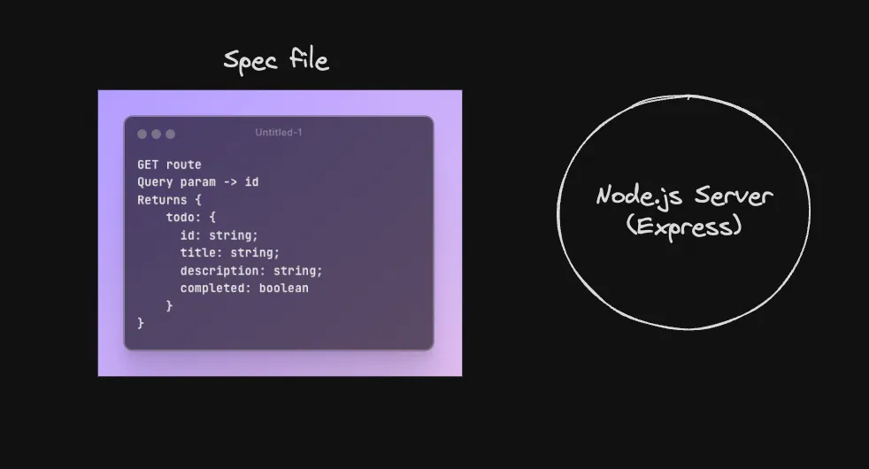
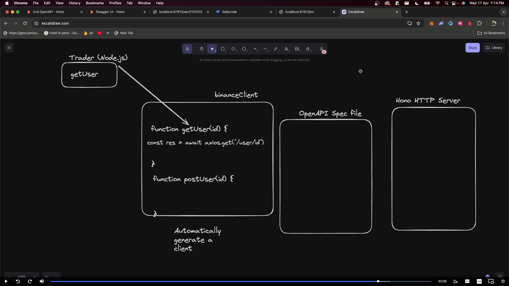

# When you create backend, it’s very hard for other people to know the exact shape of your routes




- If you have this single long file that lists all your routes, you could
  - Auto generate documentation pages `(Ref https://binance-docs.github.io/apidocs/spot/en/#query-current-order-count-usage-trade)`
  - Auto generate clients in various languages (Java, JS, Go…)
  - Let the world look at your API routes shape without actually opening your code
  - Let AIs know how to hit your APIs in a single file, without sharing your code with the AI

# What is the OpenAPI Spec

- The OpenAPI Specification (OAS) is a standard, language-agnostic interface to RESTful APIs which allows both humans and computers to discover and understand the capabilities of a service without access to source code, additional documentation, or network traffic inspection. When properly defined via OpenAPI, a consumer can understand and interact with the remote service with minimal implementation logic.

Developed initially by Swagger, and later donated to the OpenAPI Initiative under the Linux Foundation, the OpenAPI Specification has become a widely adopted industry standard for defining and using APIs.

# How to create a spec

- Write it by hand (bad, but still happens)
- Auto generate it from your code
  - Easy in languages that have deep types like Rust
  - Slightly harder in languages like Go/Rust
  - Node.js has some libraries/codebases that let you do it
    - With express - `https://www.npmjs.com/package/express-openapi` (highly verbose)
    - Without express - `https://github.com/lukeautry/tsoa` (Cohort 1 video)
- Hono has a native implementation with zod - `https://hono.dev/snippets/zod-openapi`

# Auto generated clients

- Given you have a yaml/json file that describes the shape of your routes, lets try generating a ts client that we can use in a Node.js / React app to talk to the backend
  `Ref https://www.npmjs.com/package/openapi-typescript-codegen`

```
npx openapi-typescript-codegen --input ./spec.json --output ./generated
```

# conclusion

- open api spec ? why do we need it ?
- how to create a open api spec file by hand and with hono + zod = autogenarated
- how to create js client to hit the server with minimal implementation.
