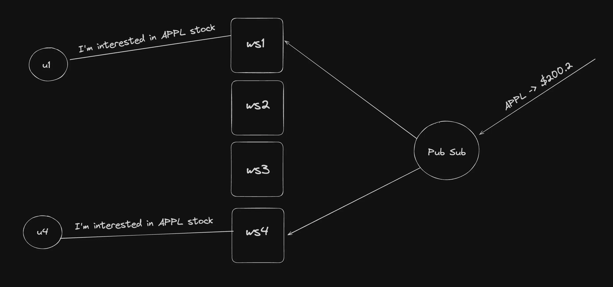

# Pub Sub + Singleton

- What if You want to create a system where users can subscribe to the feed of stocks (prices)
- This application will be used by >1Mn users
- How would you build it?

- Create a PubSubManager class (singleton)
- It keeps track of what all stocks are users on this server interested in
- It tells the pub sub whenever a new stock is added or a stock is removed from the list of - interested stocks on that server
- It relays the events to the right sockets whenever an event is received
