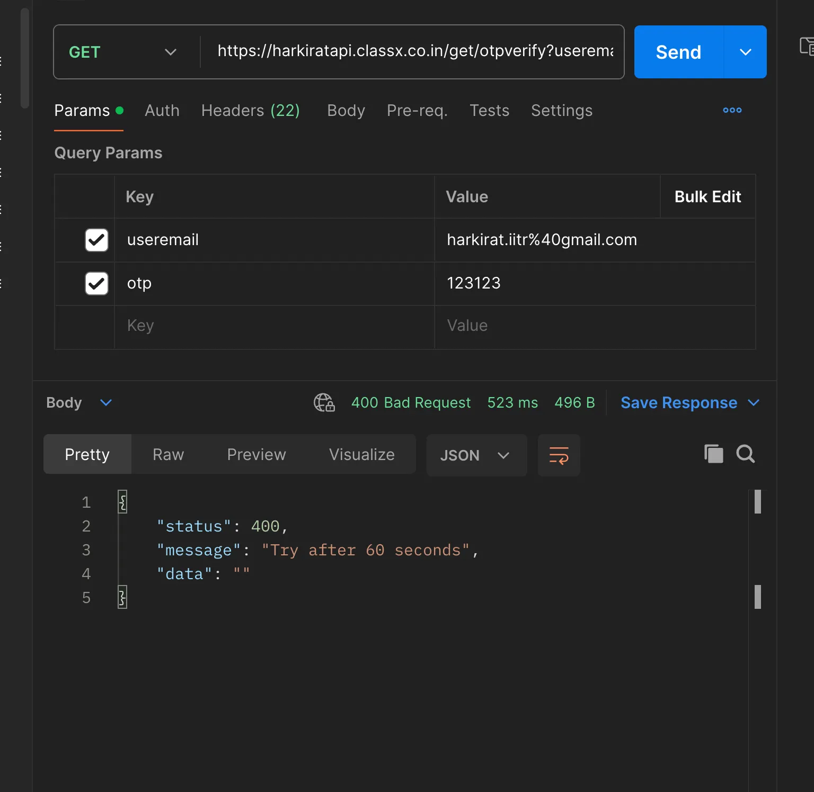
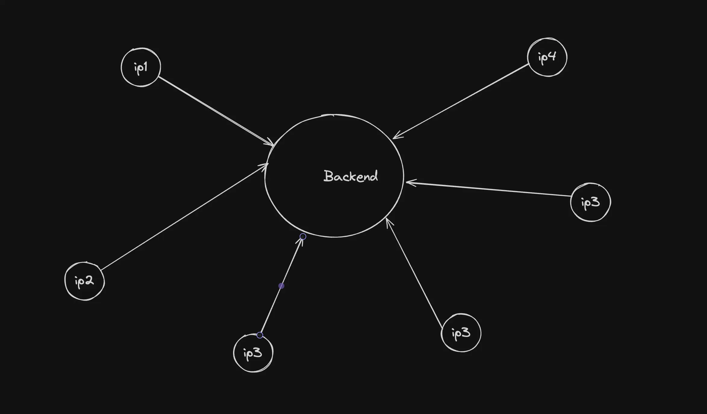
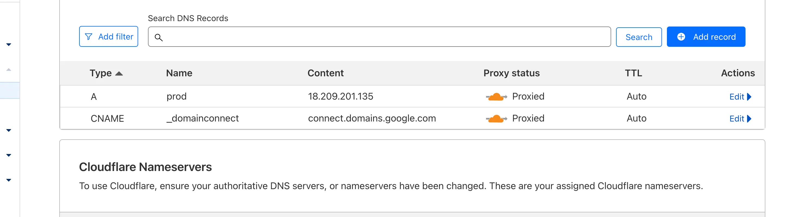

# Why Rate Limiting?

## Overview

Rate limiting is a crucial strategy in web applications and APIs for several important reasons:

### Preventing Overload

Rate limiting controls how often a user or system can make requests to a service. This helps prevent overuse of resources, ensuring that the system remains available and responsive for all users. For example, rate limiting can stop a single user from making thousands of login attempts in a minute, which could otherwise degrade service for others.

### Mitigating Abuse

Without rate limiting, an application could be more susceptible to abuse such as brute force attacks on passwords or spamming behavior. By limiting how often someone can perform an action, it reduces the feasibility of such attacks.

### Managing Traffic

In high-traffic scenarios, like ticket sales for a popular event, rate limiting can help manage the load on a server, preventing crashes and ensuring a fairer distribution of service like bandwidth or access to the purchasing system.

### DDoS Protection

A DDoS attack involves overwhelming a site with a flood of traffic from multiple sources, which can make the website unavailable. DDoS protection mechanisms detect unusual traffic flows and can filter out malicious traffic, helping to keep the service operational despite the attack.

### Exploiting the backned

### Exploiting one in production

- Try resetting password on https://harkirat.classx.co.in
  1. Go to the website
  2. Put in a random users email
  3. Send OTP
  4. Try putting a random OTP

`as it already rate limited the most secure endpoint so we can send lots of request it block your ip`

### DDoS (Distributed Denial of Service)

- Your server is still vulnerable to DDoS

- Why do attackers to DDoS -

  1. To charge ransom because the service remains down until DDoS is lifted
  2. On sneaker drop events/NFT mints where the faster the request reaches the server the better

- How can you save your reset password endpoint?

  1. You can implement logic that only 3 resets are allowed per email sent out
  2. You can implement captcha logic

### Cloudflare Services

- Cloudflare let your domain proxy means it let your all request to your domain first reach to cloudflare from cloudflare it reached to your website that help to prevent DDos as it blocked many bot farm requests.

`💡
This is usually more than good enough, but if you’d like to dive further, you can add IP based rate limits, override DDoS in the security section of cloudflare
AWS/GCP also provide you with the same`

### Captchas

- Captchas are a great-sh solution to making sure the request was sent by a human and not by a machine
  There are various freely available captchas, Cloudflare Turnstile is one of them

.png>)
