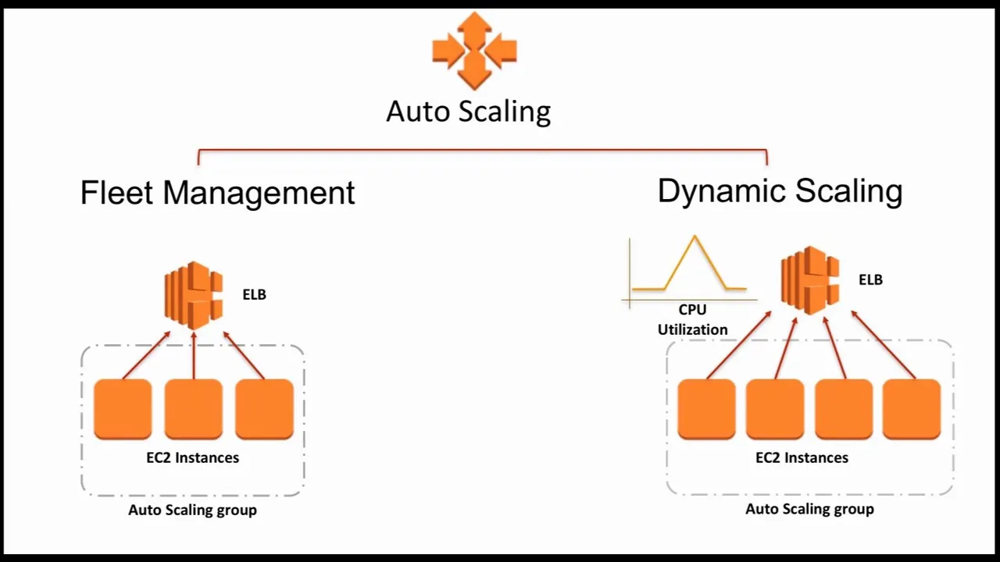
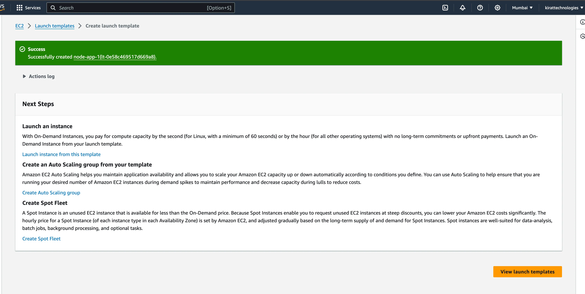
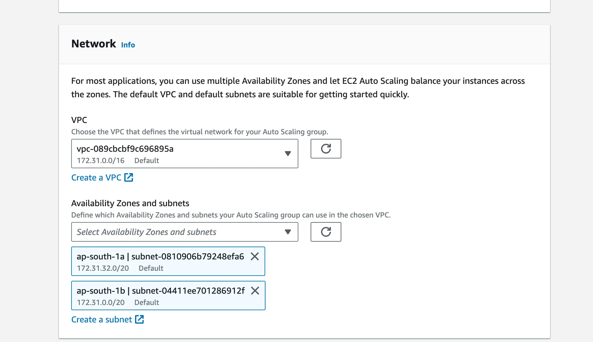
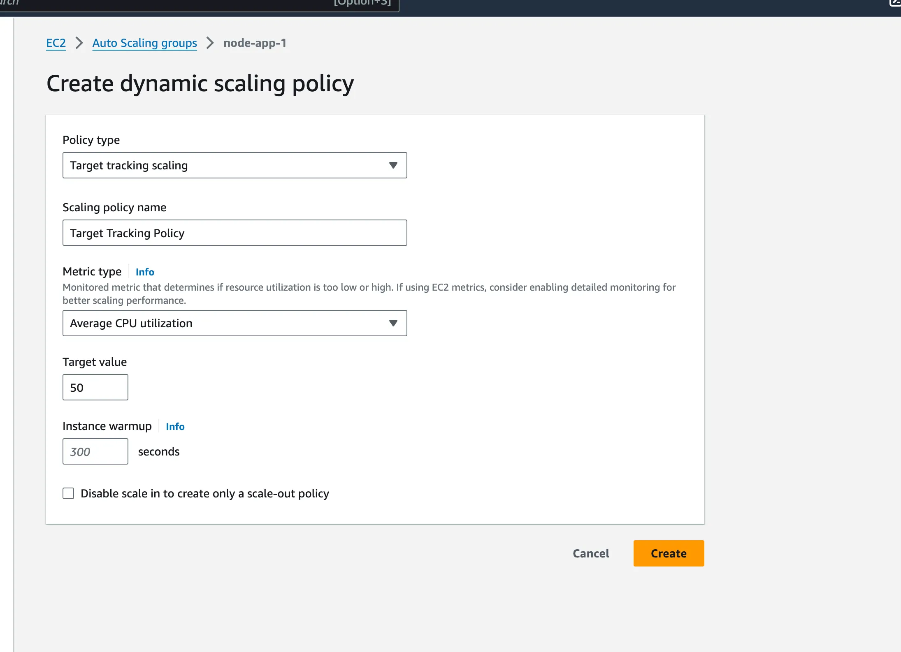
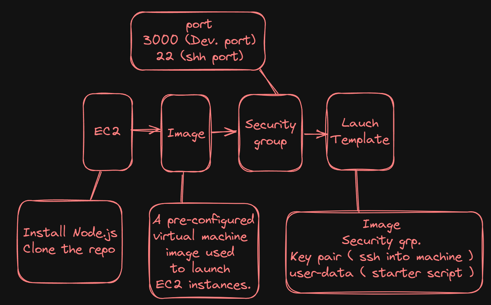

## What we’re discussing

### Server

    - ASGs and Vertical scaling ✅
    - Load balancers ✅

## Horizontal Scaling

- Horizontal scaling, also known as scaling out, involves increasing the number of instances or servers to handle more load or traffic. This approach is essential for building scalable and resilient systems that can adapt to varying workloads. In this section, we will elaborate on the key concepts and mechanisms involved in horizontal scaling, particularly in the context of AWS (Amazon Web Services)


- Horizontal scaling represents increasing the number of instances you have based on a metric to be able to support more load. This is typically achieved through the use of auto-scaling groups, which automatically adjust the number of instances based on predefined metrics such as CPU utilization, memory usage, or custom metrics.

## AWS Auto Scaling Groups

- AWS provides a feature called Auto Scaling Groups, which allows you to automatically scale the number of EC2 (Elastic Compute Cloud) instances based on demand. This ensures that your application can handle varying loads without manual intervention.

1. Amazon Machine Images (AMIs): AMIs are pre-configured virtual machine images that serve as templates for launching new EC2 instances. They include the operating system, application server, and applications required to launch an instance. AMIs are essentially snapshots of a machine from which you can create more machines.

2. Load Balancer: A load balancer acts as an entry point that distributes incoming traffic across multiple instances. It ensures high availability and reliability by forwarding requests to healthy instances within a target group. AWS provides fully managed load balancers, such as the Elastic Load Balancer (ELB), which automatically scales to handle incoming traffic.

3. Target Groups: A target group is a logical grouping of EC2 instances that a load balancer can send requests to. Target groups allow you to manage and route traffic to specific sets of instances based on your application's requirements.

4. Launch Template: A launch template is a reusable configuration that defines the parameters required to launch new EC2 instances. It includes details such as the AMI ID, instance type, key pair, security groups, and other instance settings. Launch templates simplify the process of launching and managing instances.



# Process to create ASGs

- Create a EC2 instance.
- install Node.js on it `https://www.digitalocean.com/community/tutorials/how-to-install-node-js-on-ubuntu-20-04`
- Clone the repo - `https://github.com/100xdevs-cohort-2/week-22`
- Create an AMI with your machine
- Create security group
- Launch template

  - Ref for User data - `https://stackoverflow.com/questions/15904095/how-to-check-whether-my-user-data-passing-to-ec2-instance-is-working`

- starup code for an instance called user-data in aws

```
#!/bin/bash
export PATH=$PATH:/home/ubuntu/.nvm/versions/node/v22.0.0/bin/
echo "hi there before"
echo "hi there after"
npm install -g pm2
cd /home/ubuntu/week-22
pm2 start index.js
pm2 save
pm2 startup
```



- ASG
  - Callout on availability zones - ASGs try to balance instances in each zone



- Load balancer
  - Add an HTTPS Listener from your domain, request a certificate from ACM
- Target group - Attach the target group to the ASG

## Autoscaling part

- You can create an dynamic scaling policy



- Try playing with the Min and max on the ASG


## The flow to make the whole process

- First part


