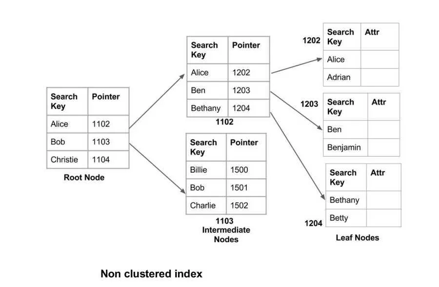
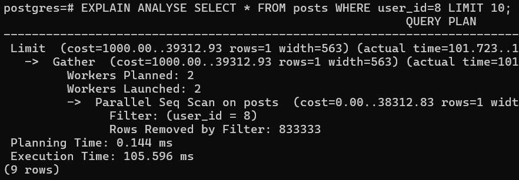
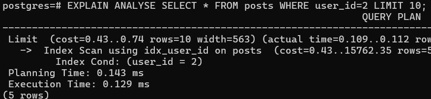

## Indexing in Postgres

- Indexing is a crucial technique in database management that significantly improves query performance. This section will guide you through the process of creating a PostgreSQL database, inserting dummy data, and observing the impact of indexing on query performance.



- Step 1: Create a PostgreSQL Database Locally
  1. Run PostgreSQL using Docker:
  ```
  docker run -p 5432:5432 -e POSTGRES_PASSWORD=mysecretpassword -d postgres
  ```
  2. Connect to the PostgreSQL container:
  ```
  docker exec -it <container_id> /bin/bash
  psql -U postgres
  ```
- Step 2: Create the Schema for a Simple Medium-like App

  1. Create the users table:

  ```
  CREATE TABLE users (
  user_id SERIAL PRIMARY KEY,
  email VARCHAR(255) UNIQUE NOT NULL,
  password VARCHAR(255) NOT NULL,
  name VARCHAR(255)
  );
  ```

  2. Create the posts table

  ```
  CREATE TABLE posts (
  post_id SERIAL PRIMARY KEY,
  user_id INTEGER NOT NULL,
  title VARCHAR(255) NOT NULL,
  description TEXT,
  image VARCHAR(255),
  FOREIGN KEY (user_id) REFERENCES users(user_id)
  );
  ```

- Step 3: Insert Dummy Data

  1.  Insert data into the tables:

  ```
  DO $$ DECLARE returned_user_id INT; BEGIN -- Insert 5 users FOR i IN 1..5 LOOP INSERT INTO users (email, password, name) VALUES ('user'||i||'@example.com', 'pass'||i, 'User '||i) RETURNING user_id INTO returned_user_id; FOR j IN 1..500000 LOOP INSERT INTO posts (user_id, title, description) VALUES (returned_user_id, 'Title '||j, 'Description for post '||j); END LOOP; END LOOP; END $$;
  ```

- Step 4: Measure Query Performance Without Indexes

  1.  Run a query to get all posts of a user and log the time it took:

  ```
  EXPLAIN ANALYSE SELECT \* FROM posts WHERE user_id=1 LIMIT 5;
  ```

  2.  Focus on the execution time.

- Step 5: Add an Index to user_id

  1.  Create an index on the user_id column:

  ```
  CREATE INDEX idx_user_id ON posts (user_id);
  ```

  2.  Run the same query again and notice the execution time:

  ```
  EXPLAIN ANALYSE SELECT \* FROM posts WHERE user_id=1 LIMIT 5;

  ```

## Observations

- Without Indexes: The query scans the entire posts table to find the relevant rows, which can be slow for large datasets.
- With Indexes: The query uses the index to quickly locate the relevant rows, significantly reducing the execution time.

## How Indexing Works (Briefly)

- When you create an index on a field, a new data structure (usually a B-tree) is created that stores the mapping from the index column to the location of the record in the original table. The search on the index is usually $$O(\log n)$$, which is much faster than a full table scan.
  - Without Indexes: The database performs a full table scan, which is $$O(n)$$
  - With Indexes: The database uses the index to perform a search, which is $$O(\log n)$$
- In PostgreSQL, the data pointer in the index is the page and offset at which the record can be found. Think of the index as the appendix of a book and the location as the page and offset where the data can be found.

## Without Indexes

- Table Structure: The posts table contains columns post_id, user_id, title, and description.
- Query Execution: The query SELECT \* FROM users WHERE id=1; performs a full table scan, which is $$O(n)$$ This means the database scans every row in the posts table to find the relevant records, which is inefficient for large datasets.




## With Indexes

- Table Structure: The posts table remains the same, but an additional posts_index table is created.
- Index Structure: The posts_index table contains index_column and location. The index_column stores the values of the user_id column from the posts table, and the location stores the corresponding row location.
- Query Execution: The query SELECT \* FROM users WHERE id=1; now uses the index to search the relevant records, which is $$O(\log n)$$ The database quickly finds the relevant rows using the index and retrieves the records from the posts table, which is $$O(1)$$




# Complex Indexes

Complex indexes, also known as composite indexes, are indexes that include more than one column. They are particularly useful for optimizing queries that filter on multiple columns. This section will elaborate on how complex indexes work and how they can be used to minimize the time for database queries.

## Understanding Complex Indexes

### Key Points:

#### Multi-Column Indexing:
- You can create an index on more than one column to optimize queries that filter on multiple columns.
- For example, if you frequently query posts by both `user_id` and `title`, a composite index on these columns can significantly speed up these queries.

#### Example Scenario:
- Suppose you want to retrieve all posts of a user with a given ID and a specific title. This query can be optimized using a composite index.

## Step-by-Step Guide

### Step 1: Create a Composite Index
Create an index on the `user_id` and `title` columns:
```sql
CREATE INDEX idx_posts_user_id_title ON posts (user_id, title);
```

### Step 2: Measure Query Performance Before and After Adding the Index

#### Run the query before adding the index:
```sql
EXPLAIN ANALYZE SELECT * FROM posts WHERE user_id=1 AND title='Title 1';
```

#### Add the composite index:
```sql
CREATE INDEX idx_posts_user_id_title ON posts (user_id, title);
```

#### Run the query again after adding the index:
```sql
EXPLAIN ANALYZE SELECT * FROM posts WHERE user_id=1 AND title='Title 1';
```

## Observations

- **Before Indexing:** The query performs a full table scan or uses a single-column index, which can be inefficient for large datasets.
- **After Indexing:** The query uses the composite index to quickly locate the relevant rows, significantly reducing the execution time.

## How Composite Indexing Works

When you create a composite index, a new data structure (usually a B-tree) is created that stores the mapping from the combination of the indexed columns to the location of the record in the original table. The search on the composite index is usually \(O(\log n)\), which is much faster than a full table scan.

- **Without Composite Indexes:** The database may perform multiple scans or a full table scan, which is \(O(n)\).
- **With Composite Indexes:** The database uses the composite index to perform a search, which is \(O(\log n)\).

## Practical Example

### Create the Composite Index:
```sql
CREATE INDEX idx_posts_user_id_title ON posts (user_id, title);
```

### Run the Query Before Adding the Index:
```sql
EXPLAIN ANALYZE SELECT * FROM posts WHERE user_id=1 AND title='Title 1';
```
**Expected Result:** The query will likely perform a full table scan, resulting in higher execution time.

### Run the Query After Adding the Index:
```sql
EXPLAIN ANALYZE SELECT * FROM posts WHERE user_id=1 AND title='Title 1';
```
**Expected Result:** The query will use the composite index, resulting in significantly reduced execution time.

## Conclusion
By creating composite indexes, you can optimize complex queries that filter on multiple columns, significantly improving query performance. This is especially useful for large datasets where full table scans can be very slow. Understanding and utilizing composite indexes effectively can lead to more efficient and faster database operations.

# Indexes in Prisma

Indexes in Prisma are a way to optimize database queries by creating an index on one or more fields in a model. Indexes can significantly improve the performance of queries that filter, sort, or join on the indexed fields. This section will elaborate on how to define and use indexes in Prisma, with a focus on minimizing query time.

## Reference
For more detailed information, refer to the official Prisma documentation on indexes: [Prisma Indexes Documentation](https://www.prisma.io/docs/concepts/components/prisma-schema/indexes).

## Adding an Index to a Model in Prisma
To add an index to a model in Prisma, you can use the `@@index` attribute for composite indexes or the `@unique` attribute for unique indexes. Here is an example schema with indexes:

```prisma
model User {
  id        String   @id @default(uuid())
  username  String   @unique
  email     String   @unique
  posts     Post[]
  createdAt DateTime @default(now())
  updatedAt DateTime @updatedAt
}

model Post {
  id          String   @id @default(uuid())
  title       String
  content     String?
  published   Boolean  @default(false)
  createdAt   DateTime @default(now())
  updatedAt   DateTime @updatedAt
  userId      String
  user        User     @relation(fields: [userId], references: [id])

  @@index([userId])
}
```

## Explanation of the Example

### User Model:
- `id`: Primary key with a default UUID.
- `username`: Unique index to ensure no two users have the same username.
- `email`: Unique index to ensure no two users have the same email.
- `posts`: Relation to the Post model.
- `createdAt`: Timestamp for when the user was created.
- `updatedAt`: Timestamp for when the user was last updated.

### Post Model:
- `id`: Primary key with a default UUID.
- `title`: Title of the post.
- `content`: Optional content of the post.
- `published`: Boolean flag to indicate if the post is published.
- `createdAt`: Timestamp for when the post was created.
- `updatedAt`: Timestamp for when the post was last updated.
- `userId`: Foreign key to the User model.
- `user`: Relation to the User model.
- `@@index([userId])`: Composite index on the `userId` field to optimize queries that filter posts by user ID.

## Introducing Indexes in Daily Code
To introduce indexes in your daily code, follow these steps:

### Identify the Fields to Index:
Look for fields that are frequently used in `WHERE`, `ORDER BY`, or `JOIN` clauses.

### Modify the Prisma Schema:
Add the `@@index` or `@unique` attributes to the relevant fields in your Prisma schema.

#### Example:
```prisma
model DailyCode {
  id        String   @id @default(uuid())
  userId    String
  code      String
  createdAt DateTime @default(now())
  updatedAt DateTime @updatedAt

  @@index([userId, createdAt])
}
```

### Generate Prisma Client:
```sh
npx prisma generate
```

### Use the Index in Queries:
```javascript
const dailyCodes = await prisma.dailyCode.findMany({
  where: {
    userId: 'some-user-id',
  },
  orderBy: {
    createdAt: 'desc',
  },
});
```

By following these steps and understanding the impact of indexing, you can significantly improve the performance of your queries in Prisma.