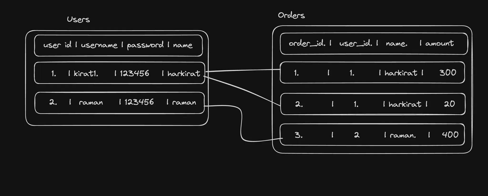
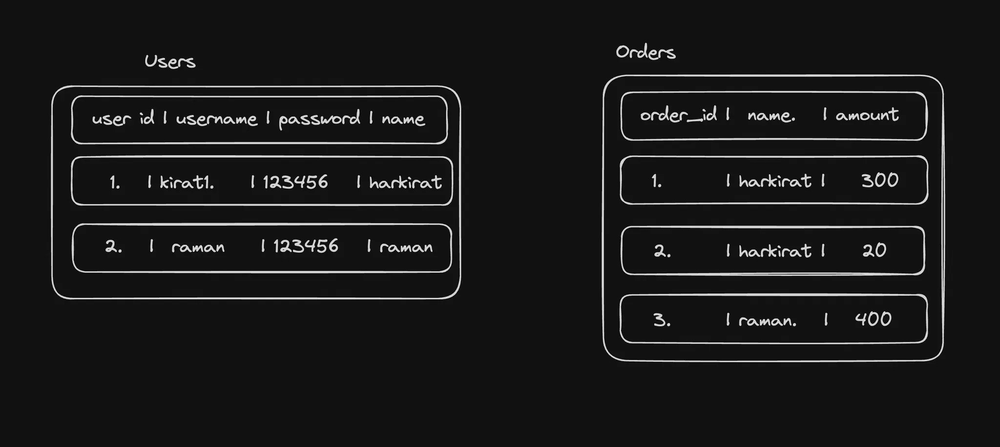
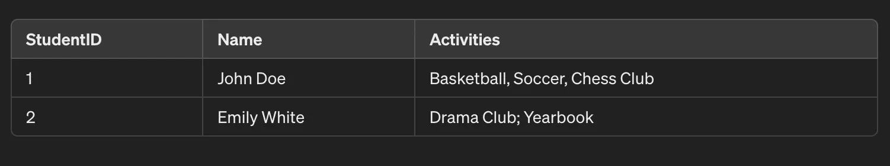
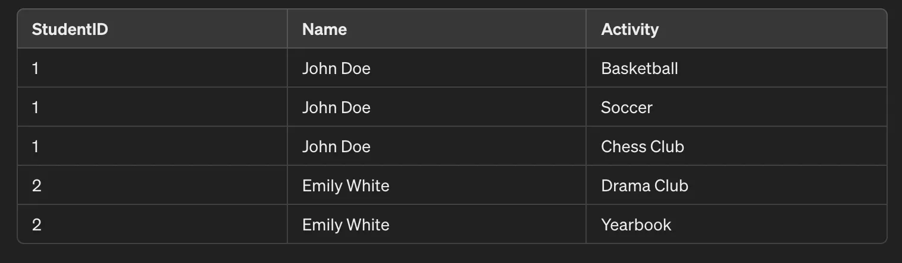
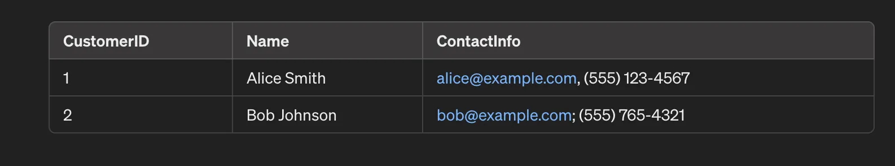
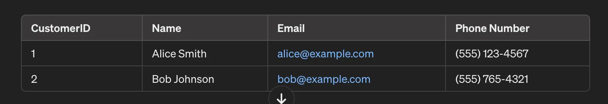
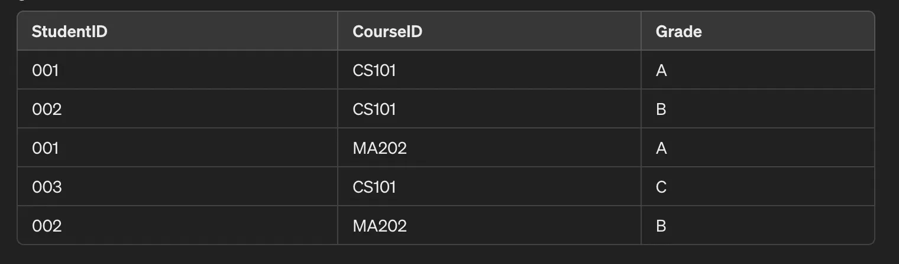
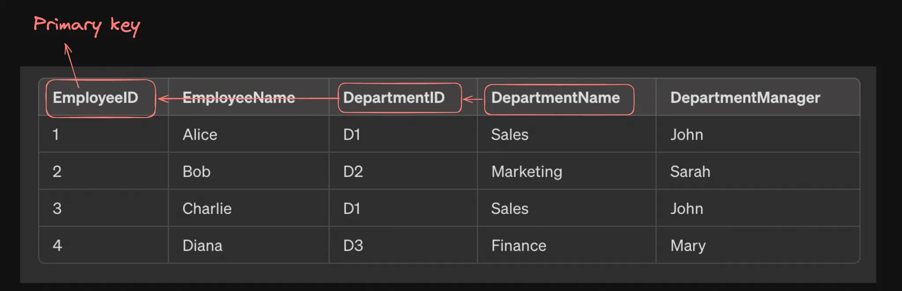
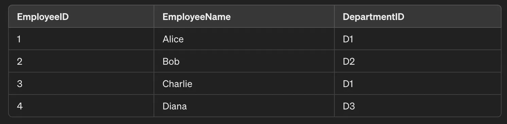
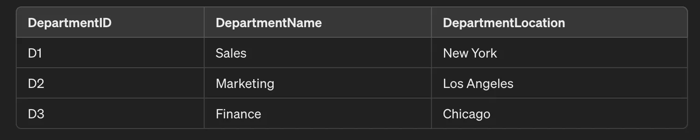

# **Normalization**

Normalization is the process of removing redundancy in your database.

## Redundancy

Redundant data means data that already exists elsewhere and we’re duplicating it in two places

For example, if you have two tables

1. users
2. user_metadata

where you do the following -

If you notice, we’ve stored the name on the order in the Orders table, when it is already present in the Users table. This is what is `redundant` data.

Notice this schema is still `full proof`. We can get all the orders given a user id. We can tell the users details (username, name) given an order id.

## Non full proof data

This data doesn’t have any relationship b/w Orders and users. This is just plain wrong. You can never tell the orders for a user (esp if 2 users can have the same name)

Normalisation is done on tables that are full proof to remove redundancy.

# Normalizing data

Normalization in databases is a systematic approach of decomposing tables to eliminate data redundancy and improve data integrity.

The process typically progresses through several normal forms, each building on the last.

When you look at a schema, you can identify if it lies in one of the following categories of normalization

1. 1NF
2. 2NF
3. 3NF
4. BCNF
5. 4NF
6. 5NF

You aim to reach 3NF/BCNF usually. The lower you go, the more normalised your table is. But over normalization can lead to excessive joins

## 1NF

- **A single cell must not hold more than one value (atomicity)**: This rule ensures that each column of a database table holds only atomic (indivisible) values, and multi-valued attributes are split into separate columns. For example, if a column is meant to store phone numbers, and a person has multiple phone numbers, each number should be in a separate row, not as a list or set in a single cell.

- **There must be a primary key for identification**: Each table should have a primary key, which is a column (or a set of columns) that uniquely identifies each row in a table
- **No duplicated rows**: To ensure that the data in the table is organised properly and to uphold the integrity of the data, each row in the table should be unique. This rule works hand-in-hand with the presence of a primary key to prevent duplicate entries which can lead to data anomalies.
- **Each column must have only one value for each row in the table**: This rule emphasizes that every column must hold only one value per row, and that value should be of the same kind for that column across all rows.

## 2NF

Ref -https://www.studytonight.com/dbms/second-normal-form.php

1NF gets rid of repeating rows. 2NF gets rid of redundancy

A table is said to be in 2NF if it meets the following criteria:

- is already in 1NF
- Has 0 partial dependency.

💡`Partial dependency - This occurs when a non-primary key attribute is dependent on part of a composite primary key, rather than on the whole primary key. In simpler terms, if your table has a primary key made up of multiple columns, a partial dependency exists if an attribute in the table is dependent only on a subset of those columns that form the primary key.
Example: Consider a table with the composite primary key (StudentID, CourseID) and other attributes like InstructorName and CourseName. If CourseName is dependent only on CourseID and not on the complete composite key (StudentID, CourseID), then CourseName has a partial dependency on the primary key. This violates 2NF.`

### Before normalization

Enrollments table

Can you spot the redundancy over here? The instructor name and course name are repeated in rows, even though the name of an instructor should be the same for a given courseID

Primary key of this table is (student_id, course_id)

CourseName and InstructorName have a `partial dependency` on `CourserID`

After normalisation

## 3NF

When a table is in 2NF, it eliminates repeating groups and redundancy, but it does not eliminate transitive partial dependency.

So, for a table to be in 3NF, it must:

- be in 2NF
- have no transitive partial dependency.

💡 `A transitive dependency** in a relational database occurs when one non-key attribute indirectly depends on the primary key through another non-key attribute.`

For example

Department name has a transitive dependency on the primary key (employee id).

To normalise to 3NF, we need to do the following

