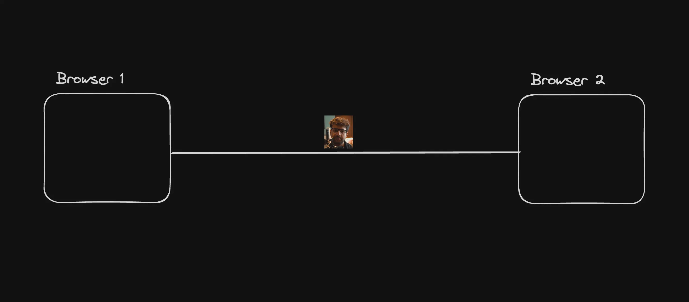
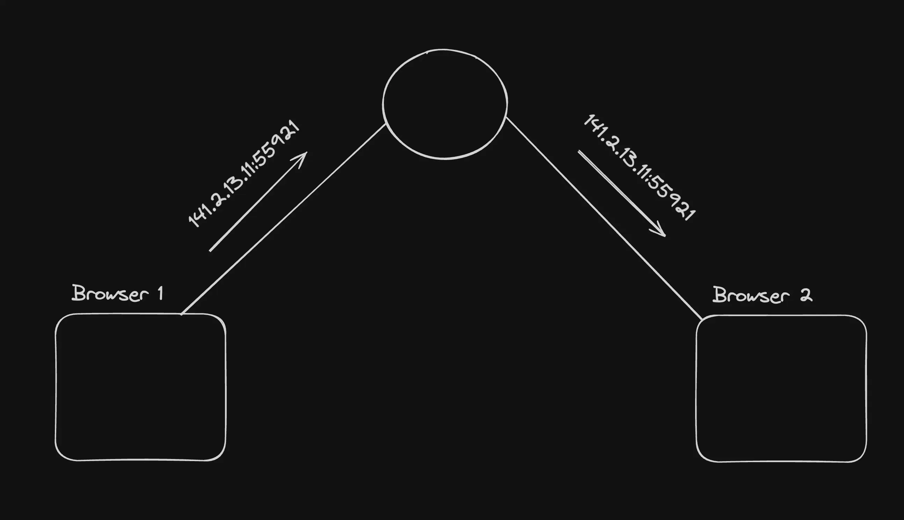
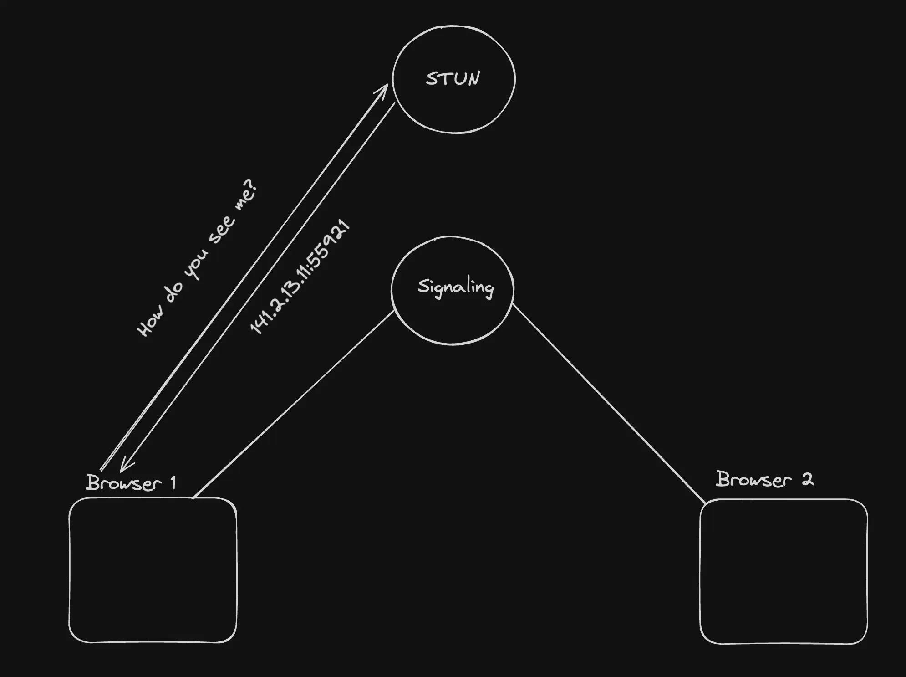
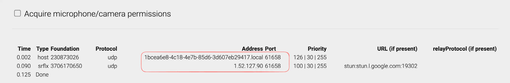
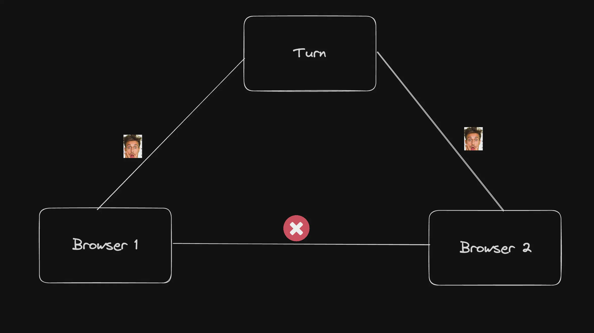
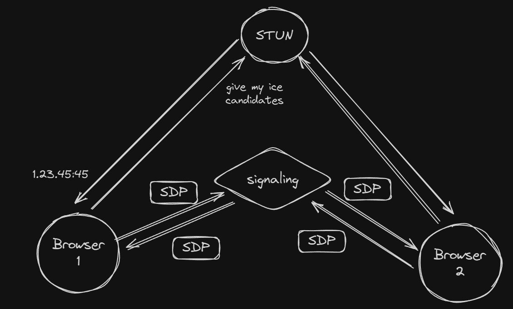
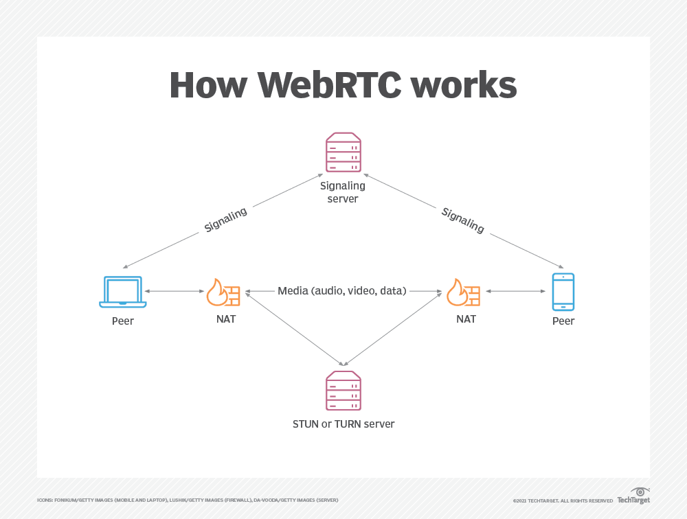
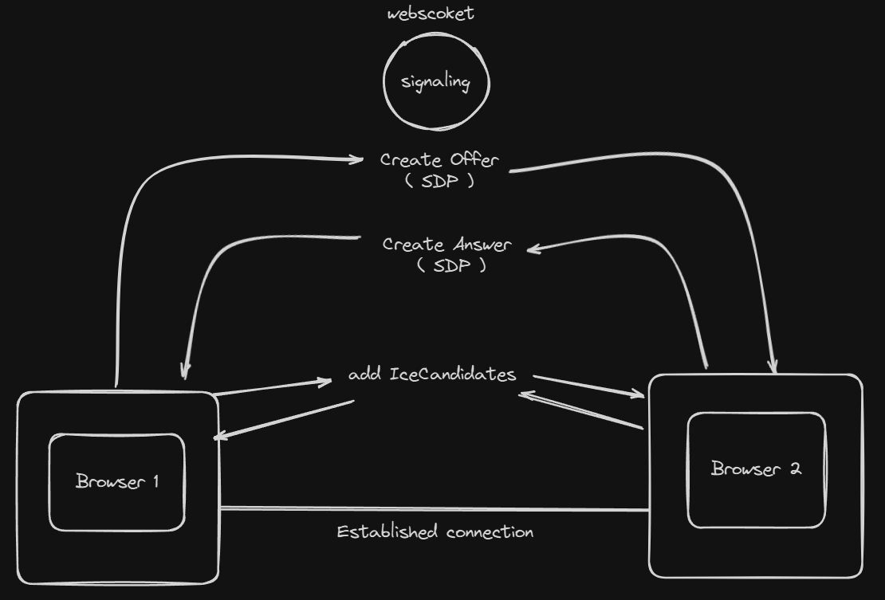
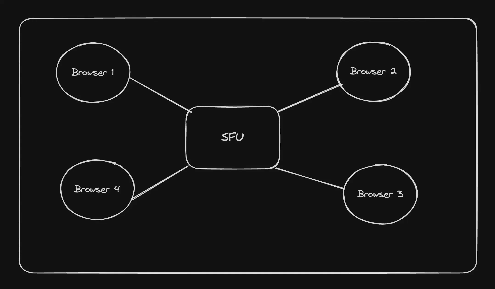
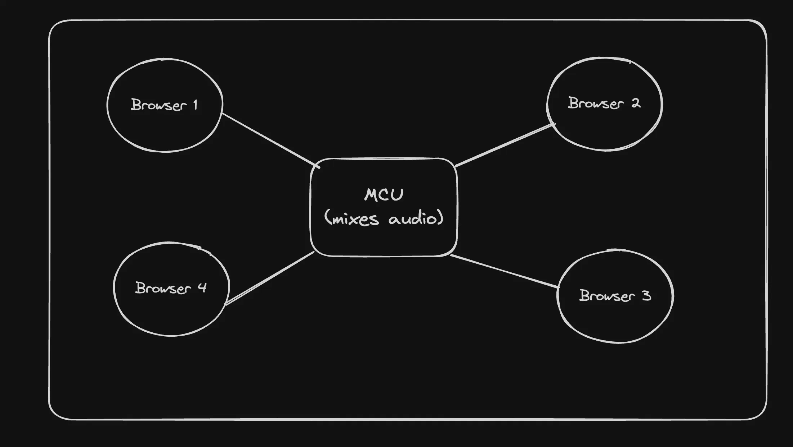

# WebRTC Overview

## Why WebRTC?
WebRTC is the core/only protocol that enables real-time media communication directly within a browser.

### Key Features:
- Enables sub-second latency.
- Used in applications like:
  - **Multi-party calls** (Zoom, Google Meet)
  - **1:1 calls** (Omegle, online teaching)
  - **Real-time data transfer** (e.g., 30FPS games)

We have already implemented this in a live stream:
- [GitHub Repository](https://github.com/hkirat/omegle/tree/master)
- [YouTube Video](https://www.youtube.com/watch?v=0MIsI2xh9Zk)

## WebRTC Architecture & Jargon

### Peer-to-Peer (P2P)
WebRTC is a **peer-to-peer** protocol, meaning media is sent directly between users without a central server. However, a central server is required for **signaling** and sometimes for **relaying media** (via a TURN server).



### Signaling Server
Before browsers can communicate, they must exchange connection details. A **signaling server** facilitates this exchange. It is typically a **WebSocket server**, but HTTP can also be used.



### STUN (Session Traversal Utilities for NAT)
A **STUN server** helps discover your **publicly accessible IP address**. It allows the browser to determine how it appears to external networks.





- Check your ICE candidates: [Trickle ICE](https://webrtc.github.io/samples/src/content/peerconnection/trickle-ice/)

### ICE Candidates (Interactive Connectivity Establishment)
ICE candidates represent potential networking endpoints for establishing a connection between peers. Examples:
- **Same network** (e.g., two friends in a hostel using WiFi) → **Private router ICE candidates**
- **Different countries** → **Public IP-based connection**

### TURN Server
If a network is too restrictive, direct peer-to-peer media transmission may be blocked. In such cases, a **TURN (Traversal Using Relays around NAT) server** is used to relay media through a known intermediary.



### Offer & Answer
- **Offer**: The first browser (initiator) sends its ICE candidates.
- **Answer**: The receiving browser sends back its ICE candidates.

### SDP (Session Description Protocol)
SDP is a **single file** containing:
- ICE candidates
- Media types and formats
- Encoding protocols

This file is sent during the **offer** and received in the **answer**.

#### Example SDP:
```sdp
v=0
o=- 423904492236154649 2 IN IP4 127.0.0.1
s=-
t=0 0
m=audio 49170 RTP/AVP 0
c=IN IP4 192.168.1.101
a=rtpmap:0 PCMU/8000
a=ice-options:trickle
a=candidate:1 1 UDP 2122260223 192.168.1.101 49170 typ host
a=candidate:2 1 UDP 2122194687 10.0.1.1 49171 typ host
a=candidate:3 1 UDP 1685987071 93.184.216.34 49172 typ srflx raddr 10.0.1.1 rport 49171
a=candidate:4 1 UDP 41819902 10.1.1.1 3478 typ relay raddr 93.184.216.34 rport 49172
```

### RTCPeerConnection
[RTCPeerConnection](https://developer.mozilla.org/en-US/docs/Web/API/RTCPeerConnection) is a browser API that:
- Manages **SDP exchange**
- Creates **offers/answers**
- Sends **media and data**

## Summary
- A **signaling server** and **STUN server** are required to establish a WebRTC connection.
- Once connected, these servers can be shut down.
- A **TURN server** is needed if users are behind a restrictive network.



# WebRTC Connection Guide

## Connecting the Two Sides

The steps to create a WebRTC connection between two sides include:

1. **Browser 1** creates an `RTCPeerConnection`.
2. **Browser 1** creates an offer.
3. **Browser 1** sets the local description to the offer.
4. **Browser 1** sends the offer to the other side through the signaling server.
5. **Browser 2** receives the offer from the signaling server.
6. **Browser 2** sets the remote description to the offer.
7. **Browser 2** creates an answer.
8. **Browser 2** sets the local description to be the answer.
9. **Browser 2** sends the answer to the other side through the signaling server.
10. **Browser 1** receives the answer and sets the remote description.

This establishes the **peer-to-peer (P2P) connection** between the two parties.





## Sending Media

To actually send media, we need to:

1. Ask for **camera/microphone permissions**.
2. Get the **audio and video streams**.
3. Call `addTrack` on the `RTCPeerConnection`.
4. This triggers an `onTrack` callback on the other side, allowing media to be received.

## WebRTC Stats

You can look at various stats and SDP logs in `about:webrtc-internals`.
Often, you may ask users to dump stats from here for better debugging.

## Using Libraries for P2P

As you can see, there are a lot of things to understand in order to build a simple app that sends video from one side to another.

There are libraries that simplify this process by hiding much of the complexity of the `RTCPeerConnection` object from you. One such library is **PeerJS**:

🔗 [PeerJS - Simplified WebRTC](https://peerjs.com/)

## Implementation

We will implement the WebRTC connection using:

### **Signaling Server (Node.js)**
The signaling server is responsible for exchanging connection metadata between peers. It will be a **WebSocket server** that supports three types of messages:

- `createOffer`
- `createAnswer`
- `addIceCandidate`

### **Frontend (React + PeerConnectionObject)**
The frontend will use **React** along with the WebRTC `RTCPeerConnection` API to establish the connection and handle media streaming.

## Reference
We are building a slightly complex version of this example: [JSFiddle WebRTC Demo](https://jsfiddle.net/rainzhao/3L9sfsvf/).

# WebRTC Architectures

There are two other popular architectures for implementing WebRTC:

- **SFU** (Selective Forwarding Unit)
- **MCU** (Multipoint Control Unit)

## Problems with P2P

Peer-to-peer (P2P) connections work well for small groups, but they have scalability issues:

- Doesn’t scale well beyond 3-4 people in the same call.

## SFU (Selective Forwarding Unit)

SFU stands for **Selective Forwarding Unit**. It acts as a central media server that forwards packets between users without processing or mixing the media.



### Popular Open Source SFUs:

- [mediasoup](https://github.com/versatica/mediasoup)
- [Pion WebRTC](https://github.com/pion/webrtc) (not exactly an SFU, but can be used to build one)

## MCU (Multipoint Control Unit)

MCU **mixes** audio and video streams together on the server before forwarding them to participants. This process requires:

- Decoding video/audio (using tools like `ffmpeg`)
- Mixing media (creating a video canvas and a single audio stream)
- Sending the merged audio/video stream to all participants


