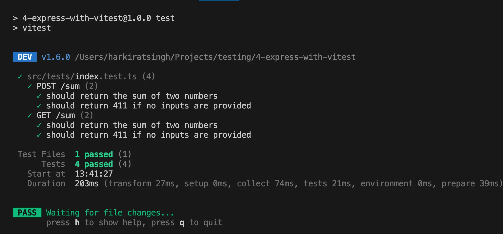
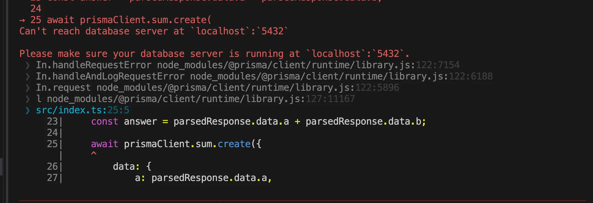

# Testing in Node.js + Express

One of the core things to do while writing your code is testing it. It’s highly ignored in most codebases, but we’re going to try to get close to how testing happens in MERN stack codebases.

## Goal

- How to test an Express backend
- Mocking, spying, Jest, Vitest
- Unit tests vs Integration tests vs End-to-End tests
- How to integrate testing and coverage in CI/CD

## Final Code for the overall week

- [Final code](https://github.com/100xdevs-cohort-2/week-24-testing/)

---

## Jest: A Popular Testing Framework for TypeScript

### Initialize a Simple TypeScript Project

```sh
npm init -y
npx tsc --init
```

### Modify `tsconfig.json`

```json
"rootDir": "./src",
"outDir": "./dist",
```

### Create `src/index.ts`

```ts
export function sum(a: number, b: number) {
  return a + b;
}
```

### Install `ts-jest` Dependencies

```sh
npm install --save-dev ts-jest @jest/globals
```

### Initialize Jest Configuration

```sh
npx ts-jest config:init
```

### Update `package.json`

```json
"scripts": {
    "test": "jest"
}
```

### Add Tests (`index.test.ts`)

```ts
import { describe, expect, test } from "@jest/globals";
import { sum } from "../index";

describe("sum module", () => {
  test("adds 1 + 2 to equal 3", () => {
    expect(sum(1, 2)).toBe(3);
  });
});
```

### Run Tests

```sh
npm run test
```

---

## Testing an Express App

[Github Repo](https://github.com/100xdevs-cohort-2/week-24-testing/tree/main/2-simple-express-app)

### Initialize a Simple TypeScript Project

```sh
npm init -y
npx tsc --init
```

### Modify `tsconfig.json`

```json
"rootDir": "./src",
"outDir": "./dist",
```

### Install Dependencies

```sh
npm install --save-dev ts-jest @jest/globals @types/express
npm i supertest @types/supertest
npm install express
```

### Initialize Jest Configuration

```sh
npx ts-jest config:init
```

### Create `src/index.ts`

```ts
import express from "express";

export const app = express();
app.use(express.json());

app.post("/sum", (req, res) => {
  const a = req.body.a;
  const b = req.body.b;
  const answer = a + b;
  res.json({ answer });
});
```

### Update `package.json`

```json
"scripts": {
    "test": "jest"
}
```

### Add Tests (`tests/sum.test.ts`)

```ts
import { describe, expect, test, it } from "@jest/globals";
import request from "supertest";
import { app } from "../index";

describe("POST /sum", () => {
  it("should return the sum of two numbers", async () => {
    const res = await request(app).post("/sum").send({ a: 1, b: 2 });
    expect(res.statusCode).toBe(200);
    expect(res.body.answer).toBe(3);
  });
});
```

### Update `jest.config.js`

```js
/** @type {import('ts-jest').JestConfigWithTsJest} */
module.exports = {
  preset: "ts-jest",
  testEnvironment: "node",
  testMatch: ["<rootDir>/src/tests/**/*.ts"],
};
```

---

## Slightly More Complex Endpoint with `zod`

[Github Repo](https://github.com/100xdevs-cohort-2/week-24-testing/tree/main/3-express-with-zod)

### Install `zod`

```sh
npm install zod
```

### Update `index.ts`

```ts
import express from "express";
import { z } from "zod";

export const app = express();
app.use(express.json());

const sumInput = z.object({
  a: z.number(),
  b: z.number(),
});

app.post("/sum", (req, res) => {
  const parsedResponse = sumInput.safeParse(req.body);
  if (!parsedResponse.success) {
    return res.status(411).json({ message: "Incorrect inputs" });
  }
  const answer = parsedResponse.data.a + parsedResponse.data.b;
  res.json({ answer });
});

app.get("/sum", (req, res) => {
  const parsedResponse = sumInput.safeParse({
    a: Number(req.headers["a"]),
    b: Number(req.headers["b"]),
  });
  if (!parsedResponse.success) {
    return res.status(411).json({ message: "Incorrect inputs" });
  }
  const answer = parsedResponse.data.a + parsedResponse.data.b;
  res.json({ answer });
});
```

### Update `sum.test.ts`

```ts
import { describe, expect, test, it } from "@jest/globals";
import request from "supertest";
import { app } from "../index";

describe("POST /sum", () => {
  it("should return the sum of two numbers", async () => {
    const res = await request(app).post("/sum").send({ a: 1, b: 2 });
    expect(res.statusCode).toBe(200);
    expect(res.body.answer).toBe(3);
  });

  it("should return 411 if no inputs are provided", async () => {
    const res = await request(app).post("/sum").send({});
    expect(res.statusCode).toBe(411);
    expect(res.body.message).toBe("Incorrect inputs");
  });
});

describe("GET /sum", () => {
  it("should return the sum of two numbers", async () => {
    const res = await request(app).get("/sum").set({ a: "1", b: "2" }).send();
    expect(res.statusCode).toBe(200);
    expect(res.body.answer).toBe(3);
  });

  it("should return 411 if no inputs are provided", async () => {
    const res = await request(app).get("/sum").send();
    expect(res.statusCode).toBe(411);
  });
});
```

# Moving from jest to vitest

## Overview

This is a simple Express project that uses Vitest for testing. The project demonstrates setting up an Express app, writing tests with Vitest, and integrating a database using Prisma.

## Why Vitest?

Vitest is a powerful and highly compatible alternative to Jest, especially for TypeScript projects. It offers several benefits over Jest, such as:

- Faster execution times
- Native support for TypeScript
- Better compatibility with modern development workflows

Learn more about why Vitest is a great choice: [Why Vitest?](https://vitest.dev/guide/why.html)

## Project Setup

### Initializing the Express App

```sh
npm init -y
npx tsc --init
npm install express @types/express zod
```

### Updating `tsconfig.json`

Modify the following properties:

```json
"rootDir": "./src",
"outDir": "./dist"
```

### Writing a Simple Express Server (`src/index.ts`)

```ts
import express from "express";
import { z } from "zod";

export const app = express();
app.use(express.json());

const sumInput = z.object({
  a: z.number(),
  b: z.number(),
});

app.post("/sum", (req, res) => {
  const parsedResponse = sumInput.safeParse(req.body);

  if (!parsedResponse.success) {
    return res.status(411).json({ message: "Incorrect inputs" });
  }

  const answer = parsedResponse.data.a + parsedResponse.data.b;
  res.json({ answer });
});

app.get("/sum", (req, res) => {
  const parsedResponse = sumInput.safeParse({
    a: Number(req.headers["a"]),
    b: Number(req.headers["b"]),
  });

  if (!parsedResponse.success) {
    return res.status(411).json({ message: "Incorrect inputs" });
  }

  const answer = parsedResponse.data.a + parsedResponse.data.b;
  res.json({ answer });
});
```

> **Note:** We do not include `app.listen()` in this file to ensure the app does not start when tests are running.

## Installing Vitest

```sh
npm i -D vitest
```

### Adding a Simple Test (`test/index.test.ts`)

```ts
import { expect, test } from "vitest";

test("true === true", () => {
  expect(true).toBe(true);
});
```

### Adding Test Script to `package.json`

```json
"scripts": {
  "test": "vitest"
}
```


## Testing API Endpoints with Supertest

### Installing Supertest

```sh
npm i supertest @types/supertest
```

### Writing API Tests (`test/index.test.ts`)

```ts
import { describe, expect, test, it } from "vitest";
import request from "supertest";
import { app } from "../index";

describe("POST /sum", () => {
  it("should return the sum of two numbers", async () => {
    const res = await request(app).post("/sum").send({ a: 1, b: 2 });
    expect(res.statusCode).toBe(200);
    expect(res.body.answer).toBe(3);
  });

  it("should return 411 if no inputs are provided", async () => {
    const res = await request(app).post("/sum").send({});
    expect(res.statusCode).toBe(411);
    expect(res.body.message).toBe("Incorrect inputs");
  });
});
```



## Adding a Database with Prisma

### Installing Prisma and Initializing

```sh
npm i prisma
npx prisma init
```

### Defining the Schema (`prisma/schema.prisma`)

```prisma
model Sum {
  id      Int @id @default(autoincrement())
  a       Int
  b       Int
  result  Int
}
```

### Generating Prisma Client

```sh
npx prisma generate
```

### Creating a Prisma Client (`src/db.ts`)

```ts
import { PrismaClient } from "@prisma/client";
export const prismaClient = new PrismaClient();
```

### Updating Express Server to Store Data in DB

```ts
import express from "express";
import { z } from "zod";
import { prismaClient } from "./db";

export const app = express();
app.use(express.json());

const sumInput = z.object({
  a: z.number(),
  b: z.number(),
});

app.post("/sum", async (req, res) => {
  const parsedResponse = sumInput.safeParse(req.body);

  if (!parsedResponse.success) {
    return res.status(411).json({ message: "Incorrect inputs" });
  }

  const answer = parsedResponse.data.a + parsedResponse.data.b;

  await prismaClient.sum.create({
    data: {
      a: parsedResponse.data.a,
      b: parsedResponse.data.b,
      result: answer,
    },
  });

  res.json({ answer });
});
```

Notice how the tests begin to error out now


## Mocking Dependencies in Tests

### Why Mock?

When writing unit tests, we mock external service calls to:

1. Avoid starting an actual database or external services.
2. Ensure test results are reliable and isolated.


### Create a mock


### Mocking Prisma Client

To mock Prisma Client, add the following to `test/index.test.ts`:

```ts
import { vi } from "vitest";

vi.mock("../db", () => ({
  prismaClient: { sum: { create: vi.fn() } },
}));
```

Now, when tests are run, the `prismaClient.sum.create` function is mocked to return `undefined` instead of making a real database call.

## Running Tests

```sh
npm run test
```


## Problems

- Can you guess the two problems that exist here?

1. What if I want to use the value that the database call returns? Right now, it will return `undefined` while a real DB call would return some real data

2. I have to constantly keep upgrading the `mock`since in the future I might use the `findOne` function, then might add a new table called users …

# Deep Mocking

Another way to mock variables is to let Vitest figure out the types and mock out all the attributes of the object being mocked.


For example, the `prismaClient` object has a lot of functions:

```js
console.log(Object.keys(prismaClient));
```

### What if we could mock out all these keys in a single function call?

## Deep Mocking

### Install `vitest-mock-extended`

```sh
npm i -D vitest-mock-extended
```

### Create `__mocks__/db.ts`

```ts
import { PrismaClient } from "@prisma/client";
import { beforeEach } from "vitest";
import { mockDeep, mockReset } from "vitest-mock-extended";

export const prismaClient = mockDeep<PrismaClient>();
```

### Remove the mock in `index.test.ts`

Replace the manual mock with:

```ts
vi.mock("../db");
```

### Try running the tests

```sh
npm run test
```


## Problem: Using Return Value from Database Call

```ts
import express from "express";
import { z } from "zod";
import { prismaClient } from "./db";

export const app = express();
app.use(express.json());

const sumInput = z.object({
  a: z.number(),
  b: z.number(),
});

app.post("/sum", async (req, res) => {
  const parsedResponse = sumInput.safeParse(req.body);

  if (!parsedResponse.success) {
    return res.status(411).json({ message: "Incorrect inputs" });
  }

  const answer = parsedResponse.data.a + parsedResponse.data.b;

  const response = await prismaClient.sum.create({
    data: {
      a: parsedResponse.data.a,
      b: parsedResponse.data.b,
      result: answer,
    },
  });

  res.json({ answer, id: response.id });
});
```


## Mocking Return Values

You can mock return values using `mockResolvedValue`.

### Update `index.test.ts`

```ts
import { prismaClient } from "../__mocks__/db";

prismaClient.sum.create.mockResolvedValue({
  id: 1,
  a: 1,
  b: 1,
  result: 3,
});
```

## Final `index.test.ts`

```ts
import { describe, expect, test, it, vi } from "vitest";
import request from "supertest";
import { app } from "../index";
import { prismaClient } from "../__mocks__/db";

vi.mock("../db");

describe("POST /sum", () => {
  it("should return the sum of two numbers", async () => {
    prismaClient.sum.create.mockResolvedValue({ id: 1, a: 1, b: 1, result: 3 });

    const res = await request(app).post("/sum").send({ a: 1, b: 2 });
    expect(res.statusCode).toBe(200);
    expect(res.body.answer).toBe(3);
  });

  it("should return 411 if no inputs are provided", async () => {
    const res = await request(app).post("/sum").send({});
    expect(res.statusCode).toBe(411);
    expect(res.body.message).toBe("Incorrect inputs");
  });
});
```

💡We only need to mock in one of the tests because in the second one, control never reaches the place where `id` is needed

## Spies vs Mocks

Mocks let you replace the functionality of a function call, while spies allow you to observe function calls.

### Problem: Incorrect Inputs Still Pass Tests

Flipping `a` and `b` in `prismaClient.sum.create` still results in passing tests.

```
const response = await prismaClient.sum.create({
    data: {
        a: parsedResponse.data.b,
        b: parsedResponse.data.a,
        result: answer
    }
})
```

Try running the tests, they would still work

```
npm run test
```
This means our tests are flaky. They succeed even when the code is incorrect

### Solution: Use a Spy

```ts
it("should return the sum of two numbers", async () => {
  prismaClient.sum.create.mockResolvedValue({ id: 1, a: 1, b: 1, result: 3 });

  vi.spyOn(prismaClient.sum, "create");

  const res = await request(app).post("/sum").send({ a: 1, b: 2 });

  expect(prismaClient.sum.create).toHaveBeenCalledWith({
    data: {
      a: 1,
      b: 2,
      result: 3,
    },
  });

  expect(res.statusCode).toBe(200);
  expect(res.body.answer).toBe(3);
});
```

### Notice: The tests begin to fail!


Revert the application logic:

```ts
const response = await prismaClient.sum.create({
  data: {
    a: parsedResponse.data.a,
    b: parsedResponse.data.b,
    result: answer,
  },
});
```

## Adding a CI/CD Pipeline

### Create `.github/workflows/test.yml`

```yaml
name: CI/CD Pipeline

on:
  pull_request:
    branches:
      - main

jobs:
  build:
    runs-on: ubuntu-latest

    steps:
      - name: Checkout code
        uses: actions/checkout@v2

      - name: Set up Node.js
        uses: actions/setup-node@v2
        with:
          node-version: 20

      - name: Install dependencies
        working-directory: 5-express-vitest-prisma
        run: npm install && npx prisma generate

      - name: Run tests
        working-directory: 5-express-vitest-prisma
        run: npm run test
```

## Unit Tests vs Integration Tests vs End-to-End Tests

### Unit Tests

Mocking external services (DBs, Kafka, Redis) means you're testing just the functionality of the method.

### Integration Tests

If you don’t mock out these services but actually start them locally, it is considered an integration test.

### End-to-End Tests

For full-stack apps where you open a browser and test workflows, it's called an end-to-end test.

---

🔗 **Final Code:** [GitHub Repository](https://github.com/100xdevs-cohort-2/week-24-testing)

🔗 **Pull Requests:**

- [PR #1](https://github.com/100xdevs-cohort-2/week-24-testing/pull/2)
- [PR #2](https://github.com/100xdevs-cohort-2/week-24-testing/pull/3)
