## 2nd Part of week 26

```markdown
# 📈 Advanced Prometheus Metrics in Node.js

This README documents how to add more advanced Prometheus metrics — like **Gauge** and **Histogram** — to a Node.js application using the `prom-client` library. It also shows how to **containerize** the application and configure **Prometheus** to scrape data for visualization.

---

## 📌 Gauge Metrics

Let’s add a **Gauge** metric to track the number of active requests.

### Step 1: Create `metrics/activeRequests.ts`

```ts
import client from "prom-client";

export const activeRequestsGauge = new client.Gauge({
    name: 'active_requests',
    help: 'Number of active requests'
});
```

---

### Step 2: Use It in `metrics/index.ts`

```ts
import { NextFunction, Request, Response } from "express";
import { requestCounter } from "./requestCount";
import { activeRequestsGauge } from "./activeRequests";

export const cleanupMiddleware = (req: Request, res: Response, next: NextFunction) => {
    const startTime = Date.now();
    activeRequestsGauge.inc();

    res.on('finish', function() {
        const endTime = Date.now();
        console.log(`Request took ${endTime - startTime}ms`);
        
        requestCounter.inc({
            method: req.method,
            route: req.route ? req.route.path : req.path,
            status_code: res.statusCode
        });

        activeRequestsGauge.dec();
    });
};
```

---

### Step 3: Add Delay for Testing

```ts
app.get("/user", async (req, res) => {
    await new Promise((resolve) => setTimeout(resolve, 1000));
    res.send({ name: "John Doe", age: 25 });
});
```

Then hit the `/user` endpoint a few times.

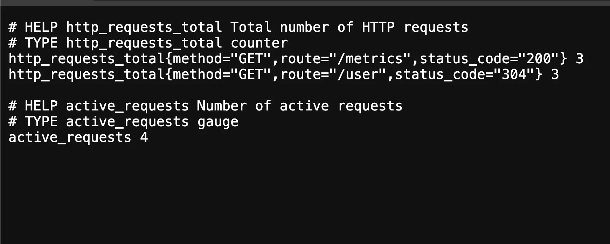

---

## 📊 Histograms

Histograms allow you to measure **request durations** in pre-defined buckets.

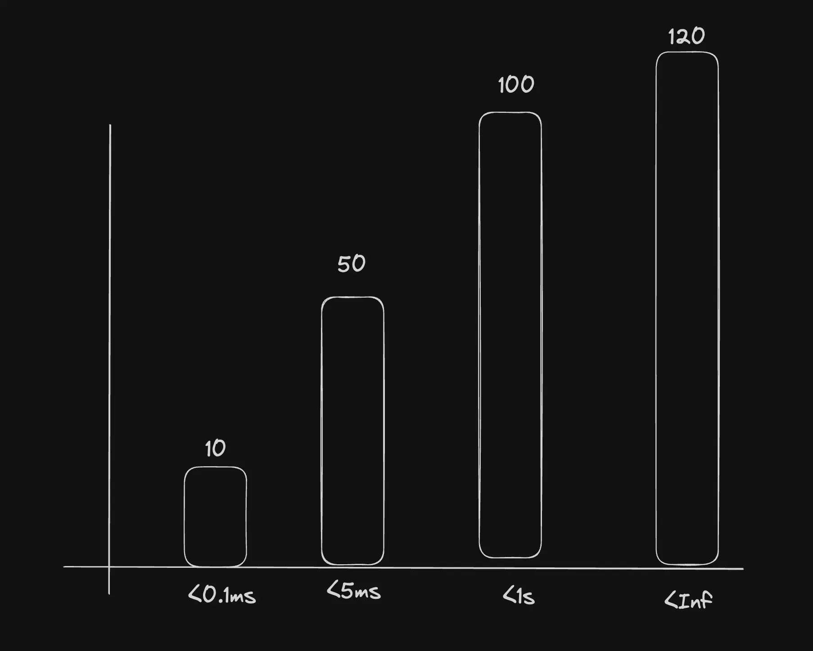

### Add in `metrics/requestCount.ts`

```ts
import client from "prom-client";

export const httpRequestDurationMicroseconds = new client.Histogram({
    name: 'http_request_duration_ms',
    help: 'Duration of HTTP requests in ms',
    labelNames: ['method', 'route', 'code'],
    buckets: [0.1, 5, 15, 50, 100, 300, 500, 1000, 3000, 5000]
});
```

> 💡 Buckets represent ranges: requests below 0.1ms, 5ms, 15ms, etc.

---

### Update `metrics/index.ts`

```ts
import { requestCounter } from "./requestCount";
import { activeRequestsGauge } from "./activeRequests";
import { httpRequestDurationMicroseconds } from "./requestTime";

export const metricsMiddleware = (req, res, next) => {
    const startTime = Date.now();
    activeRequestsGauge.inc();

    res.on('finish', () => {
        const endTime = Date.now();
        const duration = endTime - startTime;

        requestCounter.inc({
            method: req.method,
            route: req.route ? req.route.path : req.path,
            status_code: res.statusCode
        });

        httpRequestDurationMicroseconds.observe({
            method: req.method,
            route: req.route ? req.route.path : req.path,
            code: res.statusCode
        }, duration);

        activeRequestsGauge.dec();
    });

    next();
};
```

---

### Metrics Output Example

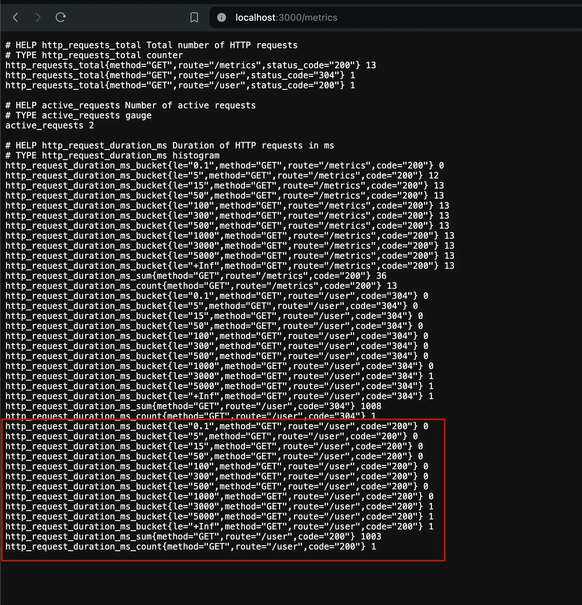

Explanation:
```
Requests handled in < 0.1ms: 0
Requests handled in < 5ms: 0
Requests handled in < 15ms: 0
Requests handled in < 50ms: 0
...
Requests handled in < 3000ms: 1
Requests handled in < 5000ms: 1
```

---

### 🔗 Final Code

📁 [GitHub Repo](https://github.com/100xdevs-cohort-2/week-26-prom)  
🌐 [Live Metrics Viewer](https://prom.100xdevs.com/metrics)

---

## 🚀 Running Prometheus

Now let’s actually start Prometheus to scrape your Node.js metrics.

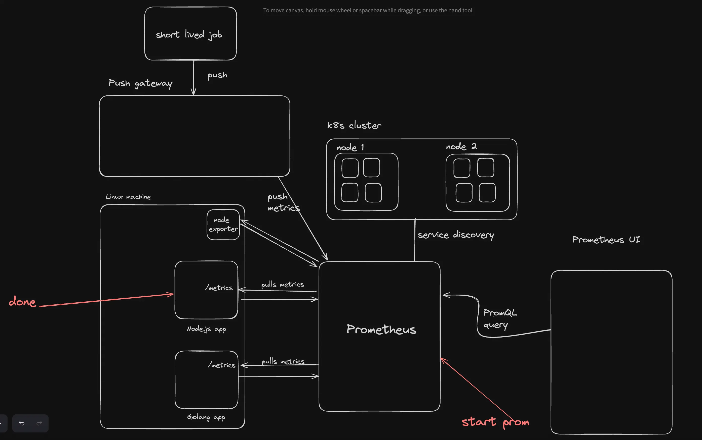

### Prometheus Configuration (`prometheus.yml`)

```yaml
global:
  scrape_interval: 15s

scrape_configs:
  - job_name: 'nodejs-app'
    static_configs:
      - targets: ['localhost:3000']
```

---

### Run Prometheus with Docker

```bash
docker run -p 9090:9090 \
  -v ./prometheus.yml:/etc/prometheus/prometheus.yml \
  prom/prometheus
```

---

### Troubleshooting

If you see errors in **Targets**:

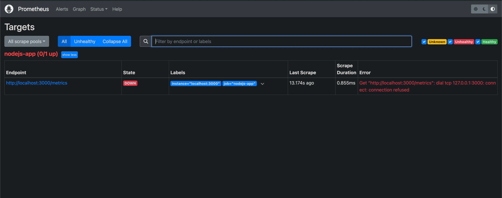  
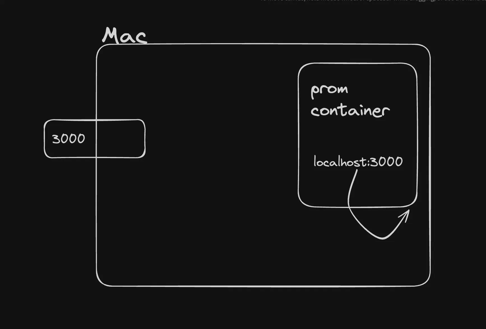

> 💡 Prometheus running in Docker can’t access your local app on port 3000 unless both are in the **same Docker network**.

---

## 📦 Containerizing the App

### Dockerfile

```Dockerfile
FROM node:20

WORKDIR /usr/src/app

COPY package*.json ./
RUN npm install

COPY . .

EXPOSE 3000
CMD [ "node", "app.js" ]
```

---

### docker-compose.yml

```yaml
version: '3.8'

services:
  node-app:
    build: ./
    ports:
      - "3000:3000"
    networks:
      - monitoring

  prometheus:
    image: prom/prometheus:latest
    volumes:
      - ./:/etc/prometheus
    ports:
      - "9090:9090"
    networks:
      - monitoring

networks:
  monitoring:
```

Update `prometheus.yml`:

```yaml
scrape_configs:
  - job_name: 'nodejs-app'
    static_configs:
      - targets: ['node-app:3000']
```

---

### Start Everything

```bash
docker-compose up
```

Access Prometheus:  
🔗 [http://localhost:9090](http://localhost:9090)

---

## 📉 Querying in Prometheus

### Basic Queries

1. **All HTTP requests by route**
   ```
   http_requests_total
   ```

2. **Total number of HTTP requests**
   ```
   sum(http_requests_total)
   ```

3. **Total duration of requests**
   ```
   http_request_duration_ms_sum
   ```

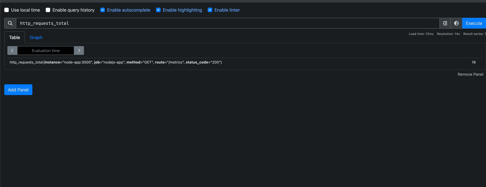  
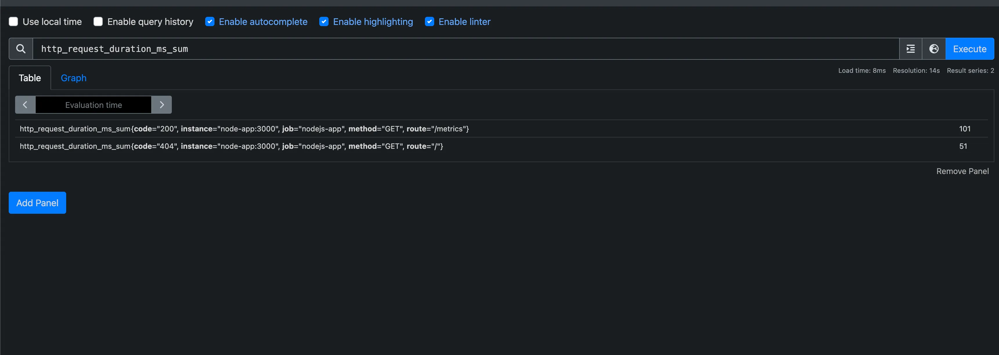  
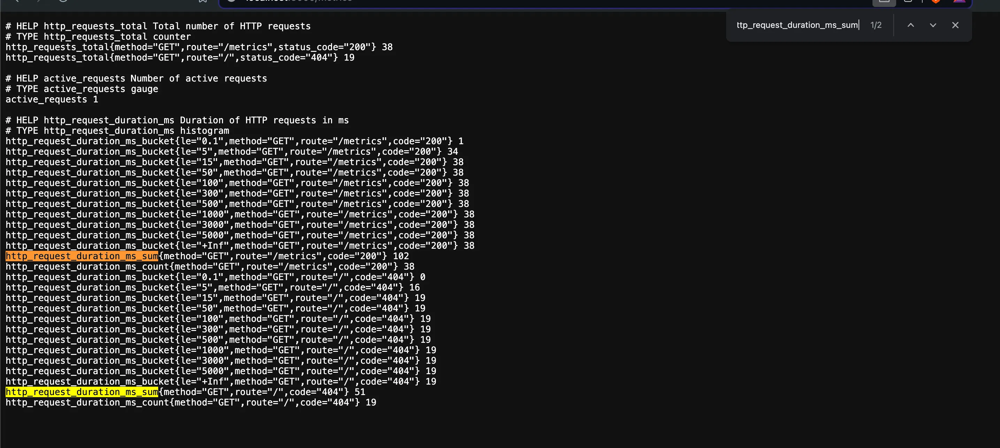

4. **Request count**
   ```
   http_request_duration_ms_count
   ```

5. **Average request time**
   ```
   http_request_duration_ms_sum / http_request_duration_ms_count
   ```

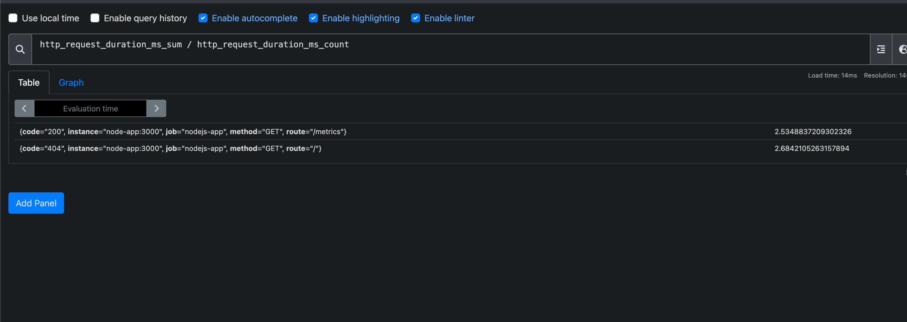

---

### Histogram Queries

1. Request duration in buckets:
   ```
   http_request_duration_ms_bucket
   ```

2. For a specific route:
   ```
   http_request_duration_ms_bucket{method="GET", route="/metrics", code="200"}
   ```

---

## 📊 Prometheus Graphs

### 1. Total requests
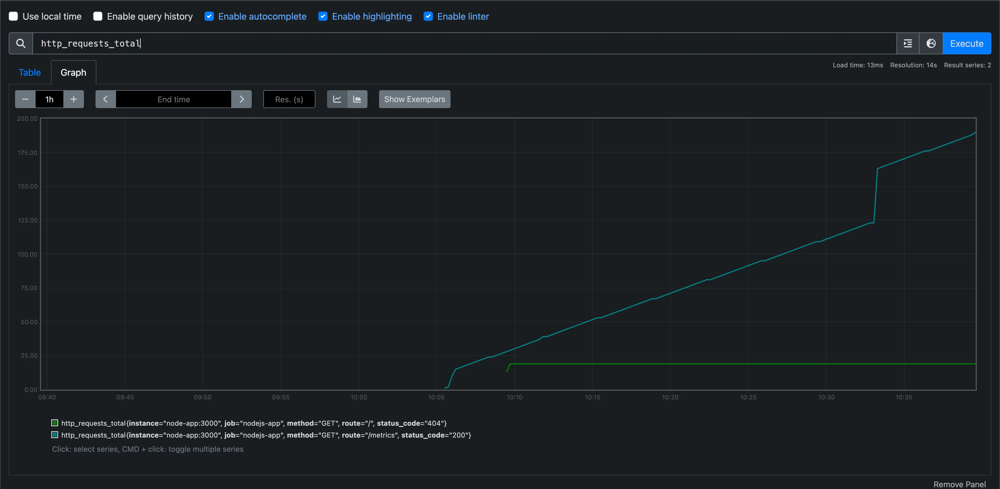

> 💡 This is cumulative. Not ideal for rate-based insights.

---

### 2. Request rate
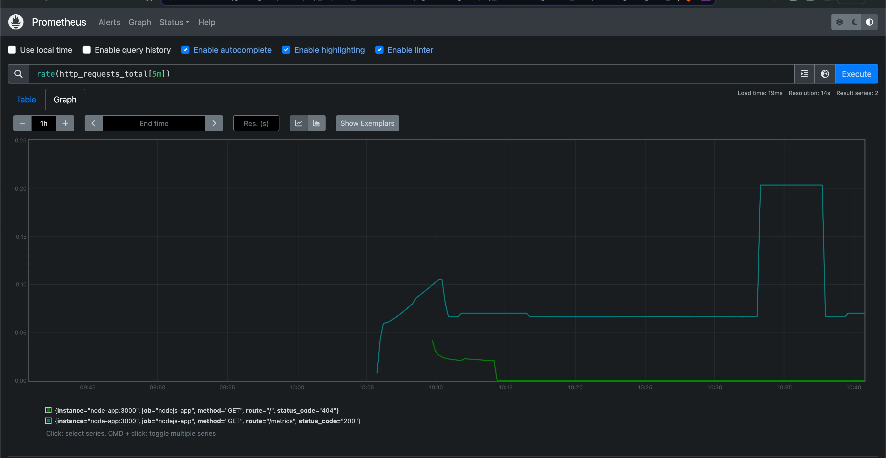

---

### 3. Request rate across all endpoints
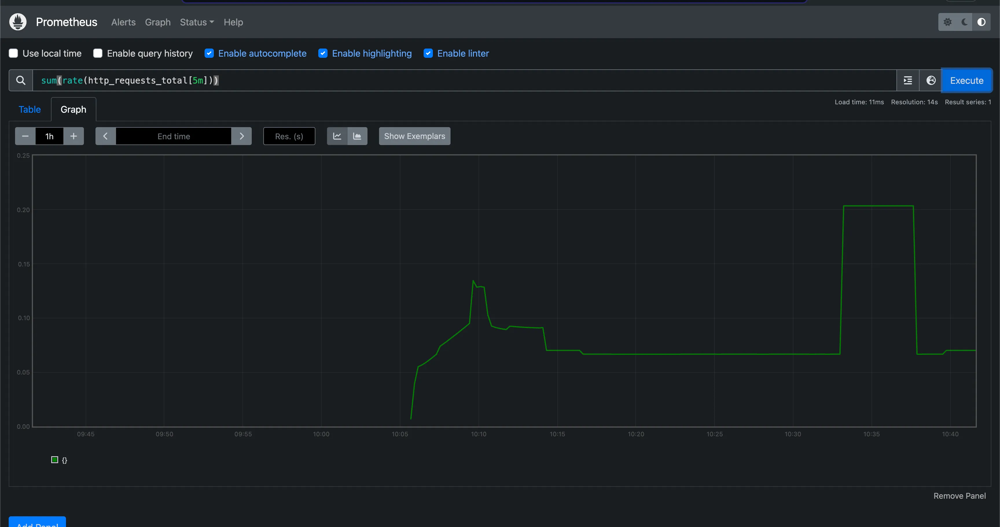

---

### 4. Avg request time (5m bucket)
```promql
rate(http_request_duration_ms_sum[5m]) / rate(http_request_duration_ms_count[5m])
```

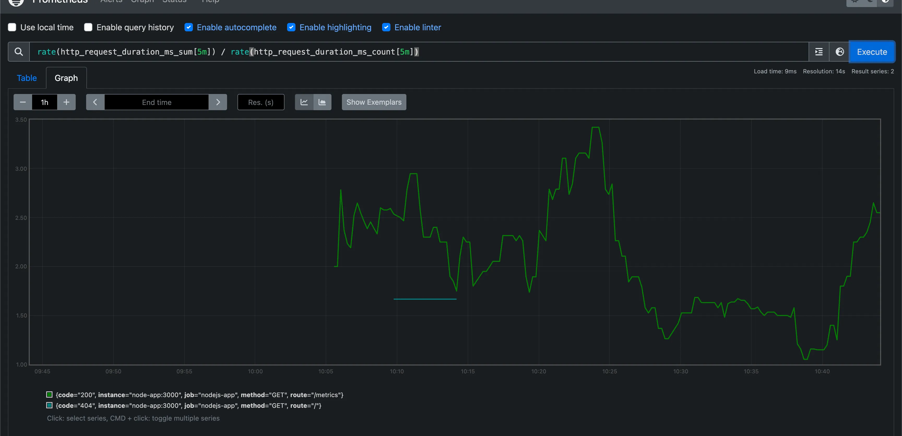

---

## ✅ Summary

- ✅ Added **Gauge** and **Histogram** metrics in Node.js.
- ✅ Visualized them in Prometheus.
- ✅ Containerized the full setup using Docker Compose.
- ✅ Explored queries and graphing in Prometheus UI.

---

