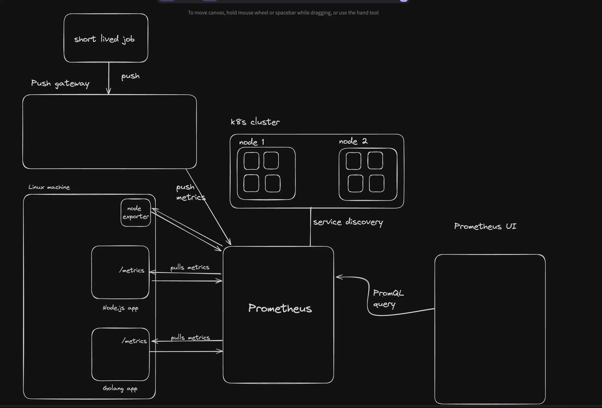
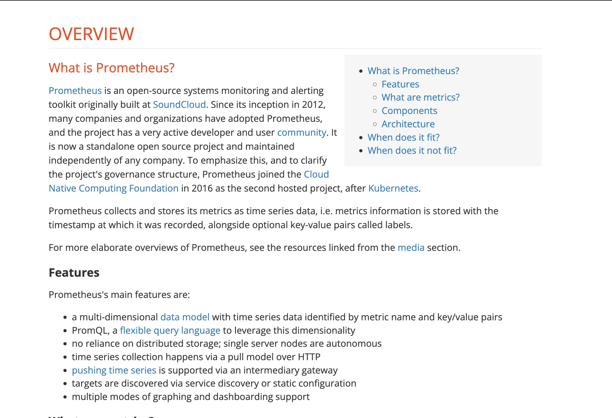
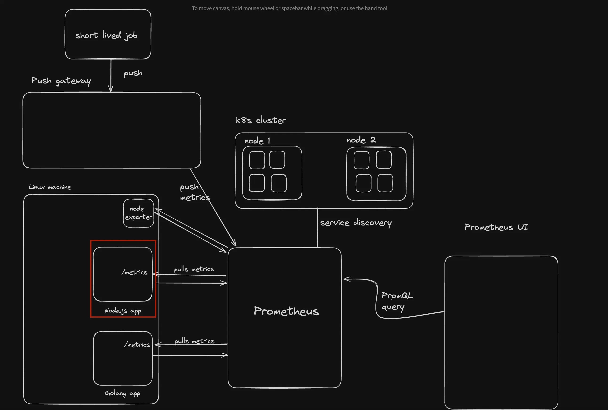
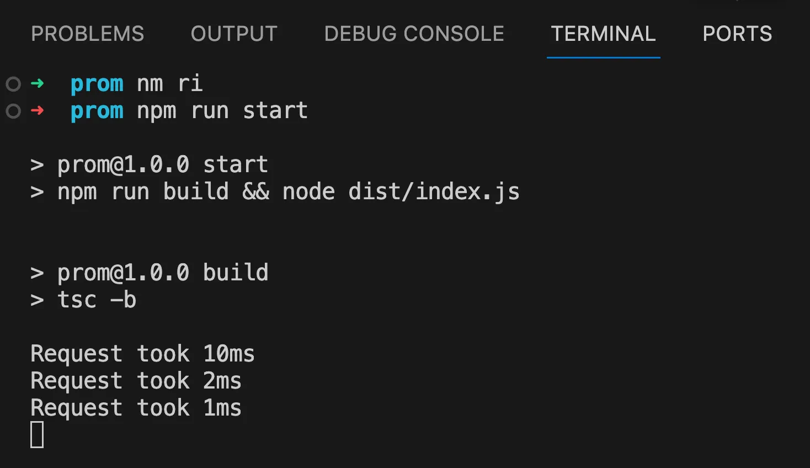
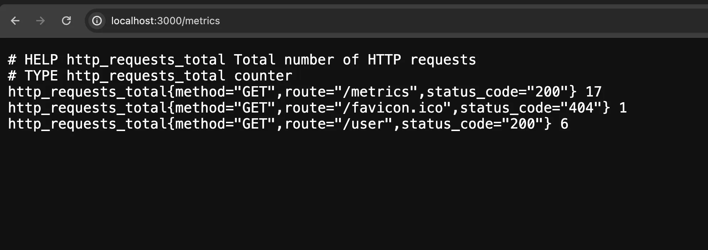

## 1st part of week 26

```markdown
# Prometheus

## Prometheus Architecture

Prometheus is a time-series database. It can monitor your:

- Processes (Node, Go, Rust…)
- Hosts



More details: [Prometheus Overview](https://prometheus.io/docs/introduction/overview/)



---

## 🔹 Key Features

### 1. **Multi-dimensional Data Model**
Prometheus stores data in a time series format where each data point consists of:

- **Metric Name**: Identifies the type of data, e.g., `http_requests_total`.
- **Labels (Key/Value Pairs)**: Add dimensions for flexible querying, e.g., `method="GET"` and `handler="/api"`.

---

### 2. **PromQL** – A Flexible Query Language

Allows querying over your time-series data.

Example:

```promql
sum(http_requests_total{job="api-server", status="500"})
````

Returns all HTTP requests with status code 500 handled by your API server.

---

### 3. **No Reliance on Distributed Storage**

* Prometheus is a standalone system.
* Each server is autonomous (scrape, store, and query independently).
* Horizontal scalability can be achieved through sharding.

---

### 4. **Pull-based Data Collection**

* Prometheus **scrapes metrics** from targets over HTTP via the `/metrics` endpoint.
* This enables control over intervals and retries.

---

### 5. **Push Support via Gateway**

* **Pushgateway** lets applications or batch jobs push metrics.
* Prometheus scrapes the Pushgateway instead of the job directly.

---

### 6. **Service Discovery / Static Configuration**

* **Service Discovery**: Integrates with Kubernetes, AWS, Consul, etc.
* **Static Configuration**: Manually define targets in config files.

---

### 7. **Graphing and Dashboarding**

* **Prometheus UI**: Built-in for ad-hoc queries.
* **Grafana**: Rich dashboard integration.
* **Alertmanager**: Alerting and notifications.

---

## 🛠️ Adding Raw Metrics to an Express App

We’ll build an Express app that exports metrics.



---

### 1. **Initialize a TypeScript Project**

```bash
npm init -y
npx tsc --init
```

Update `tsconfig.json`:

```json
"rootDir": "./src",
"outDir": "./dist"
```

Install dependencies:

```bash
npm install express @types/express
```

---

### 2. **Create Basic Server**

`src/index.ts`:

```ts
import express from "express";

const app = express();
app.use(express.json());

app.get("/user", (req, res) => {
    res.send({ name: "John Doe", age: 25 });
});

app.post("/user", (req, res) => {
    const user = req.body;
    res.send({ ...user, id: 1 });
});

app.listen(3000);
```

---

### 3. **Create Middleware to Track Request Time**

`middleware.ts`:

```ts
import { NextFunction, Request, Response } from "express";

export const middleware = (req: Request, res: Response, next: NextFunction) => {
    const startTime = Date.now();
    next();
    const endTime = Date.now();
    console.log(`Request took ${endTime - startTime}ms`);
}
```

Use it globally:

```ts
app.use(middleware);
```

Update `package.json`:

```json
"scripts": {
    "build": "tsc -b",
    "start": "npm run build && node dist/index.js"
}
```

Run the app:

```bash
npm run start
```

Check the logs when sending a request.



---

## 📈 Add Prometheus Metrics

### Metric Types

* **Counter**: Always increases. (e.g., number of requests)
* **Gauge**: Can increase or decrease. (e.g., memory usage)
* **Histogram**: Samples request durations and groups them into buckets.

---

### 1. **Add a Request Counter**

Install Prometheus client:

```bash
npm install prom-client
```

Create `metrics/requestCount.ts`:

```ts
import { NextFunction, Request, Response } from "express";
import client from "prom-client";

const requestCounter = new client.Counter({
    name: 'http_requests_total',
    help: 'Total number of HTTP requests',
    labelNames: ['method', 'route', 'status_code']
});

export const requestCountMiddleware = (req: Request, res: Response, next: NextFunction) => {
    const startTime = Date.now();

    res.on('finish', () => {
        const endTime = Date.now();
        console.log(`Request took ${endTime - startTime}ms`);

        requestCounter.inc({
            method: req.method,
            route: req.route ? req.route.path : req.path,
            status_code: res.statusCode
        });
    });

    next();
};
```

---

### 2. **Expose `/metrics` Endpoint**

In `src/index.ts`:

```ts
import client from "prom-client";

app.get("/metrics", async (req, res) => {
    const metrics = await client.register.metrics();
    res.set('Content-Type', client.register.contentType);
    res.end(metrics);
});
```

Run the app:

```bash
npm run start
```



---

## 🧹 Better Project Structure

Create `metrics/index.ts`:

```ts
import { NextFunction, Request, Response } from "express";
import { requestCounter } from "./requestCount";

export const metricsMiddleware = (req: Request, res: Response, next: NextFunction) => {
    const startTime = Date.now();

    res.on('finish', function() {
        const endTime = Date.now();
        console.log(`Request took ${endTime - startTime}ms`);

        requestCounter.inc({
            method: req.method,
            route: req.route ? req.route.path : req.path,
            status_code: res.statusCode
        });
    });

    next();
}
```

Update `metrics/requestCount.ts` to only export the metric:

```ts
import client from "prom-client";

export const requestCounter = new client.Counter({
    name: 'http_requests_total',
    help: 'Total number of HTTP requests',
    labelNames: ['method', 'route', 'status_code']
});
```

Use it in `src/index.ts`:

```ts
import { metricsMiddleware } from "./metrics";
app.use(metricsMiddleware);
```

---

## ✅ Summary

You’ve now:

* Built a basic Express app.
* Added Prometheus metric tracking.
* Collected request metrics using `prom-client`.
* Exposed metrics on a `/metrics` endpoint.
* Structured the app for clean metric handling.

---

