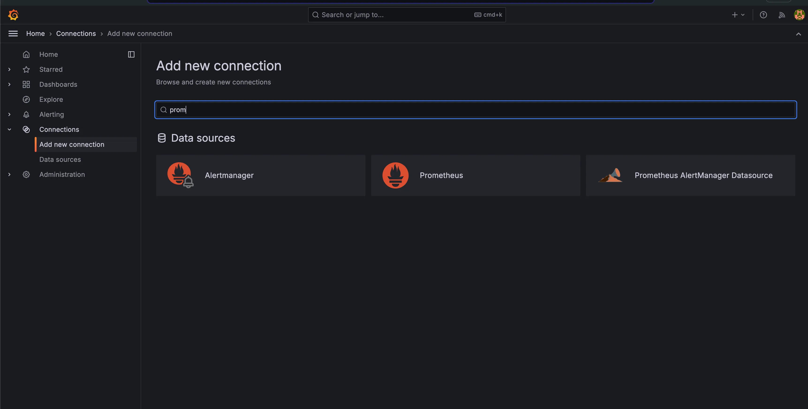
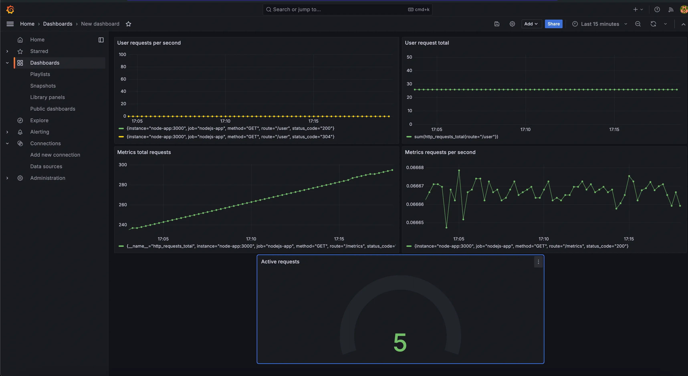
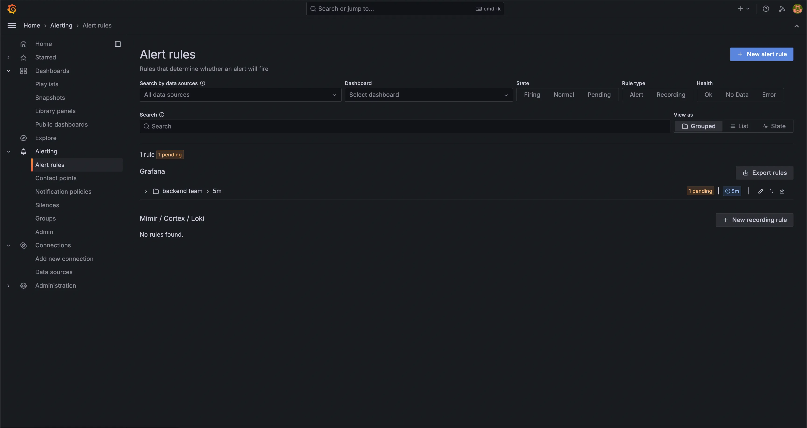

# 📊 Week 26 - Part 3: Monitoring with Grafana

## 🔍 Overview

This part covers the integration of **Grafana** with **Prometheus** to visualize metrics collected from your application. Although Prometheus offers its own interface, **Grafana** makes monitoring more efficient and user-friendly.

> **Reference:** [Grafana Official Website](https://grafana.com/)

---

## 🚀 Getting Started

### 🐳 Installing Grafana with Docker Compose

Update your `docker-compose.yml` as follows:

```yaml
version: '3.8'

services:
  node-app:
    build: ./
    ports:
      - "3000:3000"
    networks:
      - monitoring

  prometheus:
    image: prom/prometheus:latest
    volumes:
      - ./:/etc/prometheus
    ports:
      - "9090:9090"
    networks:
      - monitoring

  grafana:
    image: grafana/grafana:latest
    ports:
      - "3001:3000"
    networks:
      - monitoring
    environment:
      - GF_SECURITY_ADMIN_PASSWORD=admin

networks:
  monitoring:
````

### ✅ Access Grafana

Open your browser and navigate to:
**`http://localhost:3001`**

---

## 🔗 Connect Prometheus to Grafana

1. Go to **Settings** > **Data Sources**
2. Click **Add data source**
3. Choose **Prometheus**
4. Set the **URL** to:
   `http://prometheus:9090`
5. Click **Save & Test**



---

## 🧪 Assignment

Build a Grafana dashboard that includes the following panels:

1. **Total number of requests** to `/metrics` endpoint
2. **HTTP requests per second** to `/metrics`
3. **Total number of requests** to `/user` endpoint
4. **HTTP requests per second** to `/user`
5. **Gauge panel** showing **current active requests**



---

## 🚨 Alerting in Grafana

Grafana lets you define alerts on metrics to stay informed in real-time.

### 🔔 Steps to Set an Alert

1. **Name:** High number of requests

2. **Query:**

   ```promQL
   rate(http_requests_total{route="/user"}[$__rate_interval])
   ```

3. **Threshold:** 50 requests/s

4. **Evaluation interval:** Define how frequently to evaluate

5. **Create a folder** to reuse alert configs

6. **Add labels:**

   * `Team: Backend`
   * `Type: Error`

7. **Save alert rule**



---

## 🧪 Testing the Alert

Simulate a large number of requests to `/user` endpoint to trigger the alert.

---

## 📬 Notification Setup

1. Go to **Alerting > Contact Points**
2. Create a **new contact point**
3. Connect it in **Notification Policies**
4. **Note:** Email/Slack notifications won't work unless SMTP/Slack credentials are configured properly

---

## ✅ Summary

This setup helps you:

* Visualize Prometheus metrics in Grafana
* Create insightful dashboards
* Set alerts for critical thresholds
* Get notified about backend performance

---

```

Let me know if you want the images or folder structure setup too!
```
