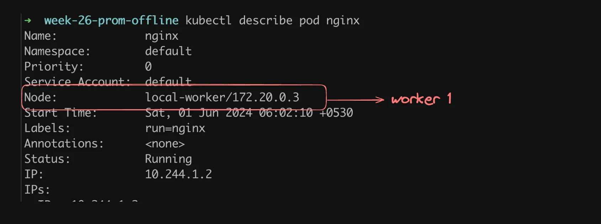

# 🐳 Introduction to Kubernetes

> 💡 **Note:** Docker is a prerequisite before proceeding with Kubernetes.

Kubernetes (commonly referred to as **K8s**) is a powerful container orchestration engine that enables you to **create**, **delete**, and **update containers** efficiently.

---

## 🚀 Why Kubernetes?

Kubernetes is useful when:

- You have Docker images in a registry and want to deploy them in a cloud-native way.
- You want your system to auto-heal in case of crashes.
- You need autoscaling with simple configurations.
- You prefer a unified dashboard to observe your system.


---

## 📉 Before Kubernetes


---

## 📈 After Kubernetes

Your frontend, backend, and other components become **Pods** within your Kubernetes cluster.


---

## 🧠 Key Concepts & Jargon

> 🔗 Reference: [Kubernetes Components Overview](https://kubernetes.io/docs/concepts/overview/components/)

### 🧱 Nodes

Machines in a Kubernetes cluster are called **nodes**:

- **Master Node (Control Plane):** Handles deployment, self-healing, and listening for instructions.
- **Worker Nodes:** Run your actual applications (frontend/backend).

#### 🔌 API Server

- Handles RESTful API requests (from `kubectl`, UI, etc.)
- Manages authentication and authorization
- Exposes metrics and health checks
- Acts as a communication hub

#### 📦 etcd

- A consistent and highly-available **key-value store**
- Stores all cluster data

🔗 [etcd Quickstart](https://etcd.io/docs/v3.5/quickstart/)

#### 📅 kube-scheduler

- Assigns new pods to appropriate nodes

#### 🔁 kube-controller-manager

> 🔗 [Controller Docs](https://kubernetes.io/docs/concepts/architecture/controller/)

Manages various controllers:

- **Node Controller:** Detects node failures
- **Deployment Controller:** Manages deployments and updates ReplicaSets
- **ReplicaSet Controller:** Ensures the desired number of pod replicas

---

## 🛠 Worker Node Components

### 🧩 kubelet

An agent running on each node, ensuring containers in a Pod are running correctly.

**Control Loop Tasks:**

- Watches PodSpecs from the API server
- Reconciles actual vs desired state
- Starts, updates, or stops containers accordingly
- Performs health checks
- Reports status to the API server

### 🌐 kube-proxy

Manages **network routing** so services can communicate with Pods.


---

## 🛞 Container Runtime

The runtime is responsible for **executing containers**.

Common Runtimes:

- containerd
- CRI-O
- Docker


### Container Runtime Interface (CRI)

Allows Kubernetes to work with different runtimes via a standardized interface.

---

## 🧪 Cluster

A **cluster** is a collection of **worker** and **master nodes**. You can scale the cluster by adding/removing nodes.

---

## 📦 Key Resources

### Images

Docker images are complete packages of software including code, dependencies, and configuration.

🔗 Example: [Mongo Image on Docker Hub](https://hub.docker.com/_/mongo)

### Containers

An image in execution.

```bash
docker run -p 5432:5432 -e POSTGRES_PASSWORD=mysecretpassword -d postgres
```

### Pods

The **smallest unit** in Kubernetes. A pod can host one or more containers.


---

## 🧰 Creating a Kubernetes Cluster

### 🔧 Local Setup

#### 1. Using Kind (Kubernetes in Docker)

- 📥 [Install Kind](https://kind.sigs.k8s.io/docs/user/quick-start/#installation)

```bash
# Single node setup
kind create cluster --name local

# Check running containers
docker ps

# Delete the cluster
kind delete cluster -n local
```

##### Multi-node Setup

```yaml
# clusters.yml
kind: Cluster
apiVersion: kind.x-k8s.io/v1alpha4
nodes:
  - role: control-plane
  - role: worker
  - role: worker
```

```bash
kind create cluster --config clusters.yml --name local
docker ps
```

---

#### 2. Using Minikube

📥 [Install Minikube](https://minikube.sigs.k8s.io/docs/start)

```bash
minikube start
docker ps
```

> 💡 It's not ideal to use a single node (control plane as worker).

---

## 📡 Kubernetes API

Kubernetes exposes an API through which developers can create pods.

```bash
docker ps  # Find control pane
```

Try API endpoint:

```
https://127.0.0.1:<port>/api/v1/namespaces/default/pods
```

Kubernetes API performs authentication & authorization. Kind stores config at:

```bash
~/.kube/config
```

---

## 🧪 kubectl (Kubernetes CLI)

📥 [Install kubectl](https://kubernetes.io/docs/tasks/tools/#kubectl)

### Basic Commands

```bash
kubectl get nodes
kubectl get pods
kubectl get nodes --v=8  # View HTTP requests
```

---

## 🚀 Deploying Your First Pod

We learned about:

- Cluster
- Nodes
- Images
- Containers
- Pods

### Step 1: Test Docker Image

```bash
docker run -p 3005:80 nginx
```

Visit: [http://localhost:3005](http://localhost:3005)


---

### Step 2: Run Pod via Kubernetes

```bash
kubectl run nginx --image=nginx --port=80
kubectl get pods
kubectl logs nginx
kubectl describe pod nginx
```




---

## 📚 Resources

- [Kubernetes Official Docs](https://kubernetes.io/docs/home/)
- [Kind Documentation](https://kind.sigs.k8s.io/docs/user/quick-start/)
- [Minikube Documentation](https://minikube.sigs.k8s.io/docs/start/)
- [Docker Hub](https://hub.docker.com)

---

## Stop the pod

Stop the pod by running

```
 kubectl delete pod nginx
```

Check the current state of pods

```
kubectl get pods
```
