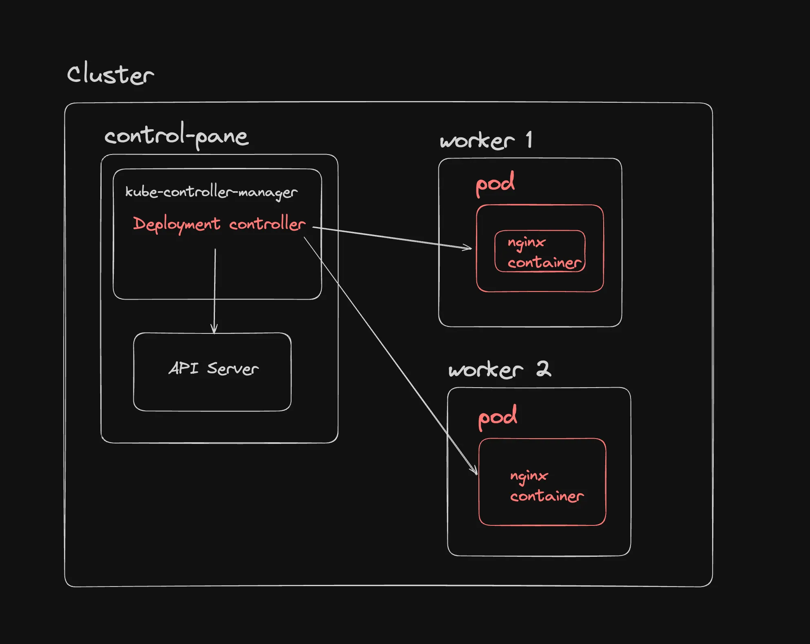
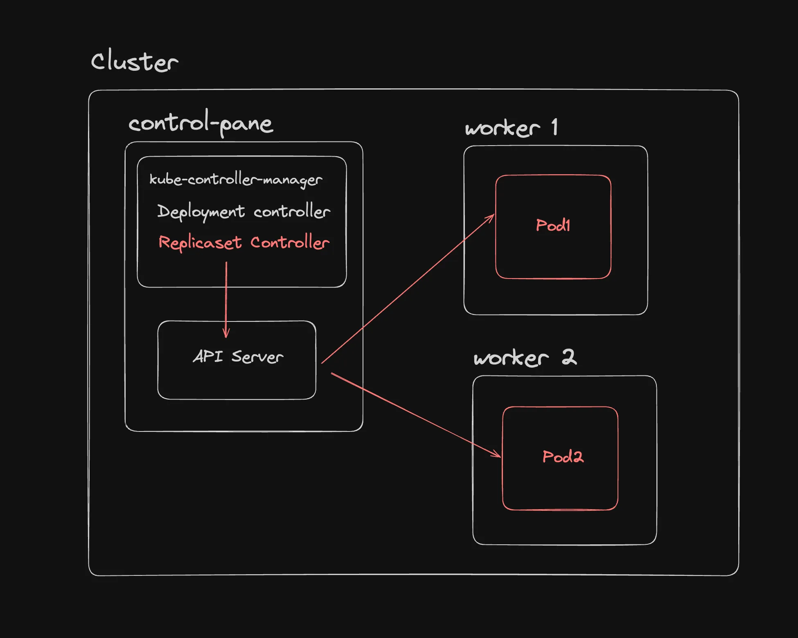
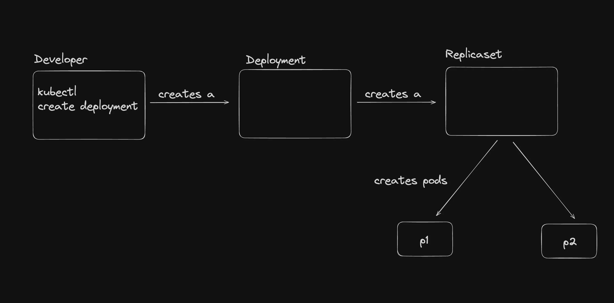

# 📦 Kubernetes Deployment, ReplicaSet, and Pods

This document explains the relationship and differences between **Deployments**, **ReplicaSets**, and **Pods** in Kubernetes. It provides visual references, real-time command-line usage, and manifest examples to illustrate how these components work together to manage containerized applications.

---

## 🚀 Deployment Overview

A **Deployment** in Kubernetes is a higher-level abstraction that manages a set of Pods and provides **declarative updates** to them.

**Key features of a Deployment:**

* Scaling applications
* Rolling updates
* Rollbacks
* Self-healing

> 

---

## 🧱 Understanding the Basics

### 🔹 Pod

* The **smallest and simplest** Kubernetes object.
* Represents a **single instance of a running process**.
* May contain **one or more containers**.

### 🔹 Deployment

* A **higher-level controller** that manages **identical Pods**.
* Ensures the **desired number of Pods** are running.
* Provides **declarative updates** to the Pods it manages.

---

## 🔍 Key Differences: Deployment vs. Pod

| Feature          | Pod                                       | Deployment                                   |
| ---------------- | ----------------------------------------- | -------------------------------------------- |
| **Level**        | Basic unit                                | High-level abstraction managing Pods         |
| **Lifecycle**    | Ephemeral                                 | Maintains Pods and ensures desired state     |
| **Updates**      | Manual and disruptive                     | Supports rolling updates and rollback        |
| **Scaling**      | Manual creation/deletion of Pods          | Declarative scaling by setting replica count |
| **Self-Healing** | Manual intervention needed when Pod fails | Automatically replaces failed Pods           |

---

## 🔁 What is a ReplicaSet?

A **ReplicaSet** ensures that a specified number of **identical Pods** are running at all times.

> When you create a Deployment, it internally creates a ReplicaSet which in turn manages Pods.

> 

### ⚙️ Series of Events:

> 

```bash
kubectl create deployment nginx-deployment --image=nginx --port=80 --replicas=3
```

### 🔄 Step-by-Step Breakdown:

1. **kubectl** sends a request to the API server.
2. **API Server** validates and stores config in **etcd**.
3. **Deployment Controller** creates a **ReplicaSet**.
4. **ReplicaSet Controller** ensures the desired Pods are created.
5. **Scheduler** assigns Pods to Nodes.
6. **Kubelet** on each Node pulls image and starts containers.

---

## 🏗️ Hierarchical Relationship

```
Deployment → ReplicaSet → Pods
```

| Level      | Description                                                                |
| ---------- | -------------------------------------------------------------------------- |
| Deployment | High-level controller managing ReplicaSets, updates, scaling, and rollback |
| ReplicaSet | Maintains stable set of Pods using labels and selectors                    |
| Pod        | Smallest unit with running containers                                      |

---

## ❓ Why Use Deployment over ReplicaSet?

While a **ReplicaSet** can maintain the desired number of Pods, it **lacks features** like:

* Rolling updates
* Rollbacks
* Versioning

Hence, **Deployments** are preferred for production-ready applications.

---

## 🛠️ Create a ReplicaSet

### 1. Create `rs.yml`

```yaml
apiVersion: apps/v1
kind: ReplicaSet
metadata:
  name: nginx-replicaset
spec:
  replicas: 3
  selector:
    matchLabels:
      app: nginx
  template:
    metadata:
      labels:
        app: nginx
    spec:
      containers:
      - name: nginx
        image: nginx:latest
        ports:
        - containerPort: 80
```

### 2. Apply the ReplicaSet

```bash
kubectl apply -f rs.yml
```

### 3. Check the ReplicaSet and Pods

```bash
kubectl get rs
kubectl get pods
```

### 4. Test Self-Healing

```bash
kubectl delete pod <pod-name>
kubectl get pods
```

### 5. Test Scale Enforcement

```bash
kubectl run nginx-pod --image=nginx --labels="app=nginx"
# It should terminate immediately
```

### 6. Delete the ReplicaSet

```bash
kubectl delete rs nginx-replicaset
```

---

## 🧪 Create a Deployment

### 1. Create `deployment.yml`

```yaml
apiVersion: apps/v1
kind: Deployment
metadata:
  name: nginx-deployment
spec:
  replicas: 3
  selector:
    matchLabels:
      app: nginx
  template:
    metadata:
      labels:
        app: nginx
    spec:
      containers:
      - name: nginx
        image: nginx:latest
        ports:
        - containerPort: 80
```

### 2. Apply the Deployment

```bash
kubectl apply -f deployment.yml
```

### 3. Verify Deployment, ReplicaSet, and Pods

```bash
kubectl get deployment
kubectl get rs
kubectl get pod
```

### 4. Test Pod Replacement

```bash
kubectl delete pod <pod-name>
kubectl get pods
```

---

## 🧠 Summary

* **Pod**: Smallest unit, used to run containers.
* **ReplicaSet**: Maintains specified number of Pods.
* **Deployment**: Manages ReplicaSets and provides scaling, rolling updates, and rollback.

---

## 📘 References

* Kubernetes Documentation: [https://kubernetes.io/docs/concepts/workloads/controllers/deployment/](https://kubernetes.io/docs/concepts/workloads/controllers/deployment/)
* Kubectl Reference: [https://kubernetes.io/docs/reference/kubectl/](https://kubernetes.io/docs/reference/kubectl/)

---

Let me know if you want this in a downloadable `.md` file or want to customize it further (e.g., add your name, date, tags, or more diagrams).
