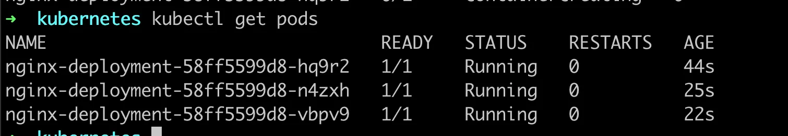
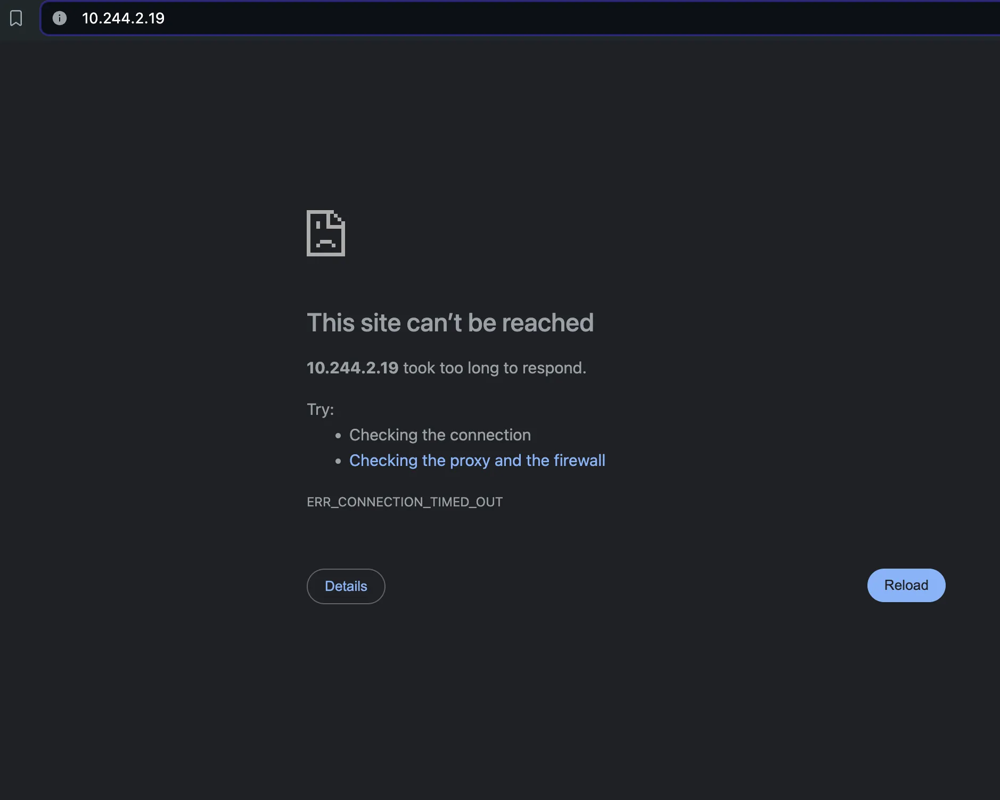

Here you go, Akash — a fresh `README.md` with **all your content + image references** correctly placed for visual support.

---

````md
# 🚀 Why Do You Need a Deployment in Kubernetes?

If all a **Deployment** does is create a **ReplicaSet**, why not just create a ReplicaSet directly?  
This guide answers that question with a practical experiment and walks you through key deployment concepts like rollback, update failures, and exposing apps via services.

---

## 🧪 Experiment: Failed Deployment Scenario

Let’s update the image to something that doesn’t exist:

```yaml
apiVersion: apps/v1
kind: Deployment
metadata:
  name: nginx-deployment
spec:
  replicas: 3
  selector:
    matchLabels:
      app: nginx
  template:
    metadata:
      labels:
        app: nginx
    spec:
      containers:
        - name: nginx
          image: nginx2:latest
          ports:
            - containerPort: 80
````

### ✅ Apply Deployment

```bash
kubectl apply -f deployment.yml
```

### 🔍 Check ReplicaSets

```bash
kubectl get rs
```

```
NAME                          DESIRED   CURRENT   READY   AGE
nginx-deployment-576c6b7b6    3         3         3       14m
nginx-deployment-5fbd4799cb   1         1         0       10m
```

### 🔍 Check Pods

```bash
kubectl get pods
```

```
nginx-deployment-5fbd4799cb-fmt4f   0/1   ImagePullBackOff   0   12m
```

> 🖼️
> 
> 
> 

---

## 📌 Role of Deployment

Even though **ReplicaSet** manages the Pods, the **Deployment** manages the ReplicaSets.

🛡️ Deployment ensures:

* Smooth updates
* Rollback support
* Availability in case of failures

---

## 🔄 Rollbacks in Deployment

### ⏳ Check Deployment History

```bash
kubectl rollout history deployment/nginx-deployment
```

### ↩️ Undo Last Deployment

```bash
kubectl rollout undo deployment/nginx-deployment
```

---

## 🐘 Deploying Postgres Instead of Nginx

Update deployment to use Postgres image (without env):

```yaml
containers:
  - name: nginx
    image: postgres:latest
    ports:
      - containerPort: 80
```

Check logs:

```bash
kubectl logs -f <pod-name>
```

```
Error: Database is uninitialized and superuser password is not specified.
```

---

## 🔐 Fixing with POSTGRES\_PASSWORD

```yaml
env:
  - name: POSTGRES_PASSWORD
    value: "yourpassword"
```

### ✅ Pods Running Successfully Now

```bash
kubectl get pods
```

> 🖼️
> 
> 
> 

---

## 🌐 Exposing the Application

Let’s delete all resources and create a fresh deployment of nginx:

```yaml
image: nginx:latest
replicas: 3
```

```bash
kubectl apply -f deployment.yml
kubectl get pods -o wide
```

```
IP            NODE
10.244.2.19   local-worker2
10.244.1.13   local-worker
```

> 🖼️
> 

These are **private IPs**, so the app is **not accessible** externally.

---

## 🛰️ Kubernetes Services

A **Service** exposes a set of Pods via a stable endpoint.

### 🔑 Concepts:

* **Selector**: Targets Pods using labels
* **ClusterIP**: Internal access
* **NodePort**: External access via static port
* **LoadBalancer**: External access (cloud)

---

## 📦 Creating a NodePort Service

### `service.yml`

```yaml
apiVersion: v1
kind: Service
metadata:
  name: nginx-service
spec:
  selector:
    app: nginx
  ports:
    - protocol: TCP
      port: 80
      targetPort: 80
      nodePort: 30007
  type: NodePort
```

---

## 🔁 Kind Cluster Setup with Port Mapping

### `kind.yml`

```yaml
kind: Cluster
apiVersion: kind.x-k8s.io/v1alpha4
nodes:
  - role: control-plane
    extraPortMappings:
      - containerPort: 30007
        hostPort: 30007
  - role: worker
  - role: worker
```

```bash
kind create cluster --config kind.yml
```

---

## 🚀 Access Your App

```bash
kubectl apply -f deployment.yml
kubectl apply -f service.yml
```

🔗 Open in browser:

```
http://localhost:30007
```

> 🖼️
> 

---

## 📘 Summary

| Component      | Role                                                              |
| -------------- | ----------------------------------------------------------------- |
| **Pod**        | Smallest unit that runs containers                                |
| **ReplicaSet** | Ensures desired number of Pods are running                        |
| **Deployment** | Manages ReplicaSets, updates, and rollbacks                       |
| **Service**    | Provides a stable way to access Pods across the cluster or public |

---

## ⚙️ Types of Services

* 🌀 **ClusterIP** – Internal access
* 🌐 **NodePort** – Access via `<NodeIP>:<NodePort>`
* ☁️ **LoadBalancer** – External access via cloud provider

---
