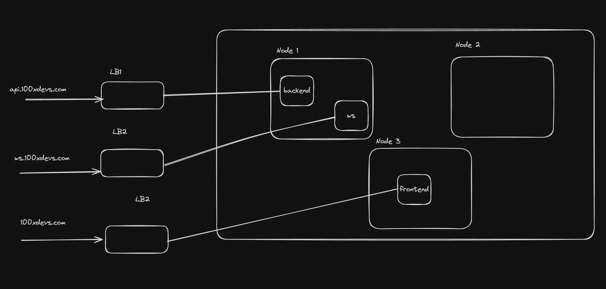

# Downsides of Kubernetes Services & Introduction to Ingress

Kubernetes Services are a great way to expose applications, but they come with some downsides. This guide explains those limitations and introduces **Ingress** and **Ingress Controllers** as better alternatives for managing traffic.

---

## ❌ Downsides of Services

### 1. Scaling to Multiple Apps

If you have multiple apps (e.g., frontend, backend, websocket server), you must create **separate services and load balancers** for each of them.

- No centralized traffic management (e.g., path-based routing from a single URL)
- Limits on how many load balancers can be created



---

### 2. Multiple Certificates for Every Route

- Certificates must be manually created and maintained **outside the cluster**
- They need to be manually updated on expiry


---

### 3. No Centralized Rate Limiting

- Rate limiting is configured **per load balancer**
- You cannot enforce a **single rate limiter** across all services


---

## 🧪 Trying It Out

Here's a sample manifest to spin up **two separate deployments** with **two LoadBalancer services**:

### Apply the Manifest

```bash
kubectl apply -f manifest.yml
````

You will observe two LoadBalancers being created:


Open each LoadBalancer:


---

## 🌐 Ingress and Ingress Controller

> Ref: [Kubernetes Ingress Docs](https://kubernetes.io/docs/concepts/services-networking/ingress/)

**Ingress** is an API object that manages external HTTP access to services within a cluster.

* Provides **load balancing**, **SSL termination**, and **name-based virtual hosting**
* Only supports HTTP/HTTPS


> 💡 Ingress does **not** expose arbitrary ports or protocols.

---

### Ingress Controller

> Ref: [Ingress Controller Explained - 100xDevs](https://projects.100xdevs.com/tracks/kubernetes-1/Kubernetes-Part-1-3)

Kubernetes’ control plane includes various built-in controllers, but **Ingress Controllers** must be installed manually.


#### Popular Ingress Controllers

* **NGINX Ingress Controller**
* **HAProxy Ingress**
* **Traefik Kubernetes Ingress**

👉 [Full List of Ingress Controllers](https://kubernetes.io/docs/concepts/services-networking/ingress-controllers/)

---

## 📂 Namespaces in Kubernetes

Namespaces let you split your cluster into logical environments (e.g., dev, staging, prod).

### Basic Commands

```bash
# Create a namespace
kubectl create namespace backend-team

# Get all namespaces
kubectl get namespaces

# Get all pods in a namespace
kubectl get pods -n backend-team
```

### Deployment Manifest (in Namespace)

```yaml
apiVersion: apps/v1
kind: Deployment
metadata:
  name: nginx-deployment
  namespace: backend-team
spec:
  replicas: 3
  selector:
    matchLabels:
      app: nginx
  template:
    metadata:
      labels:
        app: nginx
    spec:
      containers:
        - name: nginx
          image: nginx:latest
          ports:
            - containerPort: 80
```

### Apply & Manage

```bash
kubectl apply -f deployment-ns.yml
kubectl get deployment -n backend-team
kubectl config set-context --current --namespace=backend-team
kubectl get pods
kubectl config set-context --current --namespace=default
```

---

## 🚀 Installing the NGINX Ingress Controller

> Ref: [NGINX Installation Guide](https://docs.nginx.com/nginx-ingress-controller/installation/installing-nic/installation-with-manifests/)

### Using Helm

> Ref: [Helm Docs](https://helm.sh/)
> Install: [Helm Install Guide](https://helm.sh/docs/intro/install/)

```bash
# Add repo and update
helm repo add ingress-nginx https://kubernetes.github.io/ingress-nginx
helm repo update

# Install ingress controller
helm install nginx-ingress ingress-nginx/ingress-nginx \
  --namespace ingress-nginx --create-namespace
```

### Verify Installation

```bash
kubectl get pods -n ingress-nginx
kubectl get services --all-namespaces
```

> A LoadBalancer service will be automatically created, routing all traffic to the NGINX pod.


---

## ✅ Summary

| Feature                | Services            | Ingress                          |
| ---------------------- | ------------------- | -------------------------------- |
| Centralized Routing    | ❌                   | ✅ Path/Host-based Routing        |
| Rate Limiting          | ❌ Per Load Balancer | ✅ Unified via Ingress Controller |
| Certificate Management | ❌ Manual & External | ✅ Centralized via Ingress        |
| Load Balancer Count    | ❌ One per service   | ✅ Single for all routes          |

---