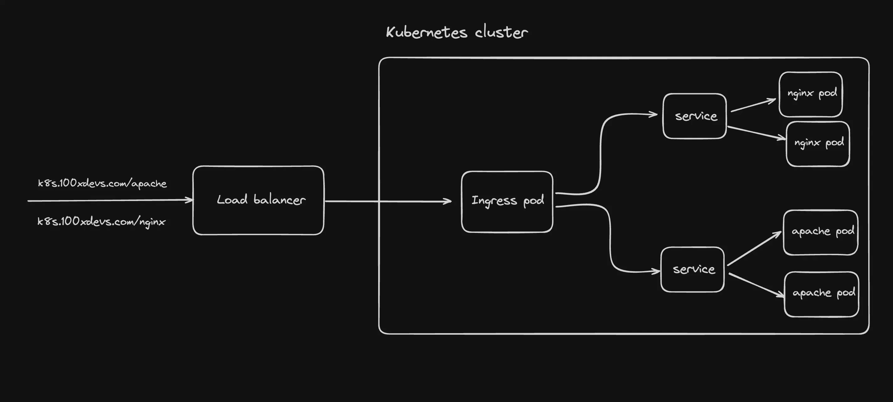
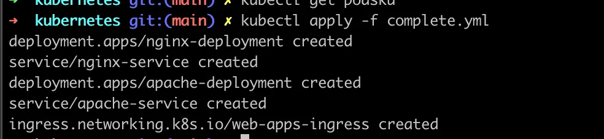
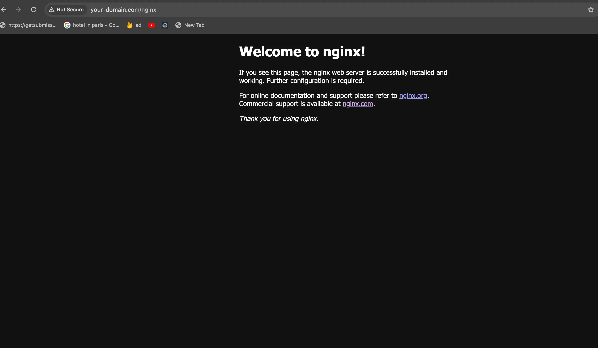
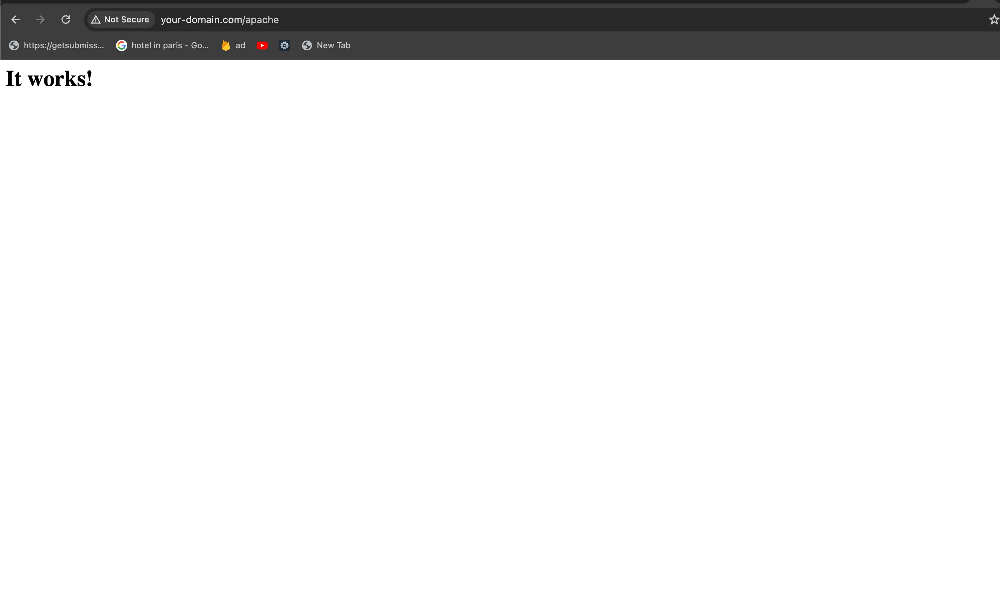

# 🧭 Adding Routing with Ingress Controller in Kubernetes

This guide walks you through deploying two simple web applications (Nginx and Apache) in Kubernetes and exposing them using an **Ingress Controller**. You'll also clean up older resources, create new deployments and services, and configure routing using an Ingress resource.

---

## 📸 Final Setup Preview



---

## 🧹 Step 1: Clean Up Existing Deployments & Services

First, delete all old deployments in the default namespace:

```bash
kubectl get deployments
kubectl delete deployment <deployment_name>
```

Then, delete old services (avoid deleting the default Kubernetes service):

```bash
kubectl get services
kubectl delete service <service_name>
```

---

## 🚀 Step 2: Deploy Nginx App

Create a deployment and service for Nginx (not the ingress controller):

```yaml
apiVersion: apps/v1
kind: Deployment
metadata:
  name: nginx-deployment
  namespace: default
spec:
  replicas: 2
  selector:
    matchLabels:
      app: nginx
  template:
    metadata:
      labels:
        app: nginx
    spec:
      containers:
        - name: nginx
          image: nginx:alpine
          ports:
            - containerPort: 80
---
apiVersion: v1
kind: Service
metadata:
  name: nginx-service
  namespace: default
spec:
  selector:
    app: nginx
  ports:
    - protocol: TCP
      port: 80
      targetPort: 80
  type: ClusterIP
```

---

## 🌐 Step 3: Deploy Apache App

```yaml
apiVersion: apps/v1
kind: Deployment
metadata:
  name: apache-deployment
  namespace: default
spec:
  replicas: 2
  selector:
    matchLabels:
      app: apache
  template:
    metadata:
      labels:
        app: apache
    spec:
      containers:
        - name: my-apache-site
          image: httpd:2.4
          ports:
            - containerPort: 80
---
apiVersion: v1
kind: Service
metadata:
  name: apache-service
  namespace: default
spec:
  selector:
    app: apache
  ports:
    - protocol: TCP
      port: 80
      targetPort: 80
  type: ClusterIP
```

---

## 🧩 Step 4: Configure Ingress Routing

Create an Ingress resource to route paths to the Nginx and Apache services:

```yaml
apiVersion: networking.k8s.io/v1
kind: Ingress
metadata:
  name: web-apps-ingress
  namespace: default
  annotations:
    nginx.ingress.kubernetes.io/rewrite-target: /
spec:
  ingressClassName: nginx
  rules:
    - host: your-domain.com
      http:
        paths:
          - path: /nginx
            pathType: Prefix
            backend:
              service:
                name: nginx-service
                port:
                  number: 80
          - path: /apache
            pathType: Prefix
            backend:
              service:
                name: apache-service
                port:
                  number: 80
```

---

## 📦 Step 5: Combined Manifest (`complete.yml`)

```yaml
# (Same YAML from above — all deployments, services, and ingress in one file)
# Save the above content into a file named `complete.yml`
```

Apply it using:

```bash
kubectl apply -f complete.yml
```



---

## 🖥️ Step 6: Update Your Local Hosts File

Edit `/etc/hosts` and add:

```
65.20.84.86    your-domain.com
```

This points your domain to the external IP of your load balancer.

---

## 🌍 Step 7: Test the Setup

Now, visit the following URLs:

- [http://your-domain.com/nginx](http://your-domain.com/nginx)
- [http://your-domain.com/apache](http://your-domain.com/apache)

### ✅ Expected Output




---

## 📚 Conclusion

You’ve successfully:

- Cleaned up previous resources
- Deployed Nginx and Apache apps
- Created services for both
- Configured routing with Ingress Controller

You're now able to host multiple apps on a single domain using different paths! 🎉

---

# 🌐 Trying Traefik’s Ingress Controller

[Traefik](https://traefik.io) is a powerful and dynamic reverse proxy and load balancer that can also be used as an Ingress Controller for Kubernetes.

In this section, we’ll use Traefik to expose our previously deployed Nginx and Apache services.

---

## 📦 Step 1: Install Traefik Ingress Controller Using Helm

```bash
helm repo add traefik https://helm.traefik.io/traefik
helm repo update
helm install traefik traefik/traefik --namespace traefik --create-namespace
```

---

## 📄 Step 2: Verify Installation

### ✅ Check for IngressClass

```bash
kubectl get IngressClass
```

Ensure there is an ingress class with the name `traefik`.

---

### 🌐 Check for LoadBalancer Service

```bash
kubectl get svc -n traefik
```

Traefik should create a `LoadBalancer` type service which you'll use to route traffic via your domain.

---

## 🧩 Step 3: Create Traefik Ingress Resource

Create a file called `traefik.yml` with the following content:

```yaml
apiVersion: networking.k8s.io/v1
kind: Ingress
metadata:
  name: traefik-web-apps-ingress
  namespace: default
spec:
  ingressClassName: traefik
  rules:
    - host: traefik-domain.com
      http:
        paths:
          - path: /nginx
            pathType: Prefix
            backend:
              service:
                name: nginx-service
                port:
                  number: 80
          - path: /apache
            pathType: Prefix
            backend:
              service:
                name: apache-service
                port:
                  number: 80
```

Apply the Ingress manifest:

```bash
kubectl apply -f traefik.yml
```

---

## 🖥️ Step 4: Update Local Hosts File

Add the IP of your Traefik LoadBalancer to `/etc/hosts`:

```
65.20.90.183    traefik-domain.com
```

---

## 🌍 Step 5: Visit the URLs

- [http://traefik-domain.com/nginx](http://traefik-domain.com/nginx)
- [http://traefik-domain.com/apache](http://traefik-domain.com/apache)

---

## 😕 Why Isn’t It Working?

You may notice that accessing `/nginx` or `/apache` isn't returning the expected UI.


### 💡 Assignment: Debug & Solve

**Question:** Why are you not seeing anything on the final page?

> Hint: Unlike the NGINX ingress controller, Traefik doesn’t automatically rewrite the path to `/`. You need to explicitly add a middleware or annotation to rewrite the path in the Ingress manifest.

---

### 🧠 Task:

Figure out how to **rewrite the path to `/`** when using **Traefik** as your Ingress class.

- Search for **Traefik middleware** for path rewriting.
- Update the `Ingress` definition accordingly.
- Revisit the site and test again.

---