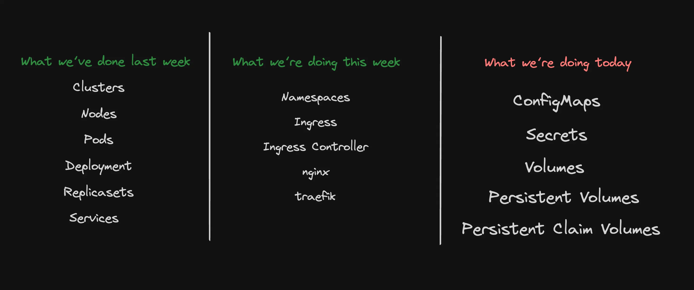
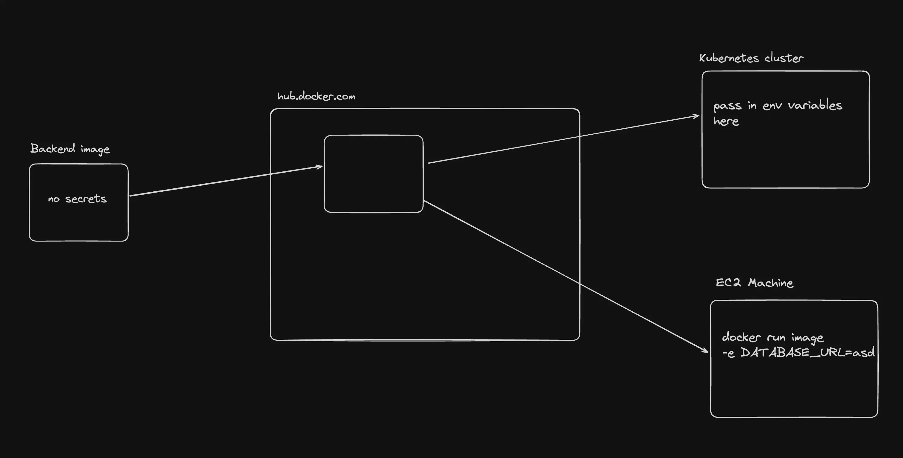
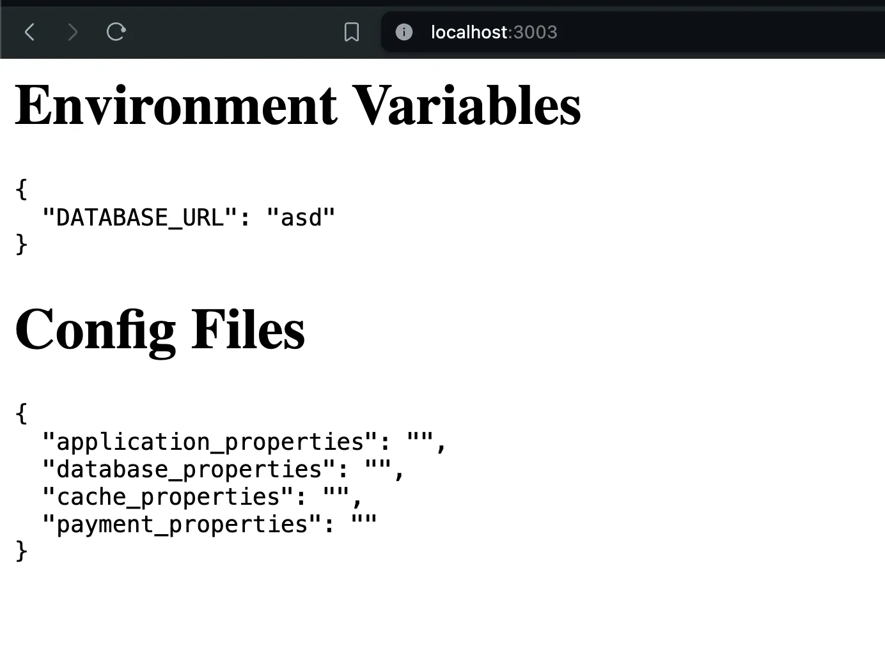
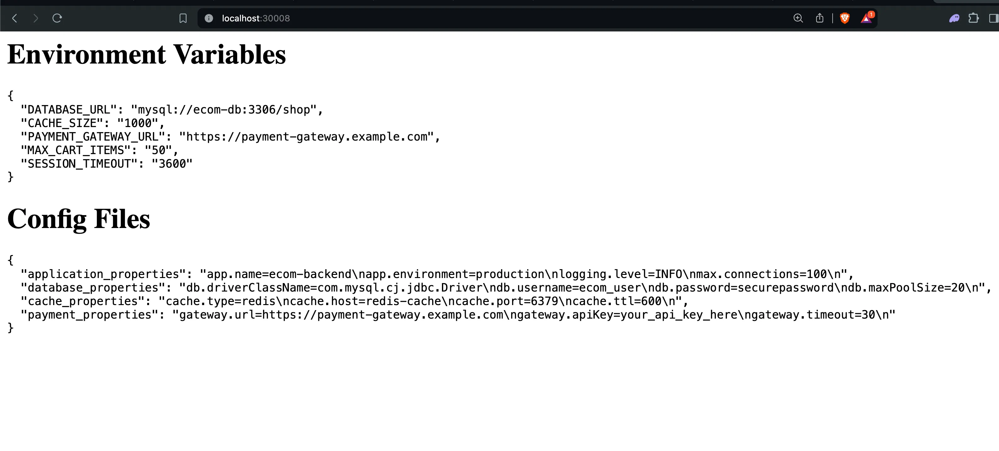
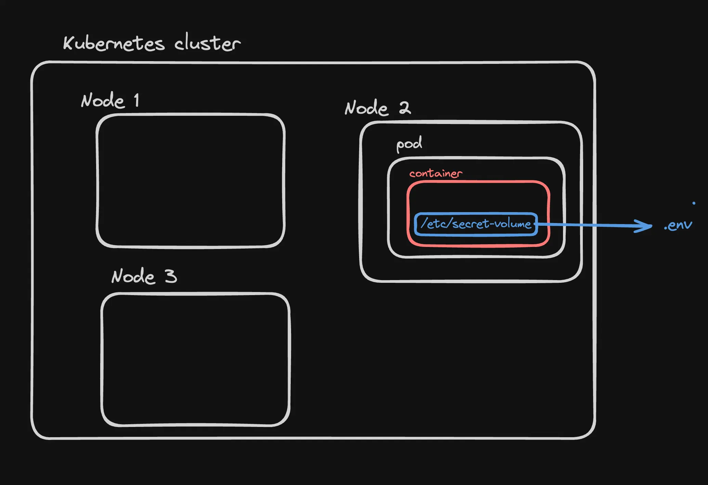
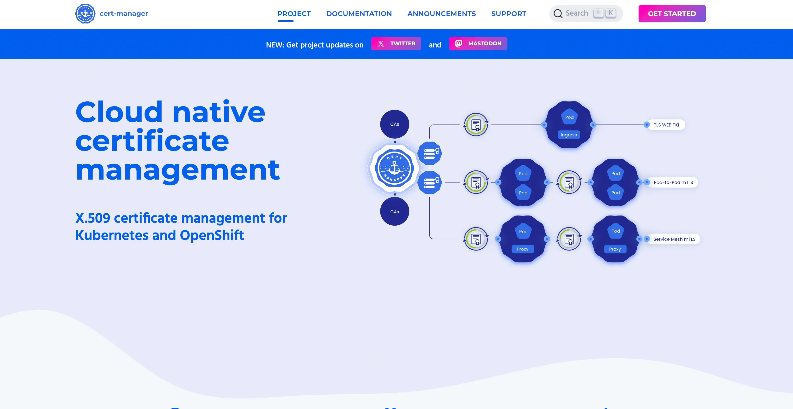

# 🔐 Secrets and ConfigMaps in Kubernetes



Kubernetes encourages several best practices for configuration management:

- ✅ Always use **Deployments** instead of creating bare Pods.
- ✅ Write your configuration files in **YAML** (not JSON).
- ✅ Store all configuration files in **version control** before applying them to the cluster.

---

## 📦 External Configuration in Kubernetes

Kubernetes v1 API allows you to **store your application's configuration outside of the container image** using:

- 🗂️ **ConfigMaps**
- 🔐 **Secrets**

> ⚠️ **Rule of Thumb:** Never hard-code secrets inside your image. Always pass them via environment variables.

---



## 🗂️ ConfigMaps

📖 [Official Docs](https://kubernetes.io/docs/concepts/configuration/configmap/)

A **ConfigMap** is an API object used to store **non-confidential** data as key-value pairs. You can mount ConfigMaps as:

- Environment variables
- Command-line arguments
- Configuration files in volumes

This makes your applications **easily portable** by separating environment-specific configs from your image.

### 🛠 Creating a ConfigMap

**Manifest:**

```yaml
apiVersion: v1
kind: ConfigMap
metadata:
  name: ecom-backend-config
data:
  database_url: "mysql://ecom-db:3306/shop"
  cache_size: "1000"
  payment_gateway_url: "https://payment-gateway.example.com"
  max_cart_items: "50"
  session_timeout: "3600"
```

**Apply the manifest:**

```bash
kubectl apply -f cm.yml
```

**View the ConfigMap:**

```bash
kubectl describe configmap ecom-backend-config
```

---

## 🧪 Express App Example

This app exposes config values via environment variables.

**`index.js`:**

```js
import express from "express";

const app = express();
const port = 3000;

app.get("/", (req, res) => {
  const envVars = {
    DATABASE_URL: process.env.DATABASE_URL,
    CACHE_SIZE: process.env.CACHE_SIZE,
    PAYMENT_GATEWAY_URL: process.env.PAYMENT_GATEWAY_URL,
    MAX_CART_ITEMS: process.env.MAX_CART_ITEMS,
    SESSION_TIMEOUT: process.env.SESSION_TIMEOUT,
  };

  res.send(`
    <h1>Environment Variables</h1>
    <pre>${JSON.stringify(envVars, null, 2)}</pre>
  `);
});

app.listen(port, () => {
  console.log(`App listening at http://localhost:${port}`);
});
```

**Dockerfile:**

```dockerfile
FROM node:20

WORKDIR /usr/src/app

COPY package*.json ./
RUN npm install

COPY . .

RUN npx tsc -b

EXPOSE 3000
CMD [ "node", "index.js" ]
```

📦 DockerHub: [100xdevs/env-backend](https://hub.docker.com/repository/docker/100xdevs/env-backend/general)

Run locally:

```bash
docker run -p 3003:3000 -e DATABASE_URL=asd 100xdevs/env-backend
```



---

## 🚀 Deploying on Kubernetes

### Deployment Manifest (`express-app.yml`):

```yaml
apiVersion: apps/v1
kind: Deployment
metadata:
  name: ecom-backend-deployment
spec:
  replicas: 1
  selector:
    matchLabels:
      app: ecom-backend
  template:
    metadata:
      labels:
        app: ecom-backend
    spec:
      containers:
        - name: ecom-backend
          image: 100xdevs/env-backend
          ports:
            - containerPort: 3000
          env:
            - name: DATABASE_URL
              valueFrom:
                configMapKeyRef:
                  name: ecom-backend-config
                  key: database_url
            - name: CACHE_SIZE
              valueFrom:
                configMapKeyRef:
                  name: ecom-backend-config
                  key: cache_size
            - name: PAYMENT_GATEWAY_URL
              valueFrom:
                configMapKeyRef:
                  name: ecom-backend-config
                  key: payment_gateway_url
            - name: MAX_CART_ITEMS
              valueFrom:
                configMapKeyRef:
                  name: ecom-backend-config
                  key: max_cart_items
            - name: SESSION_TIMEOUT
              valueFrom:
                configMapKeyRef:
                  name: ecom-backend-config
                  key: session_timeout
```

Apply it:

```bash
kubectl apply -f express-app.yml
```

### Service Manifest (`express-service.yml`):

```yaml
apiVersion: v1
kind: Service
metadata:
  name: ecom-backend-service
spec:
  type: NodePort
  selector:
    app: ecom-backend
  ports:
    - port: 3000
      targetPort: 3000
      nodePort: 30007
```

Apply the service:

```bash
kubectl apply -f express-service.yml
```



---

## 🔐 Secrets in Kubernetes

📖 [Official Docs](https://kubernetes.io/docs/concepts/configuration/secret/)

Secrets are Kubernetes objects designed to **store sensitive data**, such as passwords, tokens, and keys.

### 📄 Secret and Pod Manifest:

```yaml
apiVersion: v1
kind: Secret
metadata:
  name: dotfile-secret
data:
  .env: REFUQUJBU0VfVVJMPSJwb3N0Z3JlczovL3VzZXJuYW1lOnNlY3JldEBsb2NhbGhvc3QvcG9zdGdyZXMi
---
apiVersion: v1
kind: Pod
metadata:
  name: secret-dotfiles-pod
spec:
  containers:
    - name: dotfile-test-container
      image: nginx
      volumeMounts:
        - name: env-file
          readOnly: true
          mountPath: "/etc/secret-volume"
  volumes:
    - name: env-file
      secret:
        secretName: dotfile-secret
```

Inspect it:

```bash
kubectl exec -it secret-dotfiles-pod -- /bin/bash
cd /etc/secret-volume/
ls
```



---

## ℹ️ Why Base64?

Kubernetes requires **base64 encoding** for storing secret values. This is **not for security**, but to ensure binary data (like TLS certs) can be stored reliably.

> ✅ Decode using: [base64decode.org](https://www.base64decode.org/)
> ✅ Encode using: [base64encode.org](https://www.base64encode.org/)

---

## 🔑 Secrets as Environment Variables

### Secret Manifest:

```yaml
apiVersion: v1
kind: Secret
metadata:
  name: my-secret
data:
  username: YWRtaW4= # admin
  password: cGFzc3dvcmQ= # password
```

### Pod using Secret as Env Vars:

```yaml
apiVersion: v1
kind: Pod
metadata:
  name: secret-env-pod
spec:
  containers:
    - name: my-container
      image: busybox
      command:
        [
          "/bin/sh",
          "-c",
          "echo Username: $USERNAME; echo Password: $PASSWORD; sleep 3600",
        ]
      env:
        - name: USERNAME
          valueFrom:
            secretKeyRef:
              name: my-secret
              key: username
        - name: PASSWORD
          valueFrom:
            secretKeyRef:
              name: my-secret
              key: password
```

---

## ✅ Conclusion

- **ConfigMaps** help manage _non-sensitive_ configuration
- **Secrets** handle _sensitive data_
- Use **environment variables or mounted files** to provide data to your containers
- Always **keep secrets out of your source code and Docker images**

---

Here's a separate and clean `README.md` file for **ConfigMaps vs Secrets**, with your provided content formatted professionally:

---

````markdown
# ⚙️ ConfigMaps vs 🔐 Secrets in Kubernetes

## 🛠 Creating a ConfigMap

```yaml
apiVersion: v1
kind: ConfigMap
metadata:
  name: example-config
data:
  key1: value1
  key2: value2
```
````

---

## 🔐 Creating a Secret

```yaml
apiVersion: v1
kind: Secret
metadata:
  name: example-secret
data:
  password: cGFzc3dvcmQ=
  apiKey: YXBpa2V5
```

---

## 🔍 Key Differences

### 1. 🧭 Purpose and Usage

- **Secrets**: Meant to store **sensitive data** like passwords, API keys, SSH keys.
- **ConfigMaps**: Designed for **non-sensitive configuration** like env vars or CLI args.

### 2. 🔏 Base64 Encoding

- **Secrets**: All values are **base64 encoded** (not encrypted). This makes them suitable for secure transport, but not inherently secure.
- **ConfigMaps**: Values are stored in **plain text**.

### 3. 🔄 Volatility and Updates

- **Secrets**: More likely to be rotated or updated frequently due to their sensitivity.
- **ConfigMaps**: Configuration data changes less frequently and usually with planned updates.

### 4. ⚙️ Kubernetes Features

- **Secrets**:

  - Can be integrated with external secret managers.
  - Supports **encryption at rest**.
  - CSI support for secrets injection: [Secrets Store CSI Driver](https://secrets-store-csi-driver.sigs.k8s.io/concepts.html#provider-for-the-secrets-store-csi-driver)

- **ConfigMaps**:

  - Used to inject config values into pods.
  - Lacks native encryption or external secret store integration.

---

## 🛡️ Bonus: Adding HTTPS with cert-manager

📖 Official Docs: [cert-manager.io](https://cert-manager.io/)

You can issue TLS certificates automatically for your Kubernetes services using `cert-manager`.

> 💡 Try getting a domain name and installing a certificate using `cert-manager` before tomorrow’s class.

**Buy a cheap domain from:** [Namecheap](https://www.namecheap.com/)

---



