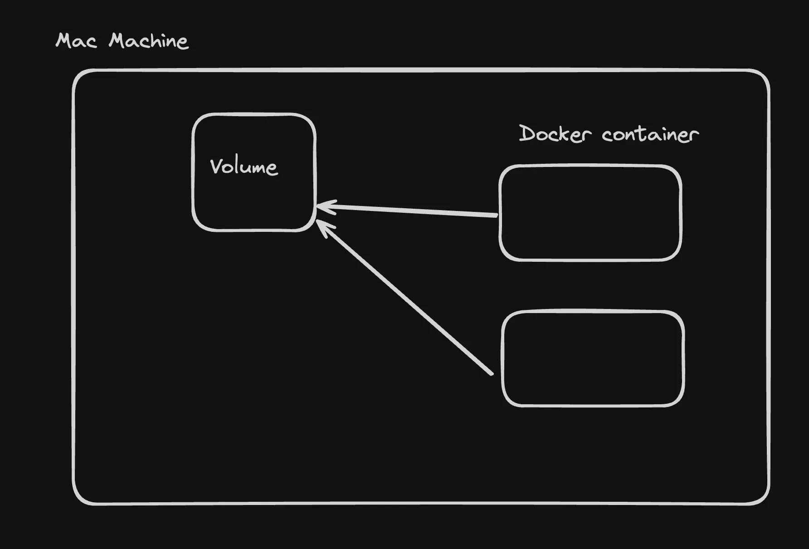
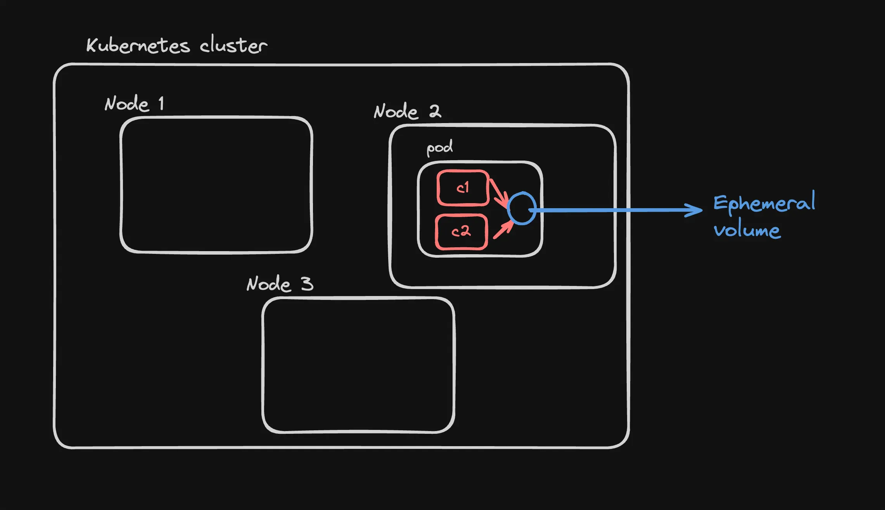
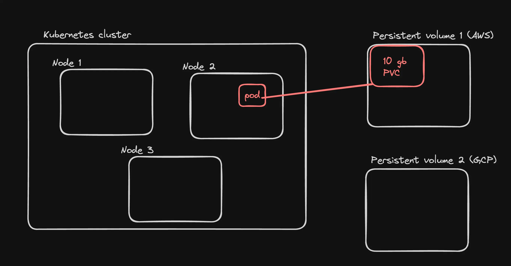
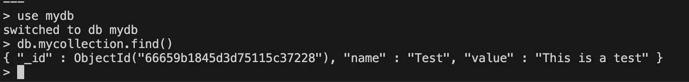

# 📦 Volumes in Docker & Kubernetes

This guide explains how volumes work in Docker and Kubernetes, how data is persisted or shared across containers, and how to implement ephemeral and persistent volumes.

---

## 🧪 Pretext

We are using the following Docker image that runs a Node.js app, writing periodically to the filesystem:

🔗 [Docker Hub - 100xdevs/write-random](https://hub.docker.com/r/100xdevs/write-random)

### ▶️ Node.js Code - Run it in Docker

```bash
docker run 100xdevs/write-random
````

### 🔍 Check the Container Contents

```bash
docker exec -it <container_id> /bin/bash
cat randomData.txt
```

### ❓ Where is this file being stored?

The data is stored in the **container’s internal Docker filesystem**, which is **ephemeral**.
When the container dies, the data is lost.

---

## 💾 Volumes in Docker

To persist data beyond container lifecycle, Docker provides **Volumes**.



---

### 📁 Bind Mounts

Bind mount maps a directory on your host machine into the container.

```bash
docker run -v /Users/harkiratsingh/Projects/100x/mount:/usr/src/app/generated 100xdevs/write-random
```

📌 *Changes in this folder are reflected on your local machine.*

---

### 📦 Volume Mounts

1. **Create a Docker volume**:

```bash
docker volume create hello
```

2. **Use the volume in a container**:

```bash
docker run -v hello:/usr/src/app/generated 100xdevs/write-random
```

📌 *The file `randomFile.txt` will persist even after the container is stopped.*

---

## 🚀 Ephemeral Volumes in Kubernetes

Sometimes, you want **two containers in the same pod to share data**, but don’t need to persist it beyond pod life.



### ✅ Setup with `emptyDir`

Here’s a manifest to share data using `emptyDir` (ephemeral volume):

```yaml
apiVersion: apps/v1
kind: Deployment
metadata:
  name: shared-volume-deployment
spec:
  replicas: 1
  selector:
    matchLabels:
      app: shared-volume-app
  template:
    metadata:
      labels:
        app: shared-volume-app
    spec:
      containers:
      - name: writer
        image: busybox
        command: ["/bin/sh", "-c", "echo 'Hello from Writer Pod' > /data/hello.txt; sleep 3600"]
        volumeMounts:
        - name: shared-data
          mountPath: /data
      - name: reader
        image: busybox
        command: ["/bin/sh", "-c", "cat /data/hello.txt; sleep 3600"]
        volumeMounts:
        - name: shared-data
          mountPath: /data
      volumes:
      - name: shared-data
        emptyDir: {}
```

### 🧪 Run It

```bash
kubectl apply -f kube.yml
```

### 🔍 Check Data from Reader Container

```bash
kubectl exec -it <pod-name> --container reader sh
cat /data/hello.txt
```

---

## 📦 Persistent Volumes in Kubernetes

You can create **Persistent Volumes (PV)** and **Persistent Volume Claims (PVC)** to retain data even after a pod is deleted.



---

## 📡 Static Persistent Volumes using NFS

Create a simple **NFS server** using Docker:

```yaml
version: '3.7'
services:
  nfs-server:
    image: itsthenetwork/nfs-server-alpine:latest
    container_name: nfs-server
    privileged: true
    environment:
      SHARED_DIRECTORY: /exports
    volumes:
      - ./data:/exports:rw
    ports:
      - "2049:2049"
    restart: unless-stopped
```

💡 Make sure port **2049** is open on your server.

---

## 📄 PersistentVolume & PersistentVolumeClaim

```yaml
apiVersion: v1
kind: PersistentVolume
metadata:
  name: nfs-pv
spec:
  capacity:
    storage: 10Gi
  accessModes:
    - ReadWriteMany
  storageClassName: nfs
  nfs:
    path: /exports
    server: 52.66.197.168
---
apiVersion: v1
kind: PersistentVolumeClaim
metadata:
  name: nfs-pvc
spec:
  accessModes:
    - ReadWriteMany
  resources:
    requests:
      storage: 10Gi
  storageClassName: nfs
```

---

### 🐳 Create a Pod that uses the PVC

```yaml
apiVersion: v1
kind: Pod
metadata:
  name: mongo-pod
spec:
  containers:
  - name: mongo
    image: mongo:4.4
    command: ["mongod", "--bind_ip_all"]
    ports:
    - containerPort: 27017
    volumeMounts:
    - mountPath: "/data/db"
      name: nfs-volume
  volumes:
  - name: nfs-volume
    persistentVolumeClaim:
      claimName: nfs-pvc
```

---

### 🧪 Test Persistence

```bash
kubectl exec -it mongo-pod -- mongo
use mydb
db.mycollection.insert({ name: "Test", value: "This is a test" })
exit

kubectl delete pod mongo-pod
kubectl apply -f mongo.yml

kubectl exec -it mongo-pod -- mongo
use mydb
db.mycollection.find()
```



---

## ⚙️ Automatic PV Creation using StorageClass (Vultr)

Ref: [Vultr Docs](https://docs.vultr.com/how-to-provision-persistent-volume-claims-on-vultr-kubernetes-engine)

### 📄 PVC Manifest

```yaml
apiVersion: v1
kind: PersistentVolumeClaim
metadata:
  name: csi-pvc
spec:
  accessModes:
    - ReadWriteOnce
  resources:
    requests:
      storage: 40Gi
  storageClassName: vultr-block-storage-hdd
```

### 📄 Pod Manifest

```yaml
apiVersion: v1
kind: Pod
metadata:
  name: mongo-pod
spec:
  containers:
  - name: mongo
    image: mongo:4.4
    command: ["mongod", "--bind_ip_all"]
    ports:
    - containerPort: 27017
    volumeMounts:
    - name: mongo-storage
      mountPath: /data/db
  volumes:
  - name: mongo-storage
    persistentVolumeClaim:
      claimName: csi-pvc
```

---

## 🔍 Explore Resources

```bash
kubectl get pv
kubectl get pvc
kubectl get pods
```

### 💾 Test Persistence

```bash
kubectl exec -it mongo-pod -- mongo
use mydb
db.mycollection.insert({ name: "Test", value: "This is a test" })
exit

kubectl delete pod mongo-pod
kubectl apply -f mongo.yml

kubectl exec -it mongo-pod -- mongo
use mydb
db.mycollection.find()
```


---

## ✅ Conclusion

* Docker volumes let you persist data outside of containers.
* Kubernetes provides `emptyDir` for temporary data and PV+PVC for long-term storage.
* You can use static storage (like NFS) or dynamic provisioning (via cloud providers).

