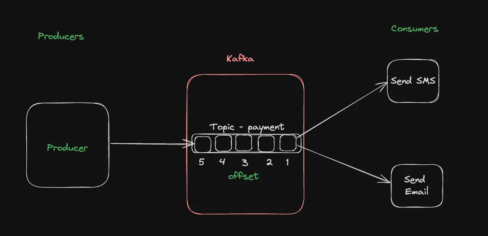

# Kafka Guide for Beginners

## 🔹 What is Kafka?

Apache Kafka is a distributed event streaming platform used for high-performance data pipelines, streaming analytics, data integration, and mission-critical applications.

Official Site: [https://kafka.apache.org/](https://kafka.apache.org/)


---

## 🔹 What is Distributed?

Kafka can be **horizontally scaled** by adding more nodes (Kafka brokers). This helps in handling more data and traffic.

---

## 🔹 Event Streaming

Kafka allows one process to **produce events** that can be **consumed by multiple consumers**, enabling real-time communication between systems.

---

## 🔹 Examples of Kafka-powered Apps

- Payment notifications
- Real-time monitoring
- Audit logging


---

## 🔹 Kafka Jargon You Must Know

### 🟠 Cluster and Broker

- **Cluster**: A group of machines running Kafka.
- **Broker**: Each machine in the Kafka cluster.

### 🟠 Producers

Used to **publish data** to a Kafka topic.

### 🟠 Consumers

Used to **consume data** from a Kafka topic.

### 🟠 Topics

A **logical channel** to which producers send messages and from which consumers read messages.

### 🟠 Offsets

Offsets track the **last consumed message**. Kafka can manage them **automatically or manually**.



---

## 🔹 Retention

Kafka topics have **retention policies**, allowing:

- Real-time processing
- Historical data replay

---

## 🔹 Partitions and Consumer Groups (Intro Only)

- We'll cover details later.

---

## 🔹 Start Kafka Locally

### Using Docker:

```bash
docker run -p 9092:9092 apache/kafka:3.7.1
```

### Get Shell Access to Container:

```bash
docker ps
docker exec -it <container_id> /bin/bash
cd /opt/kafka/bin
```

---

## 🔹 Create a Topic

```bash
./kafka-topics.sh --create --topic quickstart-events --bootstrap-server localhost:9092
```

---

## 🔹 Publish to the Topic

```bash
./kafka-console-producer.sh --topic quickstart-events --bootstrap-server localhost:9092
```

---

## 🔹 Consume from the Topic

```bash
./kafka-console-consumer.sh --topic quickstart-events --from-beginning --bootstrap-server localhost:9092
```

---

## 🔹 Kafka in a Node.js Project

Ref: [KafkaJS](https://www.npmjs.com/package/kafkajs)

### Initialize Project:

```bash
npm init -y
npx tsc --init
```

Update `tsconfig.json`:

```json
"rootDir": "./src",
"outDir": "./dist"
```

### `src/index.ts`:

```ts
import { Kafka } from "kafkajs";

const kafka = new Kafka({
  clientId: "my-app",
  brokers: ["localhost:9092"],
});

const producer = kafka.producer();
const consumer = kafka.consumer({ groupId: "my-app3" });

async function main() {
  await producer.connect();
  await producer.send({
    topic: "quickstart-events",
    messages: [{ value: "hi there" }],
  });

  await consumer.connect();
  await consumer.subscribe({ topic: "quickstart-events", fromBeginning: true });

  await consumer.run({
    eachMessage: async ({ topic, partition, message }) => {
      console.log({
        offset: message.offset,
        value: message?.value?.toString(),
      });
    },
  });
}

main();
```

Update `package.json`:

```json
"scripts": {
  "start": "tsc -b && node dist/index.js"
}
```

Start the process:

```bash
npm run start
```


---

## 🔹 Producer and Consumer as Separate Scripts

### `src/producer.ts`:

```ts
import { Kafka } from "kafkajs";

const kafka = new Kafka({
  clientId: "my-app",
  brokers: ["localhost:9092"],
});

const producer = kafka.producer();

async function main() {
  await producer.connect();
  await producer.send({
    topic: "quickstart-events",
    messages: [{ value: "hi there" }],
  });
}

main();
```

### `src/consumer.ts`:

```ts
import { Kafka } from "kafkajs";

const kafka = new Kafka({
  clientId: "my-app",
  brokers: ["localhost:9092"],
});

const consumer = kafka.consumer({ groupId: "my-app3" });

async function main() {
  await consumer.connect();
  await consumer.subscribe({ topic: "quickstart-events", fromBeginning: true });

  await consumer.run({
    eachMessage: async ({ topic, partition, message }) => {
      console.log({
        offset: message.offset,
        value: message?.value?.toString(),
      });
    },
  });
}

main();
```

Update `package.json`:

```json
"scripts": {
  "start": "tsc -b && node dist/index.js",
  "produce": "tsc -b && node dist/producer.js",
  "consume": "tsc -b && node dist/consumer.js"
}
```

---

## 🔹 Try Multiple Consumers

Run in 3 separate terminals:

```bash
npm run consume
```

Now produce:

```bash
npm run produce
```

All 3 should get the message 🎯


---

## 🔹 Consumer Groups and Partitions


### What is a Consumer Group?

A group of consumers that coordinate to consume messages from a Kafka topic.

**Purpose:**

- Load balancing
- Fault tolerance
- Parallel processing

### What is a Partition?

A subdivision of a Kafka topic. Messages in each partition are **ordered**.

**Partitioning Strategy**:

- Round-robin
- Hash of message key
- Custom logic (e.g., by user ID)


---

## 🔹 Multiple Consumer Groups

Each group gets the **full copy** of the data.


---

## 🔹 Creating a Topic with 3 Partitions

```bash
./kafka-topics.sh --create --topic payment-done --partitions 3 --bootstrap-server localhost:9092
```

Verify partitions:

```bash
./kafka-topics.sh --describe --topic payment-done --bootstrap-server localhost:9092
```

### Update your producer:

```ts
await producer.send({
  topic: "payment-done",
  messages: [{ value: "hi there", key: "user1" }],
});
```

Update consumer:

```ts
await consumer.subscribe({ topic: "payment-done", fromBeginning: true });
```

Run 3 consumers:

```bash
npm run consume
```

Produce a few messages. Consumers will divide work 💥


---

## 🔹 Current Architecture


---

## 🔹 Assignment

- Try deleting a few consumers and observe how partitions are reassigned.
- View consumer group status:

```bash
./kafka-consumer-groups.sh --bootstrap-server localhost:9092 --describe --group my-app3
```

## Three cases to discss

- Equal number of partitions and consumers
  

- More partitions than consumers
  

- More consumers than partitions
  

---

# Kafka Partitioning Strategy with `kafkajs`

This project demonstrates how to use **Kafka partitioning** based on **message keys** using `kafkajs`. Assigning a key (like a user ID) ensures that all messages related to that key go to the same partition — a powerful method to ensure message order and reduce partition-wide overload.

---

## 🧠 Why Partition by Key?

When messages are produced with a key, Kafka hashes the key and consistently sends all messages with that same key to the **same partition**.

> 💡 If a user generates too many events (e.g., notifications), they will only choke **one partition**, not the entire system.

---

## 📁 File Structure

```

.
├── producer-user.ts     
# Kafka producer that sends keyed messages
├── dist/
│   └── producer-user.js # Compiled JavaScript file
├── package.json
└── README.md

````

---

## 🚀 Getting Started

### 1. Install Dependencies

```bash
npm install kafkajs
````

### 2. Kafka Setup

Make sure Kafka is running locally at:

```
localhost:9092
```

Or update the broker URL in `producer-user.ts`.

---

## 📤 Produce Message with Key

### `producer-user.ts`

```ts
import { Kafka } from "kafkajs";

const kafka = new Kafka({
  clientId: "my-app",
  brokers: ["localhost:9092"]
});

const producer = kafka.producer();

async function main() {
  await producer.connect();
  await producer.send({
    topic: "payment-done",
    messages: [{
      value: "hi there",
      key: "user1" // 🔑 Key ensures all messages from user1 go to same partition
    }]
  });
}

main();
```

---

## 🧪 Run the Example

### 1. Add a new script in `package.json`:

```json
"scripts": {
  "produce:user": "tsc -b && node dist/producer-user.js"
}
```

### 2. Compile TypeScript

```bash
npx tsc
```

### 3. Run the Producer

```bash
npm run produce:user
```

---

## 👀 Observe Partitioning

Start 3 consumers for the `payment-done` topic and observe that all messages with the same key (e.g., `user1`) go to the **same consumer/partition**.

---

## 🔁 Tip

To simulate high-throughput scenarios and user-specific load, try sending multiple messages with the same or different keys and see how Kafka routes them.

---

## 🧩 Learn More

* [KafkaJS Documentation](https://kafka.js.org/docs/producing)
* [Kafka Partitioning Strategies](https://kafka.apache.org/documentation/#producers)

---

